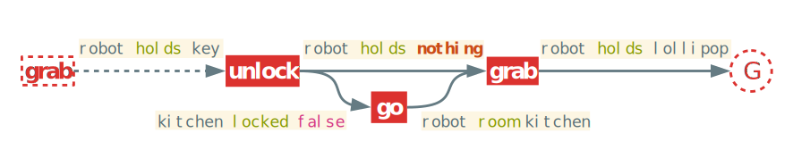
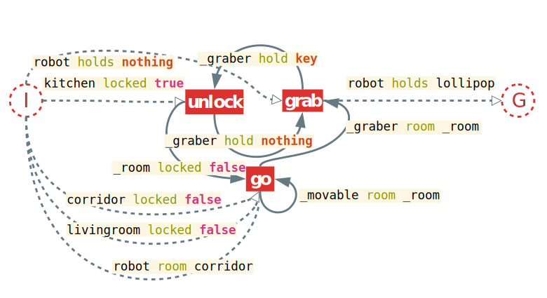
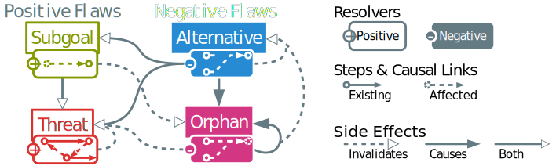

<!-- IDEAS
[Plan Space]        Approach:: idea
[POCL]                Method:: Formalism
[Flaws, Refinement]    Model:: Element of formalism
[Flaw selection]    Mechanism:: Algorithm is the implementation of mechanism
[POP Algorithm]        System :: implementation
-->

<!-- FIXME
* Examples pour chaque notion + solution de l'example et explicitation des défauts
* Étude formelle : choix + propriété + complexité
* Style : moins parlé et plus formel - tentative + consciousness
-->

**# Everything that starts with a #<!--Except titles ofc--> is purely commentary and WILL be removed**

# Introduction {-}

Until the end of the 90s, Plan-Space Planning (PSP) was generally preferred by the automated planning community. Its early commitment, expressivity, and flexibility were clear advantages over State-Space Planning (SSP). However, more recently, drastic improvements in state search planning was made possible by advanced and efficient heuristics. This allowed those planners to scale up more efficiently than plan-space search ones, notably thanks to approaches like GraphPlan [@blum_fast_1997], fast-forward [@hoffmann_ff_2001], LAMA [@richter_lama_2011] and Fast Downward Stone Soup [@roger_fast_2014].
This evolution led to a preference for performances upon other aspects of the problem of automated planning. However, some of these aspects can be more easily addressed in Partial Order Planning (POP), also known as Partial Order Causal Link (POCL) planning. For example POP, can take advantage of least commitment [@mccluskey_engineering_1997] that offers more flexibility with a final plan that describes only the necessary order of the actions considered without forcing a particular sequence. POP has been proven to be well suited for multi-agent planning [@kvarnstrom_planning_2011] and temporal planning [@benton_temporal_2012] <!-- Refs from [@shekhar_learning_2016] -->. These advantages made UCPOP [@penberthy_ucpop_1992] one of the preferred POP planner of its time with works made to port some of its characteristics into state-based planning [@gazen_combining_1997].
Related works already tried to explore new ideas to make POP into an attractive alternative to regular state-based planners like the appropriately named "Reviving partial order planning" [@nguyen_reviving_2001] and VHPOP [@younes_vhpop_2003]. More recent efforts [@coles_forwardchaining_2010; @sapena_combining_2014] are trying to adapt the powerful heuristics from state-based planning to POP's approach. An interesting approach of these last efforts is found in [@shekhar_learning_2016] with meta-heuristics based on offline training on the domain. However, we clearly note that only a few papers lay the emphasis upon plan quality using POP [@ambite_planning_1997; @estlin_learning_1997].
The present paper lays the base for our project for an intelligent robotic system that aims to use inverted planning for plan inference in order to help dependent persons to accomplish tasks. This project is based on the works of Ramirez et al. [@ramirez_plan_2009] on inverted planning for plan inference. This context led us to seek ways to improve POP with better refining techniques and resolver selection. Since we need to handle data derived from limited robotic sensors, we need a way for the planner to be able to be resilient to basic corruption on its input. Another aspect of this work lies in the fact that the final system will need to compute online planning with a feed of observational data. In order to achieve this we need a planner that can:

* repair and optimize existing plans,
* perform online planning efficiently
* retain performances on complex but medium sized problems.

Classical POP algorithms don't meet most of these criteria but can be enhanced to fit the first one. Usually, POP algorithms take a problem as an input and use a loop or a recursive function to refine the plan into a solution. We can simply expose the recursive function in order to be able to use our existing partial plan. This, however, causes multiples side effects if the input plan is suboptimal.
*Our view* on the problem diverges from other works: PSP is a very different approach compared to SSP. It is usually more computationally expensive than modern state space planners but brings several advantages. We want to make the most of them instead of trying to change POP's fundamental nature.
That view is at the core of our model: we use the refining and least commitment abilities of POP in order to improve online performances and quality. In order to achieve this, we start by computing a *proper plan* that is computed offline with the input of the domain. The explanation of the way this notion is defined and used can be found in @sec:properplan of the present paper.
Using existing partial plans as input leads to several issues, mainly with new flaw types that aren't treated in classical POP. This is why we focus the @sec:negative of our paper on plan quality and negative refinements. We, therefore, introduce new negative flaws and resolvers that aim to fix and optimize the plan: the *alternative* and the *orphan* flaws.
Side effects of negative flaws and resolvers can lead to conflicts. In order to avoid them and enhance performances and quality, the algorithm needs resolver and flaw selection mechanisms that are explained in the @sec:selection of our work.
All these mechanisms are part of our aLternative Optimization with partiaL pLan Injection Partial Ordered Planning (LOLLIPOP) algorithm presented in details in @sec:algorithm. We prove that the use of these new mechanisms leads to fewer iterations, a reduced branching factor and better quality than standard POP in @sec:analysis. Experimental results and benchmarks are presented and explained in the @sec:results of this paper.

# Partial Order Planning Preliminaries

## Notation

For the rest of this paper, we will use the notation defined in @tbl:symbols. In order to make some writings more concise, we use the symbol $\pm$ to signify that there is a notation for the positive and negative symbols but the current formula works regardless the sign. All related notions will be defined later.

Symbol                              Description
-------                             -----------
$pre(o)$, $eff(o)$                  Preconditions and effects of the operator $o$
$\Delta$                            Planning domain
$\Pi$                               Planning problem
$T.x$                               Access element $x$ of tuple $T$
$l_{\rightarrow}$, $l_{\leftarrow}$ Source and target of the causal link $l$
$o_1 \succ o_2$                     Precedence operator ($o_1$ precedes $o_2$)
$O^P$                               Proper plan of the set of operators $O$
$p.d^\pm(o)$                        Outgoing and incoming degrees of $o$
$o.d^\pm$                           Proper degrees of $o$ ($|pre(o)|$ and $|eff(o)|$)
$p.L^\pm(o)$                        Outgoing and incoming causal links of $o$
$C(p)$                              Set of cycles in partial plan $p$
$C_p(o)$                            Set of cycles in $p$, $o$ is part of
$SC_p(o)$                           $\{o\}$ if $o$ has a self cycle in $p$, $\emptyset$ otherwise
$F^\pm(p)$                          Set of flaws in $p$
$r(f)$                              Resolvers of the flaw $f$
$f.n$                               Needer of the flaw $f$
$f(p)$                              Application of the flaw $f$ on plan $p$
$fs(p)$                             Full support of $p$
$p \models \Pi$                     The partial plan $p$ is a valid solution of $\Pi$

: Most used symbols in the paper. {#tbl:symbols}

## Basic Definitions

<!--With the aim to respect the constraints of our application field, we need to define our own planning framework. Indeed, classical planning framework is usually compiled away in order to quicken a single benchmark run and are not thought for dynamical online planning in complex environments.--> <!--While needing expressivity and simplicity in our domain definition we also need speed and flexibility for online planning on robots. <!--This led to a new framework named WORLD, as it is intended for more generalist world description purpose.--> <!--Our framework is inspired by existing multi-purpose semantic tools such as RDF Turtle [@w3c_rdf_2014] and has an expressivity similar to PDDL 3.1 with object-fluents support [@kovacs_bnf_2011]. This particular type of domain description was chosen because we intend to extend works on soft solving in order to handle corrupted data better in future papers.-->

Every planning paradigm needs a way to represent its fluents and operators. Our planner is based on a rather classical domain definition with lifted operators and representing the fluents as propositional statements. The next definitions are based on the ones exposed in [@gobelbecker_coming_2010].

We define our planning domain as a tuple $\Delta = \langle T, C, P, F, O \rangle$ where

* $T$ are the **types**,
* $C$ is the set of **domain constants**,
* $P$ is the set of **properties** with their arities and typing signatures,
* $F$ represents the set of **fluents** defined as potential equations over the terms of the domain,
* $O$ is the set of optionally parameterized **operators** with preconditions and effects.

<!--
**#This part isn't used after and is relevant only to the WORLD framework**

The symbol system is completed with a notion of **term** (either a constant, a variable parameter or a property) and a few relations. We provide types with a relation of **subsumption** noted $t_1 \prec t_2$ with $t_1, t_2 \in T$ meaning that all instances of $t_1$ are also instances of $t_2$.
On terms, we add two relations: the **assignation** (noted $\leftarrow$) and the **potential equality** (noted $\doteq$).-->

Along with a domain, every planner needs a problem description in order to work. For this, we use the classical problem representation with some special additions.

The planning problem is defined as a tuple $\Pi = \langle \Delta, C_\Pi, I, G, p\rangle$ where

* $\Delta$ is a planning domain,
* $C_\Pi$ is the set of **problem constant** disjoint from $C$,
* $I$ is the **initial state**,
* $G$ is the **goal**,
* $p$ is a given **partial plan**.

The framework uses the *closed world assumption* in which all predicates and properties that aren't defined in the initial step are assumed false or don't have a value. <!--FIXME : Implementation non conform-->

@Fig:example shows an example of a planning domain and problem that we will use as a guideline throughout the article.

{#fig:example}

In order to simplify this framework we need to introduce some differences from the classical representation. First, the partial plan is a part of the problem tuple as it is a needed input of the LOLLIPOP algorithm.

We define a partial plan as a tuple $\langle S, L, B\rangle$ with $S$ the set of **steps** (semi or fully instantiated operators also called *actions*), $L$ the set of **causal links**, and $B$ the set of **binding constraints**.

Second we factorize the set of *ordering constraints*, used in classical representations, as being part of the causal links. Indeed, causal links are always supported by an ordering constraint. The only case where bare ordering constraints are needed is in threats. We decided to represent them with **bare causal links**. These are stored as causal links without bearing any fluents. Causal links can be represented by their beared fluents called *causes*. We note $f \in l$ the fact that a causal link $l$ bears the fluent $f$. Bare causal links can be noted $l = \emptyset$.
That allows us to introduce the **precedence operator** noted $a_i \succ a_j$ with $a_i, a_j \in S$ iff there is a path of causal links that connects $a_i$ with $a_j$ with $a_i$ being *anterior* to $a_j$.

A specificity of Partial Order Planning is that it fixes flaws in a partial plan in order to refine it into a valid plan that is a solution to the given problem. In this section, we define the classical flaws in our framework.

A flaw in a partial plan, called subgoal is a missing causal link required to satisfy a precondition of a step. We can note a subgoal as:
$a_p \xrightarrow{s} a_n \notin L \mid \{ a_p, a_n \} \subseteq S$
with $a_n$ called the **needer** and $a_p$ an eventual **provider** of the fluent $s$. This fluent is called *open condition* or **proper fluent** of the subgoal.

A flaw in a partial plan called threat consists of having an effect of a step that can be inserted between two actions with a causal link that is intolerant to said effect.
We say that a step $a_b$ is threatening a causal link $a_p \xrightarrow{t} a_n$ iff
$a_b \neq a_p \neq a_n \land \neg t \in eff(a_b) \land a_p \succ a_b \succ a_n$
with $a_b$ being the **breaker**, $a_n$ the *needer* and $a_p$ a *provider* of the *proper fluent* $t$.

Flaws are fixed via the application of a resolver to the plan. A flaw can have several resolvers that match its needs.

A resolver is a potential causal link defined as a tuple $r = \langle a_s, a_t, f\rangle$ with :

* $a_s, a_t \in S$ being the source and target of the resolver,
* $f$ being the considered fluent.

For standard flaws, the resolvers are simple to find. For a *subgoal* the resolvers are a set of the potential causal links between a possible provider of the proper fluent and the needer. To solve a *threat* there is mainly two resolvers: a causal link between the needer and the breaker called **demotion** or a causal link between the breaker and the provider called **promotion**.

Once the resolver is applied, another important step is needed in order to be able to keep refining. The algorithm needs to take into account the **side effects** the application of the resolver had on the partial plan. Side effects are searched by type.

Flaws that arise because of the application of a resolver on the partial plan are called causal side effects or *related flaws*. They are caused by an action $a_t$ called the **trouble maker** of a resolver. This action is the *source* of the resolver applied onto the plan.

We can derive this definition for subgoals and threats:

* **Related Subgoals** are all the open conditions inserted with the *trouble maker*. The subgoals are often searched using the preconditions of the trouble maker and added when no causal links satisfy them.
* **Related Threats** are the causal links threatened by the insertion of the *trouble maker*. They are added when there is no causal path that prevent the action to interfere with the threatened causal link.

{#fig:partialplan1}

In the partial plan presented in @fig:partialplan1, we consider that a resolver providing the fluent `robot holds key` is considered. This resolver will introduce the open conditions `robot holds nothing, key room _room, robot room _room` since it just introduced this instantiation of the `grab` operator in the partial plan. Each of these will trigger a related subgoal that will have this new `grab` operator as their needer. The potentially related threat of this resolver is that the effect `robot holds key` might threaten the link between the existing `unlock` and `grab` steps but won't be considered since there are no way the new step can be inserted after `unlock`.

In classical POP, there is no need to search for side effects when fixing a threat or when simply adding a causal link between existing steps.

## Classical POP Algorithm

The classical POP algorithm is pretty straight forward: it starts with a simple partial plan and refines its *flaws* until they are all resolved to make the found plan a solution of the problem.

\footnotesize
\Function{pop}{Queue of Flaws $a$, Problem $\Pi$}
    \State \Call{populate}{$a$, $\Pi$} \Comment{Populate agenda only on first call}
    \If{$\Pi.G = \emptyset$} \Comment{Goal is empty, default solution is provided}
        \State $\Pi.p.L \gets (I \rightarrow G)$ \label{line:emptygoal}
    \EndIf
    \If{$a = \emptyset$}
        \State \Return Success \Comment{Stop all recursion}
    \EndIf
    \State Flaw $f \gets$ \Call{choose}{$a$} \label{line:flawselection}
    \Comment{Non deterministic choice}
    \State Resolvers $R \gets$ \Call{resolvers}{$f$, $\Pi$}
    \ForAll{$r \in R$} \Comment{Non deterministic choice operator}
        \State \Call{apply}{$r$, $\Pi.p$} \label{line:resolverapplication} \Comment{Apply resolver to partial plan}
        \State SideEffects $s \gets$ \Call{sideEffect}{$r$} \label{line:sideeffectapplication}
        \State \Call{apply}{$s$, $a$} \Comment{Side effects of the resolver}
        \If{\protect\Call{pop}{$a$, $\Pi$} = Success} \Comment{Refining recursively}
            \State \Return Success
        \EndIf
        \State \Call{revert}{$r$, $\Pi.p$} \Comment{Failure, undo resolver insertion}
        \State \Call{revert}{$s$, $a$} \Comment{Failure, undo side effects application}
    \EndFor
    \State \Return Failure \Comment{Revert to last non deterministic choice of resolver}
\EndFunction

The @alg:pop is inspired by [@ghallab_automated_2004]. This POP implementation uses an agenda of flaws that is efficiently updated after each refinement of the plan. At each iteration, a flaw is selected and removed from the agenda (@line:flawselection). A resolver for this flaw is then selected and applied (@line:resolverapplication). If all resolvers cause failures, the algorithm backtracks to the last resolver selection to try another one. The algorithm terminates when no more resolver fits a flaw (`Failure`) or when all flaws have been fixed (`Success`).

This standard implementation has several limitations. First, it can easily make poor choices that will lead to excessive backtracking. It also can't undo redundant or nonoptimal links if they don't lead to backtracking.

To illustrate these limitations, we use the example described in @fig:example where a robot must fetch a lollipop in a locked room. This problem is solvable by regular POP algorithms. However, we can have some cases where small changes in POP's inputs can cause a lot of unnecessary back-trackings. For example, if we add a new action called `dig_through_wall` that has as effect to be in the desired room but that requires a *jackhammer*, the algorithm will simply need more backtracking. The effects could be worse if obtaining a jackhammer would require numerous steps (for example needing to build it). This problem can be solved most of the time using simple flaw selection mechanisms. However, this was never applied in the context of POP. The other limitation arises when the plan has been modified. This can arise in the context of the dynamical environments of online planning's application. Regular POP algorithms do not consider this issue as they do not take a partial plan as input. When POP is modified to use input plans [@sebastia_graph-based_2000], they are carefully designed to not infringe the properties required by POP to operate. In our case, the plan can contain misleading informations and this can cause a variety of new problems that are related to planning corruption.

In order to address these issues, we present a set of new mechanisms.

# LOLLIPOP's Approach

Our approach lays on several mechanisms. LOLLIPOP makes use of proper plans in order to ease the initial backchaining of POP and to drive the flaw and resolver selection, including the new negative flaws we introduced for online planning refinements.

## Proper Plan Generation {#sec:properplan}

One of the main contributions of the present paper is our use of the concept of *proper plan*. First of all, we need to define this notion.

A proper plan $O^P$ of a set of operators $O$ is a labelled directed graph that binds two operators with the causal link $o_1 \xrightarrow{f} o_2$ iff it exists at least a unifying fluent $f \in eff(o_1) \cap pre(o_2)$ between them.

This definition was inspired by the notion of domain causal graph as explained in [@gobelbecker_coming_2010] and originally used as heuristic in [@helmert_fast_2006]. Causal graphs have fluents as their nodes and operators as their edges. Proper plans are the opposite : an *operator dependency graph* for a set of actions. A similar structure was used in [@smith_postponing_1993] that builds the operator dependency graph of goals and uses precondition nodes instead of labels. This structure is very useful for getting information on the *shape of a problem*. This shape leads to an intuition based on the potential usefulness or hurtfulness of operators.
Cycles in this graph denote the dependencies of operators. We call *co-dependent* several operators that form a cycle. If the cycle is made of only one operator (self-loops), then it is called *auto-dependent*.

While building this proper plan, we need a **providing map** that indicates, for each fluent, the list of operators that can provide it. This is a simpler version of the causal graphs that is reduced as an associative table easier to update. The list of provider can be sorted in order to drive resolver selection (cf. @sec:selection). A **needing map** is also built but isn't used in further mechanisms. We note $\Delta^P$ the proper plan built with the set of operators in the domain $\Delta$. In the @fig:properplan we illustrate the application of this mechanism on our example from @fig:example. Continuous lines are the *domain proper plan*.

{#fig:properplan}

The generation of the proper plan is based upon the previous definition. It will explore the operators space and build a providing and needing map that gives the provided and needed fluents for each operator. Once done it will iterate on every precondition and search for a satisfying cause in order to add the causal link to the proper plan. The @alg:properplan details this procedure.

\footnotesize
\Function{addVertex}{Operator $o$}
    \State \Call{cache}{$o$} \Comment{Update of the providing and needing map}
    \If {binding} \Comment{boolean that indicates if the binding was requested}
        \State \Call{bind}{$o$}
    \EndIf
\EndFunction
\Function{cache}{Operator $o$}
    \ForAll{$eff \in eff(o)$} \Comment{Adds $o$ to the list of providers of $eff$}
        \State \Call{add}{$providing, eff, o$}
    \EndFor
    \State … \Comment{Same operation with needing and preconditions}
\EndFunction
\Function{bind}{Operator $o$}
    \ForAll{$pre \in pre(o)$}
        \If{$pre \in providing$}
            \ForAll{$p \in$ \Call{get}{$providing$, $pre$}}
                \State Link $l \gets$ \Call{getEdge}{$p$, $o$} \Comment{Create the link if needed}
                \State $l \gets l \cup \{pre\}$ \Comment{Add the fluent as a cause}
            \EndFor
        \EndIf
    \EndFor
    \State … \Comment{Same operation with needing and effects}
\EndFunction

Applying the notion of proper plan for problems only needs the initial and goal steps added in the proper plan. In [@fig:properplan] we illustrate this insertion with our previous example using dotted lines. However, since proper plans feature cycles they can't be used directly as input to POP algorithms to ease the initial backchaining. Moreover, the process of refining a proper plan into a usable one could be more computationally expensive than POP itself.

In order to give a head start to the LOLLIPOP algorithm we propose to build proper plans differently with the algorithm detailed in @alg:safeproperplan. A similar notion was already presented as "basic plans" in [@sebastia_graph-based_2000]. These partial plans however uses a more complete but slower solution for generation that ensures that each selected steps is *necessary* for the solution. In our case we preferred a simpler solution that can solve some basic planning problems but that can do mistakes (since our algorithm can handle them). It does a simple and fast backward construction of a partial plan driven by the providing map. Therefore, it can be tweaked with the powerful heuristics of state search planning.

\footnotesize
\Function{safe}{Problem $\Pi$}
    \State Stack<Operator> $open \gets [\Pi.G]$
    \State Stack<Operator> $closed \gets \emptyset$
    \While{$open \neq \emptyset$}
        \State Operator $o \gets$ \Call{pop}{$open$} \Comment{Remove $o$ from $open$}
        \State \Call{push}{$closed$, $o$}
        \ForAll {$pre \in pre(o)$}
            \State Operators $p \gets$ \Call{getProviding}{$\pi$, $pre$} \Comment{Sorted by usefulness}
            \If{$p = \emptyset$} \Comment{(see section~\ref{sec:selection})} <!-- Markdown breaks inside LaTeX commands … obviously-->
                \State $\Pi.p.S \gets \Pi.p.S \setminus \{p\}$
                \Continue
            \EndIf
            \State Operator $o' \gets$ \Call{getFirst}{$p$} \label{line:safefirst}
            \If{$o' \in closed$}
                \Continue
            \EndIf
            \If{$o' \not \in \Pi.p.S$}
                \State \Call{push}{$open$, $o'$}
            \EndIf
            \State $\Pi.p.S \gets \Pi.p.S \cup \{o'\}$
            \State Link $l \gets$ \Call{getEdge}{$o'$, $o$} \Comment{Create the link if needed}
            \State $l \gets l \cup \{pre\}$ \Comment{Add the fluent as a cause}
        \EndFor
    \EndWhile
\EndFunction

This algorithm is very useful since it is specifically used on goals. The result is a valid partial plan that can be used as input to POP algorithms.

## Negative Refinements and Plan Optimization {#sec:negative}

Classical POP algorithm works upon a principle of positive plan refinements. The two standard flaws (subgoals and threats) are fixed by *adding* steps, causal links, or variable binding constraints to the partial plan. Online planning needs to be able to *remove* part of the plan that isn't necessary for the solution.

Since we assume that the input partial plan is quite complete, we need to define new flaws to optimize and fix this plan. These flaws are called *negative* as their resolvers apply substractive refinements on partial plans.

An alternative is a negative flaw that occurs when it exists a better provider choice for a given link.
An alternative to a causal link $a_p \xrightarrow{f} a_n$ is a provider $a_b$ that have a better *utility value* than $a_p$.

The **utility value** of an operator is a measure of usefulness at the heart of our ranking mechanism detailed in @sec:selection. It uses the incoming and outgoing degree of the operator in the domain proper plan to measure its usefulness.

Finding an alternative to an operator is computationally expensive. It requires to search a better provider for every fluent needed by a step. In order to simplify that search, we select only the best provider for a given fluent and check if the one used is the same. If not we add the alternative as a flaw. This search is done only on updated steps for online planning. Indeed, the safe proper plan mechanism is guaranteed to only choose the best provider (@alg:safeproperplan at @line:safefirst). Furthermore, subgoals won't introduce new fixable alternative as they are guaranteed to select the best provider possible.

An orphan is a negative flaw that means that a step in the partial plan (other than the initial or goal step) is not participating in the plan. Formally, $a_o$ is an orphan iff $a_o \neq I \land a_o \neq G \land \left( p.d^+(a_o) = 0 \right) \lor \forall l \in p.L^+(a_o), l=\emptyset$.

With $p.d^+(a_o)$ being the *outgoing degree* of $a_o$ in the directed graph formed by $p$ and $p.L^+(a_o)$ being the set of *outgoing causal links* of $a_o$ in $p$. This last condition checks for *hanging orphans* that are bound with the goal with only bare causal links introduced by threat resolution.

The introduction of negative flaws requires to modify the resolver definition (@def:resolver).

A signed resolver is a resolver with a notion of sign. We add to the resolver tuple $s$ as the sign of the resolver in $\{+, -\}$.

<!--An alternative notation for the signed resolver is inspired by the causal link notation with simply the sign underneath :
$$r = a_s \xrightarrow[+/-]{f} a_t$$-->

The previously defined negative flaws have all their associated negative resolvers.

The solution to an alternative is a negative refinement that simply removes the targeted causal link. This causes a new subgoal as a side effect, that will prioritize its resolver by usefulness and then pick the most useful provider.

The resolver for orphans is the negative refinement that is meant to remove a step and its incoming causal link while tagging its providers as potential orphans.

{#fig:sideeffects}

The side effect mechanism also needs an upgrade since the new kind of flaws can easily interfere with one another. This is why we extend the side effect definition (@def:sideeffect) with a notion of sign.

A signed side effect is either a regular *causal side effect* or an *invalidating side effect*. The sign of a side effect indicates if the related flaw needs to be added or removed from the agenda.

The @fig:sideeffects illustrates the extended notion of signed resolvers and side effects. When treating positive resolvers, nothing needs to change from the classical method. When dealing with negative resolvers, we need to search for additional subgoals and threats. Deletion of causal links and steps can cause orphan flaws that need to be identified for removal.

In [@peot_threatremoval_1993], a **invalidating side effect** is explained under the name of *DEnd* strategy. In classical POP, it has been noticed that threats can disappear in some cases if subgoals or other threats were applied before them. In our formalism, we decide to gather under this notion every side effects that removes the need to consider a flaw. For example, orphans can be "saved" if a subgoal selects the orphan step. Alternatives can remove the need to compute further subgoal of a now orphan step as orphans simply remove the need to fix any flaws that concern the selected step.

These interactions between flaws are decisive in the validity and efficiency of the whole model, that is why we aim to drive flaw selection in a very rigorous manner.

## Driving Flaws and Resolvers Selection {#sec:selection}

Resolvers and flaws selection are the keys to improving performances. Choosing a good resolver helps to reduce the branching factor that accounts for most of the time spent on running POP algorithms [@kambhampati_design_1994 ]. Flaw selection is also very important for efficiency, especially when considering negative flaws which can conflict with other flaws.

Conflicts between flaws occur when two flaws of opposite sign target the same element of the partial plan. This can happen for example if an orphan removes a step needed by a subgoal or when a threat tries to add a promoting link against an alternative. The use of side effects will prevent most of these occurrences in the agenda but a base ordering will increase the general efficiency of the algorithm.

Based on the @fig:sideeffects, we create a base ordering of flaws by type. This order takes into account the number of flaw types affected by causal side effects.

1. **Alternatives** will cut causal links that have a better provider. It is necessary to identify them early since they will add at least another subgoal to be fixed as a related flaw.
2. **Subgoals** are the flaws that cause most of the branching factor in POP algorithms. This is why we need to make sure that all open conditions are fixed before proceeding on finer refinements.
3. **Orphans** remove unneeded branches of the plan. However, these branches can be found out to be necessary for the plan in order to meet a subgoal. Since a branch can contain numerous actions, it is preferable to let the orphan in the plan until they are no longer needed. Also, threats concerning orphans are invalidated if the orphan is resolved first.
4. **Threats** occur quite often in the computation. They cost a lot of processing power since they need to check if there are no paths that fix the flaw already. Numerous threats are generated without the need of intervention [@peot_threatremoval_1993]. That is why we prioritize all related subgoals and orphans before threats because they can add causal links or remove threatening actions that will fix the threat.

Resolvers need to be ordered as well, especially for the subgoal flaw. Ordering resolvers for a subgoal is the same operation as choosing a provider. Therefore, the problem becomes "how to rank operators?". The most relevant information on an operator is its usefulness and hurtfulness. These indicate how much an operator will help and how much it may cause branching after selection.

Degrees are a measurement of the usefulness of an operator. The notion is derived from the incoming and outgoing degree of a node in a graph.

We note $p.d^+(o)$ and $p.d^-(o)$ respectively the outgoing and incoming degree of an operator in a plan $p$. These represent the number of causal links that goes out or toward the operator. We call proper degree of an operator $o.d^+ = |eff(o)|$ and $o.d^- = |pre(o)|$ the number of preconditions and effects that reflects its intrinsic usefulness.

There are several ways to use the degrees as indicators. *Utility value* increases with every $d^+$, since this reflects a positive participation in the plan. It decreases with every $d^-$ since actions with higher incoming degrees are harder to satisfy. The utility value bounds are useful when selecting special operators. For example, a user-specified constraint could be laid upon an operator to ensure it is only selected as a last resort. This operator will be affected with the minimum value for the utility value. More commonly, the maximum value is used for initial and goal step to ensure their selection.

Our ranking mechanism includes several computation steps. The first step is the computation of the **base scores** noted $Z_0(o)=\langle o^+, o^-\rangle$. It is a tuple that contains two components : a positive score that acts as a participation measurement and a negative score that represents the dependencies of the operator. For each component of the score we consider a *sub score array* noted $S_z(o^\pm)$. We define them as follows :

* $S_z(o^+)$ containing only $\Delta^P.d^+(o)$, the positive degree of $o$ in the domain proper plan. This will give a measurement of the predicted usefulness of the operator.
* $S_z(o^-)$ containing the following subscores :
    1. $o.d^-$ the proper negative degree of $o$. Having more preconditions can lead to a potentially higher need for subgoals.
    2. $\sum_{c \in C_{\Delta^P}(o)}|c|$ with $C_{\Delta^P}(o)$ being the set of cycles where $o$ participates in the domain proper plan. If an action is co-dependant it may lead to a dead end when searching for precondition as it will form a cycle.
    3. $|SC(o)|$ with $SC(o)$ is the set of self-cycle $o$ participates in. This is usually symptomatic of a *toxic operator* (cf. @def:toxic). Having an operator behaving this way can lead to problems in the operator instantiation.
    4. $\left|pre(o) \setminus \Delta^P.L^-(o)\right|$ with $\Delta^P.L^-(o)$ being the set of incoming edges of $o$ in the proper plan of the domain. This represents the number of open conditions in the domain proper plan. This is symptomatic of action that can't be satisfied without a compliant initial step.

A parameter is reserved for each subscore. It is noted $P_n^\pm$ with $n$ being the index of the subgoal in the list. The final formula for the score is then defined as : $o^\pm = \sum_{n=1}^{|S_z(o^\pm)|}{P_n^\pm S_z^n(o^\pm)}$

Once this score is computed, the ranking mechanism starts the second phase, it computes the **realization scores** that are potential scores that are realized once the problem is specified. It first searches the *inapplicable operators* that are all operators in the domain proper plan that have a precondition that isn't satisfied with a causal link. Then it searches the *eager operators* that provide fluents with no corresponding causal link (as they are not needed). These operators are stored in relation with their inapplicable or eager fluents.

The third phase starts with the beginning of the solving algorithm, once the problem has been provided. It computes the *effective realization scores* based on the initial and goal step. It will add $P_1^+$ to $o^+$ for each realized eager operators (if the goal contains the related fluent) and subtract $P_4^-$ from $o^-$ for each inapplicable operators realized by the initial step.

Last, the **final score** of each operator $o$, noted $r_o$, is computed from positive and negative scores using the following formula: $r_o = o^+ \alpha^{-o^-}$. This respects the criteria of having a bounded value for the *utility value* as it ensures that the value is positive with $0$ as a minimum bound and $+\infty$ for a maximum. The initial and goal steps have their utility value set to the upper bound in order to ensure their selection of other steps.

Choosing to compute the resolver selection at operator level has some interesting consequences on the performances. Indeed, this computation is much lighter than approaches with heuristics on plan space [@shekhar_learning_2016] as it reduce the overhead caused by real time computation of heuristics on complex data. In order to reduce this overhead more, the algorithm sorts the providing associative array in order to easily retrieve the best operator for each fluent. This means that the evaluation of the heuristic is done only once for each operator. This reduces the overhead and allows for faster results on smaller plans.

## LOLLIPOP Algorithm {#sec:algorithm}

The LOLLIPOP algorithm uses the same refinement algorithm as described in @alg:pop. The differences reside in the changes made on the notions of resolvers and side effects. In @line:resolverapplication of @alg:pop, LOLLIPOP algorithm will apply negative resolvers if the selected flaw is negative. In @line:sideeffectapplication, it will search for both sign of side effects. Another change resides in the initialization of the solving mechanism and the domain as detailed in @alg:lollipopinit. This algorithm contains several parts. First, the domainInit function corresponds to the code computed during the domain compilation time. It will prepare the rankings, the proper plan and its caching mechanisms. It will also use strongly connected component detection algorithm to detect cycles. These cycles are be used during the base score computation (@line:basescore). We added a detection of illegal fluents and operators in our domain initialization (@line:isillegal). Illegal operators are either inconsistent or toxic.

\footnotesize
\Function{domainInit}{Operators $O$}
    \State ProperPlan $P$
    \State Ranking $R$
    \ForAll{Operator $o \in O$}
        \If{\Call{isIllegal}{$o$}} \Comment{Remove toxic and useless fluents} \label{line:isillegal}
            \State $O \gets O \setminus \{o\}$  \Comment{If entirely toxic or useless}
            \Continue
        \EndIf
        \State $P.$\Call{addVertex}{$o$} \Comment{Add, cache and bind all operators}
    \EndFor
    \State Cycles $C \gets$ \Call{stronglyConnectedComponent}{$P$} \Comment{Using DFS}
    \State $R.Z \gets$ \Call{baseScores}{$O$, $P$} \label{line:basescore}
    \State $R.I \gets$ \Call{inapplicables}{$P$}
    \State $R.E \gets$ \Call{eagers}{$P$}
\EndFunction
\Function{lollipopInit}{Problem $\Pi$}
    \State \Call{realize}{$\Pi.\Delta.R, \Pi$} \Comment{Realize the scores}
    \State \Call{cache}{$\Pi.\Delta.P, \Pi.I$} \Comment{Cache initial step in providing …}
    \State \Call{cache}{$\Pi.\Delta.P, \Pi.G$} \Comment{… as well as goal step}
    \State \Call{sort}{$\Pi.\Delta.P.providing$, $\Pi.\Delta.R$} \Comment{Sort the providing map}
    \If{$\Pi.p.L = \emptyset$}
        \State \Call{safe}{$\Pi$} \Comment{Computing the safe proper plan if the plan is empty}
    \EndIf
    \State \Call{populate}{$a$, $\Pi$} \Comment{populate agenda with first flaws} \label{line:populate}
\EndFunction
\Function{populate}{Agenda $a$, Problem $\Pi$}
    \ForAll{Update $u \in \Pi.U$} \Comment{Updates due to online planning}
        \State Fluents $F \gets eff(u.new) \setminus eff(u.old)$ \Comment{Added effects}
        \ForAll{Fluent $f \in F$}
            \ForAll{Operator $o \in$ \Call{better}{$\Pi.\Delta.P.providing$, $f$, $o$}}
                \ForAll{Link $l \in \Pi.P.L^+(o)$}
                    \If{$f \in l$}
                        \State \Call{addAlternative}{$a$, $f$, $o$, $\rightarrow(l)$, $\Pi$}
                        \State \Comment{With $\rightarrow(l)$ the target of $l$}
                    \EndIf
                \EndFor
            \EndFor
        \EndFor
        \State $F \gets eff(u.old) \setminus eff(u.new)$ \Comment{Removed effects}
        \ForAll{Fluent $f \in F$}
            \ForAll{Link $l \in \Pi.P.L^+(u.new)$}
                \If{\Call{isLiar}{$l$}}
                    \State $\Pi.L \gets \Pi.L \setminus \{l\}$
                    \State \Call{addOrphans}{$a$, $u.new$, $\Pi$}
                \EndIf
            \EndFor
        \EndFor
        \State … \Comment{Same with removed preconditions and incomming liar links}
    \EndFor
    \ForAll{Operator $o \in \Pi.p.S$}
        \State \Call{addSubgoals}{$a$, $o$, $\Pi$}
        \State \Call{addThreats}{$a$, $o$, $\Pi$}
    \EndFor
\EndFunction

An operator $a$ is contradictory iff $\exists f \{f, \lnot f \} \in eff(o) \lor \{f, \lnot f \} \in pre(o)$

Toxic operators have effects that are already in their preconditions or empty effects. An operator $o$ is toxic iff $pre(o) \cap eff(o) \neq \emptyset \lor eff(o) = \emptyset$

Toxic actions can damage a plan as well as make the execution of POP algorithm longer than necessary. This is fixed by removing the toxic fluents ($pre(a) \nsubseteq eff(a)$) and by updating the effects with $eff(a) = eff(a) \setminus pre(a)$. If the effects become empty, the operator is removed from the domain.

The lollipopInit function is executed during the initialization of the solving algorithm. We start by realizing the scores, then we add the initial and goal step in the providing map by caching them. Once the ranking mechanism is ready we sort the providing map. With the ordered providing map the algorithm runs the fast generation of the safe proper plan for the problem's goal.

The last part of this initialization (@line:populate) is the agenda population that is detailed in the populate function. During this step, we perform a search of alternatives based on the list of updated fluents. A big problem with online updates is that the plan can become outdated relative to the domain.

A liar link is a link that doesn't hold a fluent in the preconditions or effect of its source and target. We can note:
$$a_i \xrightarrow{f} a_j | f \notin eff(a_i) \cap pre(a_j)$$

A liar link can be created by the removal of an effect or preconditions during online updates (with the causal link still remaining).

We call lies, fluents that are held by links without being in the connected operators. To resolve the problem we remove all lies. We delete the link altogether if it doesn't bear any fluent as a result of this operation. This removal triggers the addition of orphan flaws.

While updated operators is very important for LOLLIPOP to be able to solve online planning problems, another mechanism is used in order to ensure that LOLLIPOP is complete. This mechanism is explained in @lem:deadend-validity. <!--User provided plans have their steps tagged. This tag is used for failure. If the failure has backtracked to a user-provided step, then it is removed and replaced by subgoals that represent each of its participation in the plan. This mechanism loops until every user provided steps have been removed.-->

# Theoretical Analysis {#sec:analysis}

As proven in [@penberthy_ucpop_1992], the classical POP algorithm is *sound* and *complete*. In order to prove that these properties apply to LOLLIPOP, we need to introduce some hypothesis :

* operators updated by online planning are known.
* user provided steps are known.
* user provided plans don't contain illegal artifacts. This includes toxic or inconsistent actions, lying links and cycles.

First, we define some additional properties of partial plans.

A partial plan $p$ is fully supported if each of its steps $o \in p.S$ is. A step is fully supported if each of its preconditions $f \in pre(o)$ is supported. A precondition is fully supported if it exists a causal link $l$ that provides it. We can note :
$$fs(p) \equiv
\begin{array}{l}
    \forall o \in p.S \thickspace \forall f \in pre(o) \thickspace \exists l \in p.L^-(o) : \\
        \left(f \in l \land \not \exists t \in p.S (l_{\rightarrow} \succ t \succ o \land \lnot f \in eff(t))\right)
\end{array}$$
with $p.L^-(o)$ being the incoming causal links of $o$ in $p$ and $l_{\rightarrow}$ being the source of the link.

This property is taken from the original proof. We present it again for convenience.

A partial plan is a **valid solution** of a problem $\Pi$ iff it is *fully supported* and *contains no cycles*. The validity of a partial plan $p$ regarding a problem $\Pi$ is noted $p \models \Pi \equiv fs(p) \land \left(C(p) = \emptyset \right)$ with $C(p)$ being the set of cycles in $p$.

##Proof of Soundness

Based on the @def:partialplanvalidity we state that :
$$
\left(
\begin{array}{l}
    \forall pre \in pre(\Pi.G) : \\
    fs(pre) \land
    \begin{array}{l}
        \forall o \in \Pi.L^-_{\rightarrow}(\Pi.G) \thickspace \forall pre' \in pre(o) : \\
        \left(fs(pre')\land C_p(o) = \emptyset\right)
    \end{array}
\end{array}
\right) \implies p \models \Pi$$ {#eq:recursivevalidity}
where $\Pi.L^-_{\rightarrow}(\Pi.G)$ is the set of direct antecedant of $\Pi.G$ and $C_p(o)$ is the set of fluents containing $o$ in $p$

This means that $p$ is a solution if all preconditions of $G$ are satisfied. We can satisfy these precondition using operators iff their precondition are all satisfied and if there is no other operator that threatens their supporting links.

First, we need to show that @eq:recursivevalidity holds on LOLLIPOP initialization. We use our hypothesis to rule out the case when the input plan is invalid. The @alg:safeproperplan will only solve open conditions in the same way subgoals do it. Therefore, safe proper plans are valid input plans.

Since the soundness is proven for regular refinements and flaw selection, we need to consider the effects of the added mechanisms of LOLLIPOP.
The newly introduced refinements are negative, they don't add new links :

$$\forall f \in F(p) \thickspace \forall r \in r(f) : C_p(f.n) = C_{f(p)}(f.n)$$ {#eq:nocycle}
with $F(p)$ being the set of flaws in $p$, $r(f)$ being the set of resolvers of $f$, $f.n$ being the needer of the flaw and $f(p)$ being the result partial plan after application of the flaw. Said otherwise, an iteration of LOLLIPOP won't add cycles inside a partial plan.

The orphan flaw targets steps that have no path to the goal and therefore can't add new open conditions or threats. The alternative targets existing causal links. Removing a causal link in a plan breaks the full support of the target step. This is why an alternative will always insert a subgoal in the agenda corresponding to the target of the removed causal link. Invalidating side effects also don't affect the soundness of the algorithm since the removed flaws are already solved. We can then write :
$$
\forall f \in F^-(p) : fs(p) \implies fs(f(p))
$$ {#eq:conssupport}
with $F^-(p)$ being the set of negative flaws in the plan $p$. This means that negative flaws don't
 compromise the full support of the plan.

[@Eq:nocycle;@eq:conssupport] leads to @eq:recursivevalidity being valid after the execution of LOLLIPOP. The algorithm is, therefore, sound.

##Proof of Completeness

The soundness proof shows that LOLLIPOP's refinements don't affect the support of plans in term of validity. It was proven that POP is complete. There are several cases to explore in order to transpose the property to LOLLIPOP :

If the input plan is a valid solution, LOLLIPOP returns a valid solution.

With [@eq:nocycle; @eq:conssupport] and the previous proof, the conservation of validity is already prooved. \qedhere

If the input plan is incomplete, LOLLIPOP returns a valid solution.

Since POP is complete and the @eq:conssupport prooves the conservation of support by LOLLIPOP, then the algorithm will return a valid solution if the provided plan is an incomplete plan and the problem solvable. \qedhere

If the input plan is empty, LOLLIPOP returns a valid solution.

This is prooven using @lem:incompletevalidity and POP's completeness. However, we want to add a trivial case to the proof : $pre(G) = \emptyset$. In this case the @line:emptygoal of the @alg:pop will return a valid plan. \qedhere

If the input plan is in a dead-end, LOLLIPOP returns a valid solution.

Using input plans that can be in a undertimined state is not covered by the original proof. The problem lies in the existing steps in the input plan. However, using our hypothesis we can add a failure mechanism that makes LOLLIPOP complete. On failure, the needer of the last flaw is deleted if it wasn't added by LOLLIPOP. User defined steps are deleted until the input plan acts like an empty plan. Each deletion will cause corresponding subgoals to be added to the agenda. In this case, the backtracking is preserved and all possibilities are explored as in POP. \qedhere

As all cases are covered, these proofs show that LOLLIPOP is complete.

# Experimental Results {#sec:results}

**#TODO Things we want to know:**

* Is Lollipop faster than POP ? In which cases?
* Is the lollipop competitive in small problems?
* Measure the increase in quality
* Plot the selection time and every other indicator are taken in [@kambhampati_design_1994]

# Conclusion {-}

**#TODO Things we want to discuss:**

* Discussion of results and properties
* Summary of improvements
* Introducing soft solving and online planning.
* Online planning
* plan recognition and constrained planning

# References

