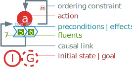
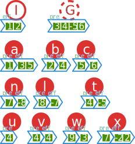
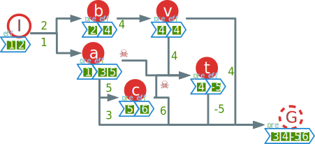

<!-- TODO discuss order of authors-->

# Introduction {-}
<!-- The Soft Ordering and Defect Aware Partial Ordering Planning algorithm (SODA POP)
This name is PERFECT ! -->
<!--TODO Online planning -->
For some time Partial Order Planning (POP) has been the most popular approach to planning resolution. The way the search is made using flexible partial plan as a search space allowed for more versatility for a wide variety of uses. As of more recent years, new state space search models and heuristics [@richter_lama_2011] have been demonstrated to be more efficient than POP planners due to the simplicity and relevance of states representation opposed to partial plans [@ghallab_automated_2004]. This have made the search of performance the main axis of research for planning in the community.

While this goal is justified, it shadows other problems that some practical applications causes. For example, for applications needing online planning the flexibility of Plan Space Planning (PSP) is an obvious advantage : plans can be repaired on the fly as new informations and objectives enter the system <!-- FIXME REF ? -->. Some other cognitive applications may provide approximate plans to be refined. These can contain errors and imperfections that will decrease significantly the efficiency of the computation and the quality of the output plan. Others AI applications needs complete plans that details the reasons behind a failure and what are its consequences on the rest of the steps to achieve the provided goal.

These problems call for new ways to improve the answer and behavior of a planner in order to provide relevant plan information pointing out exactly what needs to be done in order to make a planning problem solvable, even in the case of obviously broken input data. We aim to solve this in the present paper while preserving the advantages of PSP algorithms. Our Soft Ordering and Defect Aware Partial Ordering Planning (SODA POP) algorithm will target those issues.

# Plan Space Planning Definitions
<!-- TODO Scénario -->
In order to present our work and explain examples we will introduce a way of representation for schema and notations for mathematical representation.

 {#fig:legend}

## Fluents

A fluent is a property of the world. It is often represented by first order logical propositions but in our case we choose to focus on the algorithm and to represent fluents as simple literals (fully instantiated). We note $\lnot f$ the complementary fluent of $f$ meaning that $f$ is true when $\lnot f$ is false and vice-versa.

In order to make our example simpler we use $\mathbb{Q}^*$, the set of relative integers without $0$, as the fluent domain. We use negative integers to represent opposite fluents.

## State
We define a state as a set of fluents. States can be additively combined. We note $s_1 + s_2 = \left( s_1 \cup s_2 \right) - \left\{ f \middle| f \in s_1 \land \lnot f \in s_2  \right\}$ such operation. It is the union of the fluents with an erasure of the complementary ones.

## Action
An action is a state operator. It is represented as a tuple $a = \langle pre, eff \rangle$ with $pre$ and $eff$ being sets of fluents, respectively the preconditions and the effects of $a$. An action can be used only in a state that verifies its preconditions. We note $s \models a \Leftrightarrow pre(a) \subset s$ the verification of an action $a$ by a state $s$.

An action $a$ can be functionally applied to a state $s$ following :
$$a:= \substack{ \left\{ s \models a \middle| s \in S\right\} \to S\\
    a(s) \mapsto s + eff(a)}$$ 
with $S$ being the set of all states.
There are some special names for actions. An action with no preconditions is synonymous to a state, one with empty effect is called a goal and the action that have both empty is the empty action noted $a_\emptyset = \langle\emptyset, \emptyset\rangle$.
<!--FIXME I should find a better name -->

## Partial Plan
A *partial plan* is a tuple $p = \langle A_p, L\rangle$ where $A_p$ is a set of steps (actions) and $L$ is a set of causal links of the form $a_i \xrightarrow{f} a_j$, such that $\{ a_i, a_j \} \subset A_p \land f \in eff(a_i) \cap pre(a_j)$ or said otherwise that $f$ is an effect of the step $a_i$ and a precondition of the step $a_j$. We include the ordering constraints of PSP in the causal links. An ordering constraint is noted $a_i \to a_j$ and means that the plan consider $a_i$ as a step that is prior to $a_j$ without specific cause (usually because of threat resolution).

## Problem
We define a partial plan satisfaction problem as a tuple noted 
$P = \langle A, I, G, p \rangle$ with :

* $I$ and $G$ being the pseudo actions representing respectively the initial state and the goal.
* $p$ being a partial plan to refine.
* $A$ the set of all actions.

## Flaws
When refining a partial plan, we need to fix flaws. Those could be present or be created by the refining process. Flaws can either be unsatisfied subgoals or threats to causal links.

### Subgoals
A subgoal $s$ is a precondition of an action $a_s \in A_p$ with $s \in pre(a_s)$ 
that isn't satisfied by any causal link. We can note a subgoal as :
$$a_i \xrightarrow{s} a_s \notin L \mid \{ a_i, a_s \} \subset A_p $$

A resolver for a subgoal is an action $a_r$ that has $s$ as an effect $s \in eff(a_r)$. It is inserted along with a causal link noted $a_r \xrightarrow{s} a_s$.

### Threats
A step $a_t$ is said to threaten a causal link $a_i \xrightarrow{t} a_j$ if and only if $\neg t \in eff(a_t)$ and $a_i \succ a_t \succ a_j$ is a possible order given the ordering constraint in $L$.

The usual resolvers are either $a_t \to a_i$ or $a_j \to a_t$ which are called respectively promotion and demotion links. Another resolver is a called a white knight that is an action $a_k$ that reestablish $t$ after $a_t$

## Consistency
A partial plan is consistent if it contains no ordering cycles. That means that the directed graph formed by step as vertices and causal links as edges isn't cyclical. This is important to guarantee the soundness of the algorithm.

## Flat Plan
We can instantiate one or several flat plans from a partial plan. A flat plan is an ordered sequence of actions $\pi = [ a_1, a_2 \ldots a_n]$ that acts like a pseudo action $\pi = \langle pre_\pi, eff_\pi \rangle$ and can be applied to a state $s$ using functional composition operation $\pi := \bigcirc_{i=1}^n a_n$.

We call a flat plan valid if and only if it can be functionally applied on the empty action. We note that this is different from classic planning because in our case the initial state is the first action that is already included in the plan.

## Solution
A partial plan which generates only valid flat plans is a solution to the given problem.

# Classical POP
Partial Order Planning (POP) is a popular implementation of the general PSP algorithm. It is proven to be sound and complete [@erol_umcp:_1994]. The completeness of the algorithm guarantees that if the problem has a solution it will be found by the algorithm and the soundness assures that all answer from the algorithm is valid. POP refines a partial plans by trying to fix its flaws.

## Description
From that point the base algorithm is very similar for any implementation of POP : Using an agenda of flaws that is efficiently updated after each refinement of the plan. A flaw is selected for resolution and we use a non deterministic choice operator to pick a resolver for the flaw. The resolver in inserted in the plan and we recursively call the algorithm on the new plan. On failure we return to the las non deterministic choice to pick another resolver. The algorithm ends when the agenda is empty or when there is no more resolver to pick for a given flaw.

## Limitations

This standard way of doing have seen multiple improvement over expressiveness like with UCPOP [@penberthy_ucpop:_1992], hierarchical task network to add more user control over sub-plans [@bechon_hipop:_2014], cognition with defeasible reasoning [@garcia_defeasible_2008], or speed with multiple ways to implement the popular fast forward method from state planning [@coles_forward-chaining_2010]. However, all these variants doesn't treat the problem of online planning, resilience and soft solving.
Indeed, these problems can affect POP's performance and quality as they can interfere with POP's inner working.

 {#fig:problem}

Before, continuing we present a simple example of classical POP execution with the problem represented in figure @fig:problem. We didn't represented empty preconditions or effects to improve readability. Here we have an initial state $I = \langle \emptyset , \{ 1, 2 \} \rangle$ and a goal $G = \langle \{ 3, 4, -5, 6 \}, \emptyset \rangle$ encoded as dummy steps. We also introduce actions that aren't steps yet but that are provided by $A$. The action $a$, $b$ and  $c$ are normal actions that are useful to achieve the goal. The action $t$ is meant to be threatening to the plan's integrity and will generate threats. The actions $u$, $v$, $w$ and $x$ are toxic actions. We introduce $u$ and $v$ as useless actions, $w$ as a dead-end action and $x$ as a contradictory action.

 {#fig:pop}

As explained, this problem has been crafted to illustrate problems with standard POP implementations. We give the resulting plan of standard POP in figure @fig:pop. We can see some problems as for how the plan has been built. The action $v$ is being used even if it is useless since $b$ already provided fluent $4$. We can also notice that despite being contradictory the action $x$ raised no alarm. As for ordering constraints we can clearly see that the link $a \to t$ is redundant with the path $a \xrightarrow{5} c \to t$ that already put that constraint by transitivity. Also some problems arise durring execution with the selection of $w$ that causes a dead-end.

All these issues are caused by what we call defects as they aren't regular PSP flaws but still causes problems with execution and results. We will address defects and how to fix them in [the next section](#pop-).

# Auxiliary algorithms to POP

In order to improve POP algorithms' resilience, online performance and plan quality we propose a set of auxiliary algorithms that provides POP with a clean and efficiently populated initial plan. These algorithms are independent but will give the best results if invoked in the presented order.

## POP+

This auxiliary algorithm is used as a caching mechanism for online planning. The algorithm starts to populate a partial plan (usually empty) with a quick and incomplete backward chaining. We chose to use backward chaining in our case as for online planning we can know the goal in advance but not necessarily the initial state. That is why we can compute a partial plan by satisfying subgoals and limiting ourself to not include twice the same action (to ensure convergence).

This can independently be implemented by using forward chaining in other applications and thus benefit from the advantage of state planning and the latest improvement over fast-forward. The aim here is to efficiently populate most of the plan without guarantee about completeness and soundness. This way we can make POP much more efficient as most of the selection is done by the time it starts.

## POP- {#pop-}
<!-- TODO Algorithme + exemple -->

When the POP algorithm is used to refine a given plan (that wasn't generated with POP or that was altered), a set of new defects can be present in it interfering in the resolution and sometimes making it impossible to solve. To clarify, those aren't regular POP flaws but new problems that classical POP can't solve. The aim of this auxiliary algorithm is to clean the plans from such defects in order to improve computational time, resilience and plan quality.

There are two kinds of defects : The illegal defects that violates base hypothesis of PSP and the interference defects that can lead to excessive computational time and to poor plan quality.

### Illegal defects
<!-- TODO Justify why I fix that exactly -->
These defects are usually hypothesized out by regular models. They are illegal use of partial plan representation and shouldn't happen under regular circumstances. They may appear if the input is generated by an approximate cognitive model that doesn't ensure consistency of the output or by unchecked corrupted data.

#### Cycles
A plan cannot contain cycles as it makes it impossible to complete. Cycles are usually detected as they are inserted in a plan but poor input can potentially contains them and break the POP algorithm as it cannot undo cycles.

We use the famous and simple turoise and hare algorithm to detect cycles. Upon cycle detection the algorithm can remove arbitrarily a link in the cycle to break it. The most effective solution is to remove the link that is the farthest from the goal travelling backward as it would be that link that would have been last added in the regular POP algorrithm.
<!--TODO prove that -->

#### Inconsistent actions
In a plan some actions can be illegal for POP. Those are the actions that are contradictory. An action $a$ is contradictory if and only if 
$$\{f, \lnot f \} \in eff(a) \lor \{f, \lnot f \} \in pre(a)$$

We remove only one of those effect or preconditions based on the usage of the action in the rest of the plan. If none of those are used we choose to remove both.

#### Liar links
The defects can be related to incorrect links. The first of which are liar links : a link that doesn't reflect the preconditions or effect of its source and target. We can note 
$$a_i \xrightarrow{f} a_j | f \notin eff(a_i) \cap pre(a_j)$$

These can form with the way inconsistent actions are fixed : a deleted fluent could still have links in the plan.

To resolve the problem we either replace $f$ with a fluent in $eff(a_i) \cap pre(a_j)$ that isn't already provided or we delete the link all together.

### Interference defects
These class of defects are not as toxic as the illegal ones : they won't make the plan unsolvable but they can still cause performance drops in POP execution. These can appear more often in regular POP results as they are not targeted by standard implementations.

#### Redundant links
This defect can happen in POP generated plans to some extends. A redundant link have a transitive equivalent of longer length. That means that a link $a_i \to a_j$ is redundant if and only if it exists another path from $a_i$ to $a_j$ of length greater or equal to $1$. Since POP relies on those additional links, this part focus on removing the ones that were generated for threat removal purpose to simplify the plan.

#### Competing causal links
Causal links can be found to compete with one another. This can't happen in POP but won't be fixed by the algorithm. A competing link $a_i \xrightarrow{f} a_k$ competes with another link $a_j \xrightarrow{f} a_k$ if it provides the same fluent to the same action. <!-- TODO find the way to select the one that is removed -->

#### Useless actions
Actions can sometimes have no use in a plan as they don't contribute to it. It is the case of orphans actions (actions without any links) and in a completed plan actions that are dead ends (action with no outgoing path to the goal). We also consider useless actions that doesn't have effects (except the goal step).
<!-- FIXME make that an option since Ramirez's method needs this to be off-->

## POP

For this part we can use regular POP algorithms. An important property here is that adding to completeness and soundness we need the algorithm to converge. This will be further detailed in the [dedicated section](#convergence).

## Soft Resolution

Here we propose another way to deal with failure. The new algorithm is meant to find relevant solution to unsolvable problems. This of course breaks the property of soundness of POP but is proven to be useful in time sensitive context that needs real time hints on the actions to accomplish or that needs relevant and detailed reasons of failure.

Soft failure is useful when the precision and validity of the output isn't the most important criteria we look for. In some cases (like in recognition processes) it is more useful to have an output even if it is not exact than no output at all. That is why we propose a soft failing mechanism for POP algorithms.

The method is to keep track of reversions in the algorithm by storing the partial plan and the reason it fails each time a non deterministic choice fails. We note the set of these failed plans $F$. 
Once the algorithm fails completely the soft failing algorithm kicks in and choose the best plan. To sort incomplete plans we use the length of the plan and the degree of violation.

The length of a plan is the number of actions in the plan's graph : $\left| P \right| = \left| A_P \right|$ and the violation degree is the number of flaws remaining divided by the number of links in the plan.
<!--FIXME Check if there is a better more formal indicator and better notation-->
The quality of a plan is the length of it times the violation degree.<!--FIXME Or is it ? -->

The better plan is then selected to be refined by previous defect resolution method. It is then inputed again in POP algorithm <!-- TODO or is it ? --> and we recursively repeat the steps. This stops when the plan doesn't change between two iterations or if we reached a defined number of iterations. The resulting plan is returned with violation information about it for the caller to handle. 

# Properties of the algorithms
After defining the way our algorithms works we will focus on the properties that can be achieve by combining them together.

## Convergence of POP {#convergence}
As to our knowledge no proof of the convergence of POP has been done we want to explicitly formulate one. 

The classic planning problem is already proven to be decidable without functions in the fluents [@ghallab_automated_2004]. Therefore we can categorise the termination cases. In the case of a solvable problem, POP is proven to be complete. This ensures convergence in that case. Now for the more complex case of unsolvable problems we need to refer to the way POP works. POP algorithm will seek to solve flaws. At any time there is a finite number of flaws since the plans have a finite number of steps. As POP resolves these flaws it will either continue until resolution or until failure. The problem is that POP can encounter loops in the dependancies of actions or in threats resolution. These loops can't occur in POP algorithm since a cycle in the ordering constraints instantly causes a failure as the plan isn't consistent anymore. This prooves that POP always converges. <!-- FIXME Moar maths ! -->

## Hyper soundness
Now that we proved that regular POP converges we can introduce the next property : hyper soundness. An algorithm is said to be hyper sound when it gives a valid solution for all problems including unsolvable ones. We note that this property isn't compatible with consistency regarding the original problem but still does regarding the derived problem that includes all fake actions in $A$. <!-- TODO note mathematically an A' and explain with more details -->

The hyper soundness of our combined algorithm is proven using the convergence of POP and the way the Soft solving behaves. As a POP fails it will issue flawed partial plans. As we fix the flaws artificially we make sure that this failure won't happen again in the next iteration of POP on the fixed plan. As the number of flaws is finite and POP converges, the whole algorithm will converge with all flaws solved therefore issuing a valid plan. <!-- FIXME Moar maths ! -->

## Enhancement for online planning

# Experimental results

# Conclusion {-}

<!-- # Unused sample -->
<!--  {#fig:description}
The figure @fig:description is awesome-->

# References

