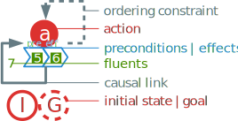
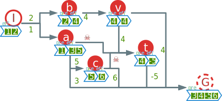
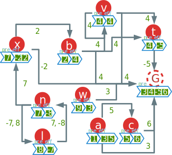
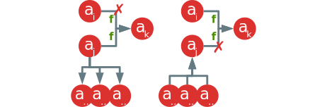

<!-- TODO discuss order of authors-->

# Introduction {-}
<!-- The Soft Ordering and Defect Aware Partial Ordering Planning algorithm (SODA POP)
This name is PERFECT ! -->

For some time Partial Order Planning (POP) has been the most popular approach to planning resolution. This kind of algorithms are based on *least commitment strategy* on plan step ordering that can allow actions to be flexibly interleaved during execution [@weld_introduction_1994]. Thus the way the search is made using flexible partial plan as a search space allowed for more versatility for a wide variety of uses. As of more recent years, new state space search models and heuristics [@richter_lama_2011] have been demonstrated to be more efficient than POP planners due to the simplicity and relevance of states representation opposed to partial plans [@ghallab_automated_2004]. This have made the search of performance the main axis of research for planning in the community <!-- TODO Ref -->.

While this goal is justified, it shadows other problems that some practical applications cause. For example, the flexibility of Plan Space Planning (PSP) is an obvious advantage for applications needing online planning: plans can be repaired on the fly as new informations and objectives enter the system. The idea of using POP for online planning and repairing plans instead of replanning everything is not new [@van_der_krogt_plan_2005], but has never been paired with the resilience that some other cognitive applications may need, especially when dealing with sensors data and noise.

This resilience makes fixing errors easier than with an external algorithm as the plan logic allows for context driven decision on the way to repair the issues. For example if an action becomes unrelevant or incoherent the flaw in the partial plan makes the problem to fix explicit and therefore easier to fix. The client softwares might sometimes provide plans that can contain errors and imperfections that will decrease significantly the efficiency of the computation and the quality of the output plan.

Adding to that, these plans may become totally unsolvable. This problem is to our knowledge not treated in planning of all forms (state planning, PSP, and even constraint satisfaction planning) as usually the aim is to find a solution relative to the original plan (which makes sense). But as we proceed a mechanism of *problem* fixing may be required. This will allow soft solving of any problem regardless of its solvability.

One of the application that needs these improvements is plan recognition with the particular use of off-the-shelf planners to infer the pursued goal of an agent where online planning and resilience is particularly important [@ramirez_plan_2009]. This method adds dummy actions that needs to be satisfied as the actions gets observed and a system that is able to repair plan in real time will allow such an application. Another application is decision-making in dynamical environment. Indeed having a plan that details all steps and explicit the ones that are not possible can help decide of the line of action to take.

These problems call for new ways to improve the answer and behavior of a planner. These improvements must provide relevant plan information pointing out exactly what needs to be done in order to make a planning problem solvable, even in the case of obviously broken input data. This paper aims to solve this while preserving the advantages of PSP algorithms (flexibility, easy fixing of plans, soudness and completeness). Our Soft Ordering and Defect Aware Partial Ordering Planning (SODA POP) algorithm will target those issues.

Our new set of auxiliary algorithms allows to make POP algorithm more resilient, efficient and relevant. This is done by pre-emptively computing proper plans for goals, by solving new kinds of defects that input plans may provide, and by healing compromised plan by extending the initial problem to allow resolution.

To explain this work we first describe a few notions, notations and specificities of existing POP algorithms. Then we present and illustrate their limitations, categorising the different defects arising from the resilience problem and explaining our complementary algorithms, their uses and properties. To finish we compare the performance, resilence and quality of POP and our solution.

# Definitions
<!-- TODO Scénario --> 
<!--In order to present our work and explain examples a way of representation for schema in figure @fig:legend and notations for mathematical representation.
--> 
First we introduce some definitions and notations for mathematical representation.

## Classical planning

A fluent is a property of the world. It is often represented by first order logical propositions but in this paper we choose to focus on the algorithm and to represent fluents as simple literals (fully instantiated). We note $\lnot f$ the complementary fluent of $f$ meaning that $f$ is true when $\lnot f$ is false and vice-versa.

In order to make our example simpler we use $\mathbb{Q}^*$, the set of relative integers without $0$, as the fluent domain. We use negative integers to represent opposite fluents.

A state is defined as a set of fluents. States can be additively combined. We note $s_1 + s_2 = \left( s_1 \cup s_2 \right) - \left\{ f \middle| f \in s_1 \land \lnot f \in s_2  \right\}$ such operation. It is the union of the fluents with an erasure of the complementary ones.

An action is a state operator. It is represented as a tuple $a = \langle pre, eff \rangle$ with $pre$ and $eff$ being sets of fluents, respectively the preconditions and the effects of $a$. An action can be used only in a state that verifies its preconditions. We note $s \models a \Leftrightarrow pre(a) \subset s$ the verification of an action $a$ by a state $s$.

An action $a$ can be functionally applied to a state $s$ following :
$$a:= \substack{ \left\{ s \models a \middle| s \in S\right\} \to S\\
    a(s) \mapsto s + eff(a)}$$ 
with $S$ being the set of all states.

There are some special names for actions. An action with no preconditions is synonymous to a state and one with empty effect is called a goal.

## Plan Space Planning

### Problem
We define a partial plan satisfaction problem as a tuple noted 
$P = \langle A, I, G, p \rangle$ with :

* $I$ and $G$ being the pseudo actions representing respectively the initial state and the goal.
* $p$ being a partial plan to refine.
* $A$ the set of all actions.

A *partial plan* is a tuple $p = \langle A_p, L\rangle$ where $A_p$ is a set of steps (actions) and $L$ is a set of causal links of the form $a_i \xrightarrow{f} a_j$, such that $\{ a_i, a_j \} \subset A_p \land f \in eff(a_i) \cap pre(a_j)$ or said otherwise that $f$ is provided by $a_i$ to $a_j$ via this causal link. We include the ordering constraints of PSP in the causal links. An ordering constraint is noted $a_i \to a_j$ and means that the plan consider $a_i$ as a step that is prior to $a_j$ without specific cause (usually because of threat resolution).

The figure @fig:legend details how the elements of partial plans are represented in the diagrams of this paper.

 {#fig:legend}

### Flaws

When refining a partial plan, we need to fix flaws. Those could be present or be created by the refining process. Flaws can either be unsatisfied subgoals or threats to causal links.

A subgoal $s$ is a precondition of an action $a_s \in A_p$ with $s \in pre(a_s)$ 
that isn't satisfied by any causal link. We can note a subgoal as :
$$a_i \xrightarrow{s} a_s \notin L \mid \{ a_i, a_s \} \subset A_p $$

A step $a_t$ is said to threaten a causal link $a_i \xrightarrow{t} a_j$ if and only if 
$$\neg t \in eff(a_t) \land a_i \succ a_t \succ a_j \models L$$ 

In other words, the action has a possible complementary effect that can be inserted between two actions needing this fluent while being consistant with the ordering constraint in $L$.

### Resolvers

Resolvers are a set of actions and causal links $r = \langle A_r , L_r \rangle$ that fixes flaws. A resolver for a subgoal is an action $a_r \in A$ that has $s$ as an effect $s \in eff(a_r)$ inserted along with a causal link noted $a_r \xrightarrow{s} a_s$. The usual resolvers for a threat are either $a_t \to a_i$ or $a_j \to a_t$ which are called respectively promotion and demotion links. Another resolver is called a white knight that is an action $a_k$ that reestablish $t$ after $a_t$ along with an ordering constraint $a_t \to a_k$ and a causal link $a_k \xrightarrow{t} a_j$.

### Solution
The solution of a PSP problem is a valid partial plan that respect the specification of said problem (only using actions in $A$ and having the correct initial and goal step).

A partial plan is consistent if it contains no ordering cycles. That means that the directed graph formed by step as vertices and causal links as edges isn't cyclical. This is important to guarantee the soundness of the algorithm.

We can instantiate one or several flat plans from a partial plan. A flat plan is an ordered sequence of actions $\pi = [ a_1, a_2 \ldots a_n]$ that acts like a pseudo action $\pi = \langle pre_\pi, eff_\pi \rangle$ and can be applied to a state $s$ using functional composition operation $\pi := \bigcirc_{i=1}^n a_n$.

We call a flat plan valid if and only if it can be functionally applied on an empty state. We note that this is different from classic state planning because in our case the initial state is the first action that is already included in the plan.

A partial plan is valid if and only if it is consistent and if all the flat plan that can be generated are valid.

# Classical POP
Partial Order Planning (POP) is a popular implementation of the general PSP algorithm. It is proven to be sound and complete [@erol_umcp:_1994]. The completeness of the algorithm guarantees that if the problem has a solution it will be found by the algorithm. The soundness assures that any answer from the algorithm is valid. POP refines a partial plan by trying to fix its flaws.

## Description

\Function{pop}{Queue of Flaws $agenda$, Problem $P$}
    \State \Call{populate}{$agenda$, $P$} \Comment{Only on first call}
    \If{$agenda = \emptyset$}
        \State \Return Success \Comment{Stop all recursion}
    \EndIf
    \State Flaw $f\gets agenda.pop$ 
    \Comment{First element of the queue}
    \State Resolvers $R \gets$ \Call{resolvers}{$f$, $P$} 
    \Comment{Ordered list of resolvers to try}
    \ForAll{$r \in R$} \Comment{Choice operator}
        \State \Call{apply}{$r$, $P.p$}
        \If{\Call{consistent}{$P.p$}} 
            \State \Call{pop}{$agenda \cup$ \protect\Call{relatedFlaws}{$f$}, $P$}
        \Else 
            \State \Call{revert}{$r$, $P.p$}
        \EndIf
    \EndFor
    \State \Return Failure \Comment{Return to last choice of resolver}
\EndFunction

From that point the base algorithm is very similar for any implementation of POP : using an agenda of flaws that is efficiently updated after each refinement of the plan. A flaw is selected for resolution and we use a non deterministic choice operator to pick a resolver for the flaw. The resolver is inserted in the plan and we recursively call the algorithm on the new plan. On failure we return to the last non deterministic choice to pick another resolver. The algorithm ends when the agenda is empty or when there is no more resolver to pick for a given flaw. 

## Limitations

This standard way of doing have seen multiple improvements over expressiveness like with UCPOP [@penberthy_ucpop:_1992], hierarchical task network to add more user control over sub-plans [@bechon_hipop:_2014], cognition with defeasible reasoning [@garcia_defeasible_2008], or speed with multiple ways to implement the popular fast forward method from state planning [@coles_forward-chaining_2010]. However, all these variants do not treat the problem of online planning, resilience and soft solving.

Some other closer works like [@van_der_krogt_plan_2005] treats the problem of online planning by removing big chuncks of the partial plan by identifying incorect trees in the plan. This causes an heavy replanning of the problem even if only one action needed removal. This is a big problem when trying to adapt a plan with minimal changes due to replanning.

Indeed, all these problems can affect POP's performance and quality as they can interfere with POP's inner working when the algorithm is able to give an answer at all.

 {#fig:problem}

Before continuing, we present a simple example of classical POP execution with the problem represented in figure @fig:problem. We did not represent empty preconditions or effects to improve readability. Here we have an initial state $I = \langle \emptyset , \{ 1, 2 \} \rangle$ and a goal $G = \langle \{ 3, 4, -5, 6 \}, \emptyset \rangle$ encoded as dummy steps. We also introduce actions that are not steps yet but that are provided by $A$. The actions $a$, $b$ and  $c$ are normal actions that are useful to achieve the goal. The action $t$ is meant to be threatening to the plan's integrity and will generate threats. We introduce $u$ as a useless action, $v$ as a toxic action, $w$ as a dead-end action and $x$ as a contradictory action. These notions will be defined [later](#defects).

 {#fig:pop}

This example has been crafted to illustrate problems with standard POP implementations. We give a possible resulting plan of standard POP in figure @fig:pop. We can see some issues as for how the plan has been built. The action $v$ is being used even if it is useless since $b$ already provided fluent $4$. We can also notice that despite being contradictory the action $x$ raised no alarm. As for ordering constraints we can clearly see that the link $a \to t$ is redundant with the path $a \xrightarrow{5} c \to t$ that already puts that constraint by transitivity. Also some problems arise during execution with the selection of $w$ that causes a dead-end.

Of course the flaw selection mechanism of certain variant can prevent that to happen in that case. But often flaw selection mechanisms are more speed oriented and will do little if a toxic action seems to fit better than a more coherent but complex one.

All these issues are caused by what we call *defects* as they are not regular PSP flaws but they still cause problems with execution and results. We will address these defects and propose a way to fix them in [the next section](#defects).

# Auxiliary algorithms to POP

In order to improve POP algorithms' resilience, online performance and plan quality, we propose a set of auxiliary algorithms that provides POP with a clean and efficiently populated initial plan. The complete algorithm will be presented in [the next section](#soda) as a combinaison of all auxiliary algorithms and regular POP.

## Proper plan generation

\Function{properPlan}{Goal $g$, Actions $A$}
    \State Partial Plan $p \gets \emptyset$
    \State Actions $relevants \gets$ \Call{satisfy}{$g$, $A$, $p$}
    \Comment{Satisfy given goal with all necessary actions and causal links}
    \State Queue of Actions $open \gets relevants$
    \While{$open \neq \emptyset$}
        \State Action $a\gets open.pop$
        \State Actions $candidates \gets$ \Call{satisfy}{$a$, $A$, $p$}
        \ForAll{$candidate \in candidates$}
            \If{$candidate \notin relevants$}
                \State $open.push(candidate)$
            \EndIf
        \EndFor
    \EndWhile
\EndFunction

As in online planning goals can be known in advance, we add a new mechanism that generates proper plans for goals. We take advantage of the fact that this step can be done offline to improve performance for online planning. This offline execution prevents us to access the details of the initial state of the world as it will be defined at runtime. We define for that the concept of *participating action*. An action $a \in A$ participates in a goal $G$ if and only if $a$ has an effect $f$ that is needed to accomplish $G$ or that is needed to accomplish another participating action's preconditions. <!-- Q:Les participating action sont des actions de l'espace d'action A ? A:Oui --> A proper plan is a partial plan that contains all participating actions as steps and causal links that bind them with the step they are participating in. This proper plan is independent from the initial step because we might not have the initial step at the time of the proper plan generation.

 {#fig:proper}

On our example it illustrate really well the need for resilience. The algorithm simply recursively chose the actions and end up with the partial plan represented in figure @fig:proper. The partial plan doesn't have an initial state (because of its offline nature). This plan also shows several cycles and obvious problems. Moreover the plan has all the steps of the correct final plan and therefore remove the subgoal search in POP if it uses this plan has input (after it has been cleaned obviously).

This auxiliary algorithm is therefore used as a caching mechanism for online planning. The algorithm starts to populate the proper plan with a quick and incomplete backward chaining.

## Defect resolution {#defects}

\Function{clean}{Problem $P$}
    \State \Call{illegal}{$P$}
    \State \Call{interfering}{$P$}
\EndFunction

\Function{illegal}{Problem $P$}
    \State \Call{assert}{$pre(P.I) = \emptyset$}
    \State \Call{assert}{$eff(P.G) = \emptyset$}
    \State $P.p.A_p \gets P.p.A_p \cup \{P.I, P.G\}$
    \State \Call{breakCycles}{$P$}
    \State Actions $actions \gets P.A \cup P.p.A_p$
    \ForAll{Action $a \in actions$}
        \State \Call{inconsistent}{$a$, $P$}
        \State \Call{toxic}{$a$, $P$}
    \EndFor
    \State \Call{liarLinks}{$P$}
\EndFunction

\Function{interfering}{Problem $P$}
    \State \Call{repeating}{$P$}
    \State \Call{useless}{$P$}
\EndFunction

When the POP algorithm is used to refine a given plan (that was not generated with POP or that was altered), a set of new defects can be present in it interfering in the resolution and sometimes making it impossible to solve. We emphasize that these defects are not regular POP flaws but new problems that classical POP can't solve. The aim of this auxiliary algorithm is to clean the plans from such defects in order to improve computational time, resilience and plan quality. It should be noted that in some cases cleaning plans will increase the number of flaws in the plan but will always improve the overall quality of it.

Plan quality is an indicator that is messured by the number of defects in a partial plan.

From there it is obvious that plan quality will improve over POP since the present algorithm is guaranteed to remove all defects in a plan.

There are two kinds of defects: the illegal defects that violate base hypothesis of PSP and the interference defects that can lead to excessive computational time and to poor plan quality.

### Illegal defects
These defects are usually hypothesized out by regular models. They are illegal use of partial plan representation and shouldn't happen under regular circumstances. They may appear if the input is generated by an approximate cognitive model that doesn't ensure consistency of the output or by unchecked corrupted data. These defects will most of the time simply break regular POP algorithms (from existing cycles) or at least make the performances decrease significantly (from toxic actions).

A plan cannot contain cycles as it makes it impossible to complete. Cycles are usually detected as they are inserted in a plan but poor input can potentially contains them and breaks the POP algorithm as it cannot undo cycles.

We use a popular and simple Depth First Search (DFS) algorithm to detect cycles. Upon cycle detection the algorithm can remove arbitrarily a link in the cycle to break it. The most effective solution is to remove the link that is the farthest from the goal travelling backward as it would be that link that would have been last added in the regular POP algorithm.
<!--TODO prove that and also code that-->

In a plan some actions can be illegal for POP. Those are the actions that are contradictory. An action $a$ is contradictory if and only if 
$$\{f, \lnot f \} \in eff(a) \lor \{f, \lnot f \} \in pre(a)$$

We remove only one of those effect or preconditions based on the usage of the action in the rest of the plan. If none of those are used we choose to remove both. In our example in figure @fig:problem the action $x$ is one of these inconsistent actions with fluent $2$ and $-2$ in its effects.

These actions are those that have effects that are already in their preconditions. This can damage a plan as well as make the execution of POP algorithm much longer than necessary. They are defined as :
$$a | pre(a) \cap eff(a) \neq \emptyset$$

This is fixed of one of two ways : if the action has only some of its fluent toxic ($pre(a) \nsubseteq eff(a)$) then the toxic fluents are removed following $eff(a) = eff(a)-pre(a)$, otherwise the action is removed alltogether from plan and $A$. For example in figure @fig:problem the action $v$ is a toxic action as the fluent $4$ is in the effects and preconditions. In this case the action $v$ will be removed by the algorithm as it doesn't have any other fluents.

The defects can be related to incorrect links. The first of which are liar links : a link that doesn't reflect the preconditions or effect of its source and target. We can note 
$$a_i \xrightarrow{f} a_j | f \notin eff(a_i) \cap pre(a_j)$$

A liar link can be either already present in the data or created by the removal of an effect of an inconsistent or toxic action (with the causal link still remaining).

To resolve the problem we either replace $f$ with a saviour, i.e. a fluent in $eff(a_i) \cap pre(a_j)$ that isn't already provided, or we delete the link all together.

### Interference defects
This kind of defects is not as toxic as the illegal ones: they won't make the plan unsolvable but they can still cause performance drops in POP execution. These can appear more often in regular POP results as they are not targeted by standard implementations.

This defect can happen in POP generated plans to some extends. A redundant link have a transitive equivalent of longer length. It means that a link $a_i \to a_j$ is redundant if and only if it exists another path from $a_i$ to $a_j$ of length greater to $1$.

Since POP relies on those additional links, this part focus on removing the ones that were generated for threat removal purpose to simplify the plan. For example in the figure @fig:pop we can see that the ordering constraint from $a$ to $t$ is redundant with the path $a \xrightarrow{5} c \to t$ in that it isn't needed to resolve the threat. Therefore the algorithm would remove it. This reduce the number of edges in the plan and therefore simplify it.

Causal links can be found to compete with one another. A competing link $a_i \xrightarrow{f} a_k$ competes with another link $a_j \xrightarrow{f} a_k$ if it provides the same fluent to the same action.

This cannot happen in classical POP algorithm so it is not handled by it. The multiple links providing the same fluent to the same action is making the plan more complex like redundant links but also can hide useless actions. This is why they must be removed in a way that reveals them and reduce the need for extra unecessary actions in the plan that would cause more flaws for POP to handle.

 {#fig:competing} <!-- FIXME Use Aller bold for fluent-->

In order to prune the least useful actions, we need to remove the least interesting link. In order to elect the best one, we compare their respective providing action. We choose the link having the providing action with the smaller outgoing degree in the planning graph. This indicates that the action is participating to more other actions. If both actions have the same outgoing degree then we remove the action with the most incoming degree. This means that we remove the more needy action.

In the example figure @fig:competing the action $a_j$ on the left participates much more than the action $a_i$ and therefore the link to be removed would be $a_i \xrightarrow{f} a_k$. On the right example the actions doesn't have different outgoing links but the action $a_j$ is here much needier than its competitor and therefore the link to be removed is the link $a_j \xrightarrow{f} a_k$.

Actions can sometimes have no use in a plan as they don't contribute to it. It is the case of orphans actions (actions without any links) and action with no outgoing path to the goal (meaning that it doesn't participates in the plan). We also consider useless actions that have no effects (except the goal step).
<!-- FIXME recursif -->
<!-- FIXME ONLINE how to remove the fake actions ???? -->

## Soft resolution
<!-- TODO examples-->

\Function{heal}{Problem $P$}
    \State int $minViolation \gets \infty$
    \State Plan $best \gets P.p$
    \State Flaw $annoyer$
    \ForAll{$\langle flaw, plan \rangle \in P.partialSolutions$}
        \State int $currentViolation \gets$ \Call{violation}{$plan$, $P.G$}
        \If{$currentViolation < minViolation$}
            \State $best \gets plan$
            \State $annoyer \gets flaw$
            \State $minViolation \gets currentViolation$
        \EndIf
    \EndFor
    \State $P.p \gets best$
    \State $P.partialSolutions \gets \emptyset$
    \ForAll{Resolver $resolver \in$ \Call{healers}{$annoyer$}}
        \State \Call{apply}{$resolver$, $P.p$}
    \EndFor
\EndFunction

This auxiliary algorithm is meant to deal with failure. It will heal the plan to make the failure recoverable for the next iteration of POP. Of course it can't fix the plan by keeping the problem as it is. This obviously breaks some properties as the algorithm no longer adheres to the specification of the input, but in exchange it will always issue a valid plan whatever happens. For more information on this property go take a look at the  [appropriate section bellow](#hypersoundness).

Soft failure is useful when the precision and validity of the output is not the most important criteria we look for. In some cases (like in recognition processes) it is more useful to have an output even if it is not exact than no output at all. That is why we propose a soft failing mechanism for POP algorithms.

### Definitions
We define first some new notions, then we will explain the healing algorithm.

A needer is an action that needs a resolution related to a flaw. We define different types of needer according to the type of the flaw.

* Subgoal needer
For a subgoal $a_n \xrightarrow{s} a_s$ the needer is the action $a_n$ that has an unsatisfied precondition in the current partial plan.

* Threat needer
The needer of a threat $a_t$ of a link $a_p \xrightarrow{t} a_n$ is the target $a_n$ of the threatened causal link.

 
A proper fluent of a flaw is the one that caused the flaw. For a subgoal $a_n \xrightarrow{s} a_s$ it is the unsatisfied precondition $s$. For a threat $a_t$ of a causal link $a_p \xrightarrow{t} a_n$ it is the fluent $t$ held by the threatened causal link.

 
The saviour of a flaw is the forged action $a_s = \langle \emptyset, \{p\} \rangle | a_s \notin A$ with $p$ being the proper fluent of the flaw.

 
The concept of healer is made to target rogue flaws that caused total failure. A healer is a resolver that is built around the saviour of the flaw in order to provide the missing fluents to it. The general formula of a healer is the following :
$$a_s \xrightarrow{p} a_n$$
with $a_s$ being the saviour of the flaw.

For threats we need an additional healer specified as an ordering constraint from the threatening action to the saviour $a_t \to a_s$ to ensure that the saviour acts after the threat and therefore provides the proper fluent for the needer.

 
The violation degree $v(p)$ of a plan $p$ is an indicator of the health of a partial plan. It is the sum of the number of flaws and the number of saviours in the plan.

### Healing process

The healing method is to keep track of reversions in the algorithm by storing the partial plan and the unsatisfiable flaw each time a non deterministic choice fails. We note the set of these failed plans $F$. As the POP algorithm encounters a final failure, this auxiliary algorithm get invoked. The aim is to evaluate each backtracking partial plan to choose the best one.

Therefore we add an order relation for $F$ noted 
$$\prec : p \prec q \iff v(p) < v(q) | \{p, q\} \subset F$$ <!-- FIXME necessary ? -->

Once the POP algorithm fails completely the soft failing algorithm can be invoked to heal the plan. It chooses the best plan $b | \forall p \in F, b \prec p$ to heal it. If two plans have the same violation degree, the algorithm chooses one arbitrarily <!-- FIXME better if chosen by order of occurence-->.

The healing process is similar to how POP works : we apply the healer of the flaw that caused the failure of the partial plan we chosen. We empty the set $F$ to allow POP to iterate further since the flaw is resolved. The healing process can be done for each unsolved flaws as POP fails repeatedly. This ensures some interesting properties explained in the following section.

# SODA POP and its properties {#soda}
After defining the way our algorithms work we will focus on the properties that can be achieved by combining them together.

\Function{soda}{Problem $P$}
    \State $P.p \gets$ \Call{properPlan}{$P.G$, $P.A$} \Comment Offline execution then this will be replaced by the previous online plan adjusted with the environment.
    \State \Call{clean}{$P$}
    \State bool $valid \gets false$
    \While{$\lnot valid$}
        \State $valid \gets$ \Call{pop}{$P$} $= Success$
        \If{$valid$} \State \Call{clean}{$P$} \State \Return $Success$ \EndIf
        \State \Call{heal}{$P$}
    \EndWhile
\EndFunction

## Convergence of POP {#convergence}
As to our knowledge no proof of the convergence of POP has been done we want to explicitly formulate one. 

The classic planning problem is already proven to be decidable without functions in the fluents [@ghallab_automated_2004]. Therefore we can categorise the termination cases. 

In the case of a solvable problem, POP is proven to be complete. This ensures that it will find a solution for the problem and therefore terminate.

Now for the more complex case of unsolvable problems we need to refer to the way POP works.

POP algorithm will seek to solve flaws. Be $flaws(p)$ the set of flaws of a given parial plan. 

The number of flaws is the number of subgoals plus the number of threats 
$$flaws(p) = subgoals(p) \cup threats(p)$$

We consider the number of actions $\#A$ as being finite. Therefore the number of steps in the plan is at worse $\#A_p = \#A$. We also assume that actions has a finite number of preconditions and effects (since we don't use functions over fluents). This leads to :
$$\#subgoals(p) < \sum_{a \in A_p} \#pre(a) < \infty$$
$$\#threats(p) < \#L \le \sum_{a \in A_p} \#pre(a) < \infty$$

This means the number of all possible flaws is finite. As POP resolves these flaws it will decrease their numbers and iterate over resolvers. The number of resolver is $\#subgoals(p) * \#A + \#threats(p) * 2$ and is also finite. This means that the iteration will in the worst case be of the number of resolvers before failing and this prooves that the algorithm terminates.

## Hypersoundness {#hypersoundeness}

Now that we proved that regular POP converges we can introduce the next property : hyper soundness.

An algorithm is said to be hypersound when it gives a valid solution for all problems regardless of their solvability.

We note that this property isn't compatible with consistency regarding the original problem and then doesn't fit the classical idea of soundness that implicitly states that the validity of a solution is relative to the problem. In the case of hypersoundness the problem is valid and a solution to a problem $P' = \langle A', I,  G, p\rangle$. We note the new set $A' = A \cup S$ with $S$ being the set of saviours for all flaws that made the POP algorithm fails during the execution of SODA.

The hypersoundness of our combined algorithm is proven using the convergence of POP and the way the Soft solving behaves.

The proper plan and defect fixing algorithms are obviously convergent. The proper plan algorithm can't iterate more than the number of actions (since duplicates are forbiden) and the defect resolution will fix the finite numbers of defects present in the finite partial plan issued by the proper plan algorithm.

POP is sound and converges. Therefore if SODA converges it will return a valid solution for $P'$. In the same way we prooven for POP, the new healing process converges because it reduces the number of flaws in the partial plan and since this number is finite, the algorithm converges.

## Enhancement for online planning

SODA POP algorithms can be used in dynamic online environments to allow a robust way to replan an existing obsolete plan. The first thing to execute prior to the runtime is the generation of the proper plans of all the goals that will be considered. 

For the first execution of the online planning the initial state is added to the problem and the defect detection is applied with the rest of the SODA POP algorithms. This will give the first plan. 

On change of environment the previous plan is modified accordingly and then fed to the defect detection and SODA algorithm again. This must be done each time the plan is modified in order to actualise the plan. <!-- FIXME The online part won't remove actions that aren't needed anymore ... -->

In practice this will generate little to no iteration of the algorithm. <!-- The main problem here is that some actions may remain in the plan even if they are obsolete from the initial step !!!  -->

# Experimental results
<!-- TODO obviously -->

# Conclusion {-}

<!-- TODO say source code will be available -->

# References

