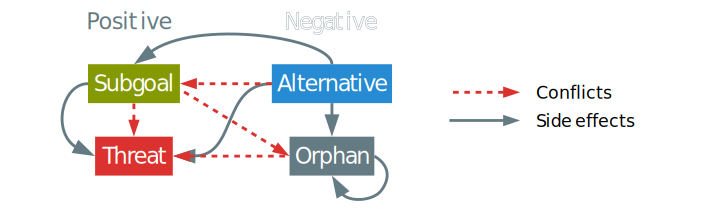

<!-- IDEAS
[Plan Space]        Approach:: idea
[POCL]                Method:: Formalism
[Flaws, Refinement]    Model:: Element of formalism
[Flaw selection]    Mechanism:: Algorithm is the implementation of mechanism
[POP Algorithm]        System :: implementation
-->

<!-- FIXME
* Examples pour chaque notion + solution de l'example et explicitation des défauts
* Étude formelle : choix + propriété + complexité
* Style : moins parlé et plus formel - tentative + consciousness
-->

**# Everything that starts with a # is purely commentary and WILL be removed**

# Introduction {-}

Until the end of the 90s, plan space planning was generally preferred by the automated planning community. Its early commitment, expressivity and flexibility were clear advantages over state space planning. However, more recently, drastic improvements in state search planning was made possible by advanced and efficient heuristics. This allowed those planners to scale up more easily than plan-space search ones, notably thanks to approaches like GraphPlan [@blum_fast_1997], fast-forward [@hoffmann_ff_2001], LAMA [@richter_lama_2011] and Fast Downward Stone Soup [@roger_fast_2014].

The evolution of interest often leads to a preference for performances upon other aspects of the problem of automated planning. Some of these aspects can be more easily addressed in Partial Order Planning (POP). For example POP, has can take advantage of least commitment [@mccluskey_engineering_1997] that offers more flexibility with a final plan that describes only the necessary order of the actions considered without forcing a particular order. POP has also been proven to be well suited for multi-agent planning [@kvarnstrom_planning_2011] and temporal planning [@benton_temporal_2012] <!-- Refs from [@shekhar_learning_2016] -->. These advantages made UCPOP [@penberthy_ucpop_1992] one of the best POP planner of its time with works made to port some of its characteristics into state-based planning [@gazen_combining_1997].

Related works already tried to explore new ideas to make POP into an attractive alternative to regular state-based planners like the appropriately named "Reviving partial order planning" [@nguyen_reviving_2001] and VHPOP [@younes_vhpop_2003]. More recent efforts [@coles_forwardchaining_2010; @sapena_combining_2014] are trying to adapt the powerful heuristics from state-based planning to POP's approach. An interesting approach of these last efforts is found in [@shekhar_learning_2016] with meta-heuristics based on offline training on the domain. However, we clearly note that only a few papers lay the emphasis upon plan quality using POP [@ambite_planning_1997; @estlin_learning_1997].

This work is the base of our project of an intelligent robotic system that can use plan and goal inference to help dependant persons to accomplish tasks. This project is based on the works of Ramirez et al. [@ramirez_plan_2009] on inverted planning for plan inference. That is what we need to improve POP with better refining techniques and utility driven heuristics. Since we need to handle data derived from limited robotic sensors, we need a way for the planner to be able to be resilient to basic corruption on its input. Another aspect of this work lies in the fact that the final system will need to compute online planning with a feed of observational data. In order to achieve this we need a base planner that can:

* refine existing partial plans for online planning,
* be able to optimize a plan by removing unnecessary steps,
* and be able to select the best-suited action for providing each subgoal.

The classical POP algorithm doesn't fit these criteria but can be enhanced to fit the first criteria. Usually, POP algorithm takes a problem as an input and uses a loop or a recursive function to refine the plan into a solution. We can simply expose the recursive function in order to be able to use our existing partial plan. This, however, causes multiples side effects if the plan is suboptimal.

*Our view* on the problem diverges from other works: Plan-Space Planning (PSP) is a very different approach that state space planning. It is usually more computationally expensive than modern state space planners but brings several advantages. We want to make the most of the differences of POP instead of trying to change its fundamental nature.

That view is at the core of our model: we use the refining and least commitment abilities of POP in order to improve online performances and quality. In order to achieve this, we start by computing a *domain proper plan* that is computed offline with the input of the domain. The explanation of the way this notion is defined and used can be found in @sec:properplan of the present paper.

Using existing partial plans as input leads to several issues, mainly with new flaw types that aren't treated in classical POP. This is why we focus the @sec:negative of our paper on plan quality and negative refinements. We, therefore, introduce new negative flaws and resolvers that aim to fix and optimise the plan: the alternative and the orphan flaws.

A side effect of negative flaws and resolvers is that they can interfere with each others and need guiding to cooperate into making use of least commitment and to participate in a better solution quality. That is the reason behind the @sec:selection of our work: goal and flaw selection that aims to reduce the branching factor of our algorithm.

**#TODO To prove**

All these mechanisms are part of  our aLternative Optimization with partiaL pLan Injection Partial Ordered Planning (LOLLIPOP) algorithm presented in details in @sec:algorithm. We prove that the use of these new mechanisms leads to fewer iterations, a reduced branching factor and better quality than standard POP in @sec:proofs. Experimental results and benchmarks are presented and explained in the @sec:results of this paper.

Before explaining our solution we need to detail the existing POP and its limitations.

# Classical Partial Order Planning Framework

<!--With the aim to respect the constraints of our applicative field, we need to define our own planning framework. Indeed, classical planning framework is usually compiled away in order to quicken a single benchmark run and are not thought for dynamical online planning in complex environments.--> While needing expressivity and simplicity in our domain definition we also need speed and flexibility for online planning on robots. <!--This led to a new framework named WORLD, as it is intended for more generalistic world description purpose.--> Our framework is inspired by existing multi-purpose semantic tools such as RDF Turtle [@w3c_rdf_2014] and has an expressivity similar to PDDL 3.1 with object-fluents support [@kovacs_bnf_2011]. This particular type of domain description was chosen because we intend to extend works on soft solving in order to handle corrupted data better in future papers. The next definitions are based on the ones exposed in [@gobelbecker_coming_2010].

## Basic Definitions

Every planning paradigm needs a way to represent its fluents and operators. Our planner is based on a rather classical domain definition with lifted operators and representing the fluents as propositional statements.

We define our planning domain as a tuple $\Delta = \langle T, C, P, F, O \rangle$ where

* $T$ are the **types**,
* $C$ is the set of **domain constants**,
* $P$ is the set of **properties** with their arities and typing signatures,
* $F$ represents the set of **fluents** defined as potential equations over the terms of the domain,
* $O$ is the set of optionally parameterized **operators** with preconditions and effects.

<!--
**#This part isn't used after and is relevant only to the WORLD framework**

The symbol system is completed with a notion of **term** (either a constant, a variable parameter or a property) and a few relations. We provide types with a relation of **subsumption** noted $t_1 \prec t_2$ with $t_1, t_2 \in T$ meaning that all instances of $t_1$ are also instances of $t_2$.
On terms, we add two relations: the **assignation** (noted $\leftarrow$) and the **potential equality** (noted $\doteq$).-->

Along with a domain, every planner needs a problem description in order to work. For this, we use the classical problem representation with some special additions.

The planning problem is defined as a tuple $\Pi = \langle \Delta, C_\Pi, I, G, p\rangle$ where

* $\Delta$ is a planning domain,
* $C_\Pi$ is the set of **problem constant** disjoint from $C$,
* $I$ is the **initial state**,
* $G$ is the **goal**,
* $p$ is a given **partial plan**.

The framework uses the *closed world assumption* in which all predicates and properties that aren't defined in the initial step are assumed false or don't have a value.

We want to introduce a problem in @fig:example that we will use to examplify the presented notion.

{#fig:example}

In order to simplify this framework we need to introduce some differences from the classical representation. For example, the partial plan is a part of the problem tuple as it is
a needed input of the LOLLIPOP algorithm.

We define a partial plan as a tuple $\langle S, L, B\rangle$ with $S$ the set of **steps** (semi or fully instantiated operators also called *actions*), $L$ the set of **causal links**, and $B$ the set of **binding constraints**.

In classical representations, a set of *ordering constraints* is also added.We propose to factorise this notion as being part of the causal links which are always supported by an ordering constraint. The only case where bare ordering constraints are needed is in threats. We decided to represent them with "bare causal links". These are stored as causal links without bearing any fluents.
This also eases implementation with the definition of the causal link giving only one graph of steps with a (possibly empty) list of fluents as a label as our main definition for a partial plan.
That allows us to introduce the **precedence operator** noted $a_i \succ a_j$ with $a_i, a_j \in S$ iff there is a path of causal links that connects $a_i$ with $a_j$ with $a_i$ being *anterior to $a_j$.

A specificity of Partial Order Planning is that it fixes flaws in a partial plan in order to refine it into a valid plan that is a solution to the given problem. In this section, we define the classical flaws in our framework.

A flaw in a partial plan, called subgoal is a missing causal link required to satisfy a precondition of a step. We can note a subgoal as:
$a_p \xrightarrow{s} a_n \notin L \mid \{ a_p, a_n \} \subseteq S$
with $a_n$ called the **needer** and $a_p$ an eventual **provider** of the fluent $s$. This fluent is called *open condition* or **proper fluent** of the subgoal.

A flaw in a partial plan, called threat consists of having an effect of a step that can be inserted between two actions with a causal link that is intolerant to said effect.
We say that a step $a_b$ is threatening a causal link $a_p \xrightarrow{t} a_n$ iff
$\neg t \in eff(a_b) \land a_p \succ a_b \succ a_n \models L$
with $a_b$ being the **breaker**, $a_n$ the *needer* and $a_p$ a *provider* of the *proper fluent* $t$.

Flaws are fixed via the application of a resolver to the plan. A flaw can have several resolvers that match its needs.

A resolver is a potential causal link defined as a tuple $r = \langle a_s, a_t, f\rangle$ with :

* $a_s, a_t \in S$ being the source and target of the resolver,
* $f$ being the considered fluent.

For standard flaws, the resolvers are simple to find. For a *subgoal* the resolvers are a set of the potential causal links between a possible provider of the proper fluent and the needer. To solve a *threat* there is mainly two resolvers: a causal link between the needer and the breaker called **demotion** or a causal link between the breaker and the provider called **promotion**.

Once the resolver is applied, another important step is needed in order to be able to keep refining. The algorithm needs to find the related flaws of the elected resolver. These related flaws are searched by type.

Flaws that arise because of the application of a resolver on the partial plan are called *related flaws*. They are caused by an action $a_t$ called the **trouble maker** of a resolver. This action is the *source* of the resolver if it was inserted into the plan.

We can derive this definition for subgoals and threats:

* **Related Subgoals** are all the open conditions inserted with the *trouble maker*. The subgoals are often searched using the preconditions of the trouble maker and added when no causal links satisfy them.
* **Related Threats** are the causal links threatened by the insertion of the *trouble maker*. They are added when there is no path of causal links that prevent the action to interfere with the threatened causal link.

{#fig:partialplan1}

In the partial plan presented in @fig:partialplan1, we consider that a resolver providing the fluent `robot holds key` is considered. This resolver will introduce the open conditions `robot holds nothing, key room _room, robot room _room` since it we just introduced this instanciation of the `grab` operator in the partial plan. Each of these will trigger a related subgoal that will have this new `grab` operator as their needer. The potential related threat of this resolver is that the effect `robot holds key` might threaten the link between the existing `unlock` and `grab` steps but won't be considered since there are no way the new step can be inserted after `unlock`.

There is no need to search for related flaws when fixing a threat or when simply adding a causal link between existing steps.

## Classical POP Algorithm

The classical POP algorithm is pretty straight forward: it starts with a simple partial plan and refines its *flaws* until they are all resolved to make the found plan a solution of the problem.

\footnotesize
\Function{pop}{Queue of Flaws $a$, Problem $\Pi$}
    \State \Call{populate}{$a$, $\Pi$} \Comment{Populate agenda only on first call}
    \If{$a = \emptyset$}
        \State \Return Success \Comment{Stop all recursion}
    \EndIf
    \State Flaw $f \gets$ \Call{choose}{$a$} \label{line:flawselection}
    \Comment{Non deterministic choice}
    \State Resolvers $R \gets$ \Call{resolvers}{$f$, $\Pi$}
    \ForAll{$r \in R$} \Comment{Non deterministic choice operator}
        \State \Call{apply}{$r$, $\Pi.p$} \label{line:resolverapplication} \Comment{Apply resolver to partial plan}
        \State $a \gets a \cup$ \Call{related}{$r$} \Comment{Related flaws introduced by the resolver}
        \If{\protect\Call{pop}{$a$, $\Pi$} = Success} \Comment{Refining recursively}
            \State \Return Success
        \EndIf
        \State \Call{revert}{$r$, $\Pi.p$} \Comment{Failure, undo resolver insertion}
    \EndFor
    \State \Return Failure \Comment{Revert to last non deterministic choice of resolver}
\EndFunction

The @alg:pop is inspired by [@ghallab_automated_2004]. This POP implementation uses an agenda of flaws that is efficiently updated after each refinement of the plan. At each iteration, a flaw is selected and removed from the agenda (@line:flawselection). A resolver for this flaw is then selected and applied (@line:resolverapplication). If all resolvers cause failures the algorithm backtracks to the last resolver selection to try another one. The algorithm terminates when no more resolver fits a flaw (`Failure`) or when all flaws have been fixed (`Success`).

This standard implementation has several limitations. First, it can easily make poor choices that will lead to excessive backtracking. It also can't undo redundant or nonoptimal links if they don't fail.

To illustrate these limitations, we use the example described in @fig:example where a robot must fetch a lollipop in a locked room. This problem is quite easily solved by regular POP algorithms.

**#L: donner des refs de regular POP algo ? A: < Ref 21**

However, we can have some cases where small changes in POP's inputs can cause a lot of unnecessary back-trackings. For example, if we add a new action called `go_throught_wall` that has as effect to be in the desired room but that requires an hammer, the algorithm will simply need more backtracking. The effects could be worse if obtaining the hammer would require a large number of steps (for example needing to build it). This problem can be solved most of the time using simple flaw selection mechanisms. However, this was never applied in the context of POP. <!-- The other limitation arises when the input partial plan contains cycles. For example lets consider a plan that contains a loop of the form $go(robot, livingroom) \rightarrow grab(robot, keys) \rightarrow go(robot, corridor) \rightarrow go(robot, livingroom)$. Since there isn't any refining method to fix existing cycles in POP the cycle will remain in the plan. This directly breaks the soundness and completeness of POP since it will either fail even if there is a solution to the problem or return a solution with a cycle.--> Regular POP algorithms do not consider this issue as they do not take a partial plan as input.
**#FIXME Not flagrant in current example, others could argue it is all artificial and that the problem doesn't really exists**

**#L: Il faut justifier ces limitations étant donné ton contexte … wan have several limitations in the context of … where cycles can be present in the input partial plan or …**

# Method

## Proper Plan Generation and Injection {#sec:properplan}

One of the main contributions of the present paper is our use of the concept of *domain proper plan* in order to quickly derive a partial plan from it. First of all we need to define what is a domain proper plan.

The proper plan $\Delta^P$ of a planning domain $\Delta$ is a labelled directed graph that binds two operators $o_1 \xrightarrow{f} o_2$ iff it exists at least an unifying fluent $f \in eff(o_1) \cap pre(o_2)$ between them.

This definition was inspired by the notion of domain causal graph as explained in [@gobelbecker_coming_2010] and originally used as heuristic in [@helmert_fast_2006]. A variation of this notion was used in [@smith_postponing_1993] that builds the operator dependency graph of goals and uses precondition nodes instead of labels. A proper plan is, therefore, an *operator dependency graph* for the domain. With this information, we can know how potentially useful an operator can be in any plan. Deriving from it is the providing map that indicates, for each fluent, the list of operators that can provide it.

The continuous lines of @fig:properplan represent the proper plan of our example domain. <!--FIXME speech flow broken-->

\footnotesize
\Function{lollipop}{Queue of Flaws $agenda$, Problem $\Pi$}
    \State \Call{solveallworldsproblems}{$agenda$, $\Pi$} \Comment{Only on first call}
\EndFunction

**#TODO [Of course !](https://youtu.be/1W7c8QghPxk)**

The generation of the proper plan is based upon the previous definition: It will explore the operators space and build a causal map that gives the provided fluents for each operator. Once done it will iterate on every precondition and search for a satisfying cause in order to add the causal link to the proper plan.

**#FIXME rewrite that once the @alg:properplan is done**

{#fig:properplan}

**#FIXME rewrite all that garbage**

The next step is to derive a viable partial plan from the proper plan. The main problem with this is the lack of initial or goal step in it. Since it is made during domain compilation time, the mechanism doesn't have access to the problem's data. That is why during the problem processing phase, the initial and goal step will be injected into the plan. This uses @alg:properplan with the initial and goal steps as new operators. It will bind the initial step to the operators that can be used in the initial world state and the goal step to the operators that can fulfil its preconditions.

In [@fig:properplan] we illustrate the proper plan mechanics with our previous example. Cycles in this graph contain information regarding the dependencies of operators. We call *co-dependent* several operators that form a cycle. If the cycle is made of only one operator (self-loops) then it is called *auto-dependent*. This information allows detecting early inconsistencies in the plan when instantiating the operators in relation to the initial and goal steps. The solution is then to simply remove inconsistent causal links while saving them as potentially problematic. Then the initialization algorithm only has to break the remaining loops using cycle flaws. This flaw is described in @sec:negative.

The last of these problems is that even if the proper plan can be coherent and even solve the problem, it may contain many unnecessary steps. This is the main reason why we introduce *negative refinements* in the next section.

## Negative Refinements and Plan Optimization {#sec:negative}

The Classical POP algorithm works upon a principle of positive plan refinements. The two standard flaws (subgoals and threats) are fixed by *adding* steps, causal links, or variable binding constraints to the partial plan. In our case, it is important to be able to *remove* part of the plan that isn't necessary for the solution.

Since we are given a partial plan that is quite complete, we need to add new flaws to optimize and fix this plan. These flaws are called *negative* since their resolvers differ from classical ones from their effects on the plan.

<!--

A cycle is a flaw corresponding to a set of causal links that form a loop. A causal link $a_i \rightarrow a_j$ belongs to a cycle iff it exists a path from $a_j$ to $a_i$. If $a_i = a_j$ the cycle is a self-loop.

The complete path of a cycle is called a **closed walk**. In order to improve runtime efficiency, the cycles are detected as the proper plan is built: during domain compilation phase that will be detailed in @sec:algorithm.-->

An alternative is a negative flaw that occurs when it exists a better provider choice for a given link.
An alternative to a causal link $a_p \xrightarrow{f} a_n$ is a provider $a_b$ that have a better *utility value* than $a_p$.

The **utility value** is a measure of the usefulness and at the heart of our heuristics detailed in @sec:selection. It uses the incomming and outgoing degree of the operator to measure its usefulness.

Finding alternative requires an iteration over all edges of the partial plan. This makes that search computationally expensive. That is the reason why, like cycles, alternatives are searched during the domain compilation time.

An orphan is a negative flaw that means that a step in the partial plan (other than the initial or goal step) is not participating in the plan. Formally, $a_o$ is an orphan iff $a_o \neq I \land a_o \neq G \land p.d^+(a_o) = 0$.

With $p.d^+(a_o)$ being the outgoing degree of $a_o$ in the dirrected graph formed by $p$.

With the introduction of negative flaws comes the modification of resolvers to handle negative refinements. We add onto the @def:resolver :

A signed resolver is a resolver with a notion of sign. We add to the resolver tuple $s$ as the sign of the resolver in $\{+, -\}$.

An alternative notation for the signed resolver is inspired by the causal link notation with simply the sign underneath :
$$r = a_s \xrightarrow[+/-]{f} a_t$$

The previously defined negative flaws have all their associated negative resolvers.

A *cycle* has as negative resolvers each causal link belonging to its closed walk. This way the algorithm detects that there are no solution if there are no ways to remove any of the causal links of the cycle.

The solution to an alternative is a negative refinement that simply remove the targeted causal link. We count on the fact that this will create a new subgoal that will priorities its resolver by usefulness and then pick the most useful provider.

The resolver for orphans is the negative refinement that is only meant to remove the targeted action and its incoming causal link while tagging the sources of them as potential orphans.

{#fig:conflicts}

**#TODO remove cycles !**

The standard mechanism of related flaws needs an upgrade since the new kind of flaws can easily interfere with one another. The @fig:conflicts illustrate the notion of **side effects** of flaws. This notion drives the search mechanism of related flaws for negative resolvers. When treating positive resolvers nothing need to change from the classical method. When dealing with negative resolvers, we need to search for additional subgoals and threats. In fact, negative refinements will most likely cause an increase in subgoals or threats since they remove causal links or steps. This deletion of causal links and steps can cause orphan flaws that need to be identified for removal. These interactions between flaws are decisive in the validity and efficiency of the whole model, that is why we aim to drive flaw selection in a very rigorous manner.

## Driving Flaws and Resolvers Selection {#sec:selection}

Resolvers and flaws selection are the keys to improving performances. Choosing a good resolver helps to reduce the branching factor that accounts for most of the time spent on running POP algorithms. Flaw selection is also very important for efficiency, especially when considering negative flaws which can enter into conflict with other flaws.

**#TODO Example**

Flaws conflicts happen when two negative flaws or flaws of oposite sign target the same element of the partial plan. Since we have a limited number of flaw types we synthesise all the conflict information in the @fig:conflicts. It also shows the *direction* of the conflict meaning that the source of the conflict is meant to be solved prior to the other. To avoid conflicts from happening we need to order the flaws following these priorities so that two flaws that are in conflict are either canceled or one of them removed.

If we order the conflicts using their priorities we have, at first, cycles that are meant to be solved before any other flaws since they will alter the topography of the graph. We need to make sure that alternative doesn't overlap with the *closed walk* of a cycle before it gets fixed. However, knowing that an alternative is in the cycle makes the common causal link a better candidate for removal.

**# There is maybe a way to tweak the degrees or the utility value in order to "trick" alternative into forcefully breaking cycle in a smarter, factorized and more efficient way**

The alternatives are meant to be resolved before subgoals before they only remove the link while adding a corresponding subgoal that will select the better alternative provider and add the causal link. Also, subgoals need to be resolved before orphan. Indeed, a subgoal may need an orphan tree that is already computed and it would be inefficient to force to compute it again if the orphan removed it too soon. However, orphans can help solve ghost threats that arise if an orphan threatens another causal link. The last conflict is a well-studied one since it arises between subgoals and threats. Indeed, there are different ways to make sure that threats get delayed in order for them to be solved by subgoals. This is the main idea behind early improvements of POP [@peot_threatremoval_1993].

In our model, the flaw selection follows this general order:

1. **Cycles** that comes from the original domain proper plan are an indication that some operators are co-dependent and that is often where problems arise. This step is also the most susceptible to cause an early failure wich is very beneficial for the speed of the algorithm.
2. **Alternatives** will cut causal links that have a better provider. It is necessary to identify them early since they will add at least another subgoal to be fixed as a related flaw.
3. **Subgoals** are the flaws that cause the most branching factor for POP algorithms. This is why we need to make sure that all open conditions are fixed before proceeding on finer refinements.
4. **Orphans** are a fine optimisation of plans. They remove unneeded branches of the plan. However, these branches can be found out to be necessary for the plan in order to meet a subgoal. Since a branch can contain numerous actions it is preferable to let the orphan in the plan until they are no longer needed.
5. **Threats** occur quite often in the computation. They cost a lot of processing power since they need to check is there are no paths that fix the flaw already. They also are side-effect heavy and numerous threats are generated without actual need of intervention. That is why we prioritise all related subgoals and orphans before threats because they can actually add causal links or remove threatening actions that will fix the threat.

**#FIXME Redo all this part + miniproperties**

**#Is a utility function named "heuristic" or do we need to change that name in the whole paper ?**

A heuristic is a function that allows to rank operators. This is at the heart of the algorithm since it will choose the most useful provider during goal selection and chose which link to cut with alternative flaws. Information driven selection was already shown as a performance improvement mechanism in [@younes_vhpop_2003] as several heuristics were combined to improve POP's efficiency.

In our case, we chose to have one main heuristic that aims to lower branching factor by trying to make the base operations more aware of the utility of the considered data. Design choice of this kind has heavy effects on performances [@kambhampati_design_1994].

The aim is to define heuristics that have a sense of the usefulness of an operator or step. In order to do that, we need to define a function that will give a higher value the more the action participates potentially or effectively in a plan and a lower value the more it is needy.

Degrees are meant to measure the usefulness of an operator. The notion is derived from the incoming and outgoing degree of a node in a graph.

We note $g.d^+(o)$ and $g.d^-(o)$ respectively the outgoing and incoming degree of an operator in a plan. These represent the number of causal links that goes out or toward the operator. We call proper degree of an operator $o.d^+ = |eff(o)|$ and $o.d^- = |pre(o)|$ the number of potential usefulness of an operator based on its number of preconditions and effects.

There are several ways to use the degrees as indicators. The goal is to increase the *utility value* with every $d^+$, since this reflects a positive participation in the plan, and decreases it with every $d^-$ since actions with higher incoming degrees are harder to satisfy. With this idea in mind, we try several formulas for utility values. In order to unify the notation we decide to transform the data into tuples with degrees ordered from the most specific to the most general : $d^\pm(o) = \langle P.d^\pm(o), \Delta.d^\pm(o), o.d^\pm \rangle$

**#I can't choose one without implementation tests because I won't rewrite everything if I am wrong**

A way to achieve this is to simply subtract the negative degrees from the positive ones and to do the product of all the results:

$$
h_{simple} = \alpha_{simple} \prod_{i=1}^3 d^+_i(o) - d^-_i(o)
$$

with $\alpha_{simple}$ being the unification constant. It is used to adjust the value of the heuristics to similar levels as to other heuristics for comparison. We can see two problems with this approach: it gets to zero if any data misses or if any degree cancels each other. This is problematic since it means that the result gets less entropy from the data than it should.

We can also use the ratio of the degrees. The problem is that it often occurs that any divisor will turn out to be zero, wich is problematic. A simple workaround is to simply add a constant to the divisor :

$$
h_{ratio} = \prod_{i=1}^3 {{d^+_i(o)} \over {d^-_i(o) + \alpha_{ratio}}}
$$

Taking the previous approach and trying another way to deal with null divisor gave this solution. We use powers to actually transform the quotient into a product :

$$
h_{logarithmic} = \left( \sum_{i=1}^3 d^+_i(o) \right) \times \alpha_{logarithmic}^{-\sum_{i=1}^3 d^-_i(o)}
$$

This has the advantage to be able to be more finely tune the way the heuristic behaves, we can make incoming edges more or less damaging to the utility of an action.

We can also combine the data by seeing it as vectors. A classical operation that can be done between two vectors is to get the dot product of the two. The formula becomes:

$$
h_{scalar} = \alpha_{scalar} \times \left( d^+(o) \cdot -d^-(o) \right)
$$

Since most of the time we get big negative values we chose to often make $0 < \alpha_{scalar} < 1$.
<!-- Syntax coloring bug -_- -->

Another operation that can be done on vectors is to take the norm of the product of the two vector. This gives us :

$$
h_{vectorial} = \alpha_{vectorial} \times \left | d^+(o) \times -d^-(o) \right |
$$

{#fig:heuristics}

These heuristics have clearly different behaviours. To illustrate this we plotted the values given by each of them in our example in @fig:heuristics.

**#TODO No theoretical analysis available yet.**

## LOLLIPOP Algorithm {#sec:algorithm}

**#TODO Algorithm and explanation are derived from the Java source code …**

# Analysis

## Properties and Proofs {#sec:proofs}
<!--FIXME better title or something ? -->

**#TODO List of properties:**

* Lollipop is complete and sound (which is quite important)
* Lollipop will always output plans at least as good as POP (define a measure of quality first)
* Lollipop won't need to compute more standard flaw than POP

The proof

# Experimental Results {#sec:results}

**#TODO Things we want to know:**

* Is Lollipop faster than POP ? in which cases?
* Is the lollipop competitive in small problems?
* which heuristic are the best? How to improve? Metaheuristic ?
* Measure the increase in quality
* Plot the selection time and every other indicator are taken in [@kambhampati_design_1994]

# Conclusion {-}

**#TODO Things we want to discuss:**

* Discussion of results and properties
* Summary of improvements
* Introducing soft solving and online planning.
* Online planning
* plan recognition and constrained planning

# Conclusion {-}

**#TODO**

# References
