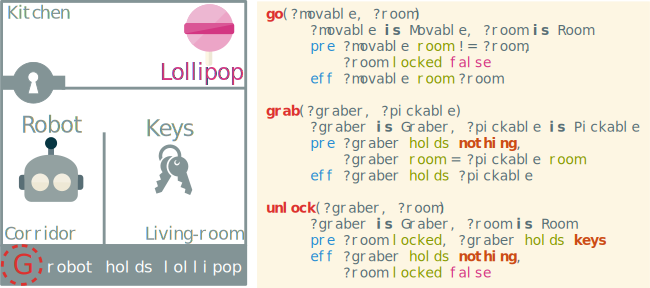

# Introduction {-}

For a long time, in the automated planning domain, the dominant approach was Partial-Order Planning (POP). It was praised for its least commitment orientation that makes it more efficient than classical planning and also more of an elegant solution for its flexibility. However, in the recent years, drastic improvements in state search planning was made possible by advanced and efficient heuristics. This allows such planners to scale up much better than plan-space search ones, notably thanks to approaches like GraphPlan [@blum_fast_1997], fast-forward [@hoffmann_ff_2001] and LAMA [@richter_lama_2011].

This search of scalability and performance hides the greatest advantage of POP: flexibility. This advantage allows POP to efficiently build plans with the parallel use of actions. It also means that it can refine broken plans and optimize them further than a regular state-based planner. This was shown clearly during the golden age of POP with UCPOP [@penberthy_ucpop_1992] that was a reference in terms of quality and expressiveness for years, to such extends that other works tried to inject state-space planners with its advances [@gazen_combining_1997].

In this paper, we explore new ideas to revive POP as an attractive alternative to other totally ordered approach. Some papers like the appropriately named "Reviving partial order planning" [@nguyen_reviving_2001] and VHPOP [@younes_vhpop_2003] already tried to extend POP into such an interesting alternative. More recent efforts [@coles_forwardchaining_2010; @sapena_combining_2014] are trying to adapt the powerful heuristics from state-based planning to POP's approach.

Our approach is different: we want to build a robust and quality oriented planner without losing speed. In order to achieve this, the planner is implemented in its recursive form and takes a partial plan as an input. For our system, we prepopulate this plan with the causal graph that was processed during the domain compilation phase. This allows our algorithm to have a significant head-start in relation to most planners as the plan is already almost complete in most cases. This is described in @sec:causalgraph of the present paper.

The problem with this is that this partial plan contains problems that can break the POP algorithm (such as cycles) or that can drive it toward nonoptimal plans. This is why we focus the @sec:negative of our paper on plan quality since we need to have negative refinements on our input plan. This leads naturally toward the introduction of negative flaws that aims to optimise the plan: the alternative and the orphan flaws.

This causes another problem since POP wasn't made to select these flaws as they can interfere with positive flaws by deconstructing their work. That is the reason behind the @sec:selection of our work: goal and flaw selection that aims to reduce the branching factor of our algorithm. This will allow greater speed and better plan quality.

In order to present our aLternative Optimization with causaL Link Injection Partial Ordered Planning (LOLLIPOP) system, we need to explain the classical POP framework and its limits.

# The Partial Order Planning Framework

In this paper, we decided to build our own planning framework based on PDDL's concepts.
 This new framework is called WORLD as it is inspired by more generalistic world description tools such as RDF Turtle [@w3c_rdf_2014]. It is about equivalent in expressiveness to PDDL 3.1 with object-fluents support [@kovacs_bnf_2011].

We chose this type of domain description because we plan to extend on the work of Göbelbecker et al. [@gobelbecker_coming_2010] in order to make this planner able to do soft resolution in future works. The next definitions are based on the ones exposed in this paper.

## Definitions

We define our **planning domain** as a tuple $\Delta = \langle T, C, \mathcal{F}, F, O \rangle$ where <!--FIXME The F symbol can be confusing-->

* $T$ are the **types**,
* $C$ is the set of **domain constants**,
* $\mathcal{F}$ is the set of **functions** with their arities and typing signatures,
* $F$ represents the set of **fluents** defined as potential equations over the terms of the domain,
* $O$ is the set of optionally parameterized **operators** with preconditions and effects.

The symbol system is completed with a notion of **term** (either a constant, a variable parameter or a property) and a few relations. We provide types with a relation of **subsumption** noted $t_1 \prec t_2$ with $t_1, t_2 \in T$ meaning that all instances of $t_1$ are also instances of $t_2$.
On terms, we add two relations: the **assignation** (noted $\leftarrow$) and the **potential equality** (noted $\doteq$).

From there we add the definition of a planning problem as the tuple $\Pi = \langle \Delta, C_\Pi , I, G, P\rangle$ where

* $\Delta$ is a planning domain,
* $C_\Pi$ is the set of **problem constant** disjoint from $C$,
* $I$ is the **initial state**,
* $G$ is the **goal**,
* $P$ is a given **partial plan**.

We need to add the partial plan as a problem parameter since our approach requires a partial plan as input.

Moreover, in comparison to classical plan-space planning, we decided to make the representation of the partial plan simpler: it is formed by a tuple $\langle S, L, B\rangle$ with $S$ the set of **steps** (instantiated operators also called actions), $L$ the set of **causal links**, and $B$ the set of **binding constraints**.  In classic representations, we also add ordering constraints that were voluntarily omitted here. Since the causal links always are supported by an ordering constraint and since the only case where bare ordering constraints are needed is in threats we decided to represent them with "bare causal links". These are stored as causal links without bearing any fluents. The old ordering constraint can still be achieved using the transitive form of the causal links. That allows us to introduce the **precedence operator** noted $a_i \succ a_j$ iff there is a path of causal links that connects $a_i$ with $a_j$ with $a_i$ being anterior to $a_j$.

Also, since we will introduce a new type of flaws, we need to rewrite the existing ones to fit the new generic resolvers.

What we call subgoal is the type of flaw that consists into a missing causal link to satisfy a precondition of a step. We can note a subgoal as:
$$a_p \xrightarrow{s} a_n \notin L \mid \{ a_p, a_n \} \subseteq S $$
with $a_n$ called the **needer** and $a_p$ an eventual **provider** of the fluent $s$. This fluent is called **proper fluent** of the subgoal.

<!--FIXME do we need the sub defs ?-->

We call a threat a type of flaws that consist of having an effect of a step that can be inserted between two actions with a causal link that is intolerant to said effect.
We can say that a step $a_b$ is said to threaten a causal link $a_p \xrightarrow{t} a_n$ if and only if
$$\neg t \in eff(a_b) \land a_p \succ a_b \succ a_n \models L$$
In this case we call the action $a_b$ the **breaker**, $a_n$ the needer and $a_p$ provider of the proper fluent $t$.

 <!--FIXME explain the succ notation before hand-->

These problems are fixed via the application of a resolver to the plan. A flaw can have several resolvers that match its needs. Since we will have negative flaws we need the resolver to be able to handle both types of flaws.

A resolver is a special causal link. We can note it as a tuple $r = \langle a_s, a_t, f, s\rangle$ with :

* $a_s$ and $a_t$ being the source and target of the resolver,
* $f$ being the considered fluent,
* $s$ being the sign of the resolver in $\{+, -\}$.

An alternative notation for the resolver is inspired by the causal link notation with simply the sign underneath
$$r = a_s \xrightarrow[+/-]{f} a_t$$

## Algorithm

The classical POP algorithm is pretty straight forward: it starts with a simple partial plan and refines its *flaws* until they are all resolved to make the found plan a solution of the problem.

\footnotesize
\Function{pop}{Queue of Flaws $agenda$, Problem $\Pi$}
    \State \Call{populate}{$agenda$, $\Pi$} \Comment{Only on first call}
    \If{$agenda = \emptyset$}
        \State \Return Success \Comment{Stop all recursion}
    \EndIf
    \State Flaw $f\gets agenda.popFromQueue$
    \Comment{First element of the queue}
    \State Resolvers $R \gets$ \Call{resolvers}{$f$, $\Pi$} \Comment{Ordered resolvers to try}
    \ForAll{$r \in R$} \Comment{Non deterministic choice operator}
        \State \Call{apply}{$r$, $\Pi.P$} \Comment{Apply resolver to partial plan}
        \If{\Call{consistent}{$\Pi.P$}} \Comment{$\Pi.P$ is the partial plan}
            \State \Call{pop}{$agenda \cup$ \protect\Call{relatedFlaws}{$f$}, $\Pi$}
            \State \Comment{Finding new flaws introduced by the resolver}
        \Else
            \State \Call{revert}{$r$, $\Pi.P$} \Comment{Undo resolver insertion}
        \EndIf
    \EndFor
    \State \Return Failure \Comment{Revert to last non deterministic choice of resolver}
\EndFunction

The algorithm [1](#pop) <!--FIXME proper numbering reference-->was inspired by [@ghallab_planification_2001; @ghallab_automated_2004]. This POP implementation uses an agenda of flaws that is efficiently updated after each refinement of the plan. At each recursion, it selects the flaw at the top of the agenda pile and remove it for processing. It then selects a resolver and tries to apply it. If it fails to apply all resolvers the algorithm backtracks to last choice to try another one. The algorithm terminates when no more resolvers fit a flaw or when all flaws have been fixed.

## Limitations

This standard implementation has several limitations. First it can easily make bad choices that will lead to excessive backtracking and poor performances. It also can't undo redundant or nonoptimal links if they don't fail. The last part is that if we input a partial plan that has problems into the algorithm it can break and either not returning a solution to a solvable problem or give an invalid solution.

{#fig:example}

To illustrate these limitations, we use the example described in [@fig:example] where a robot must fetch a drink in a locked room. This problem is quite easily solved by regular POP algorithms. However, we can observe that if we inserted an operator that has a similar effect as $go$ but that has impossible precondition (e.g. $false$), then the algorithm might select it and will need backtracking to solve the plan. This problem is solved via using simple goal selection methods. However, to our knowledge, it was never applied in the context of POP.

Another limitation is met when the input plan contains a loop or a contradiction. We consider the partial plan similar to $I \rightarrow go(robot, livingroom) \rightarrow grab(robot, keys) \rightarrow go(robot, corridor) \rightarrow go(robot, livingroom) …$.
There is an obvious loop in that plan that standard POP algorithms won't fix. In the literature this is not considered since classical POP doesn't take a partial plan as input or hypothesise out directly such inconsistencies.

# Using domain causal graph as partial plan {#sec:causalgraph}

First of all we need to define what is a domain causal graph. <!--FIXME causal graphs are on fluents, not operators @gobelbecker_coming_2010 @helmert_fast_2006-->

The causal graph $\Gamma$ of a planning dommain $\Delta$ is a labelled directed graph that binds two operators $o_1 \xrightarrow{f} o_2$ with $o_1 \neq o_2$ iff it exists at least an unifying fluent $f \in eff(o_1) \cap pre(o_2)$.

We chose to not include self-loops in the graph since it would actually polute the data for our specific usage since we try to remove loops before using the graph as a partial plan.

# Negative refinements and plan optimisation {#sec:negative}

# Driving goal and flaw selection {#sec:selection}

# Found properties of LOLLIPOP

The proof

# Experiments

# Conclusion {-}

<!-- TODO
* Discussion of results and properties
* Summary of improvements
* Introducing soft solving and online planning.
* Online planning
* plan recognition and constrained planning-->

# References
