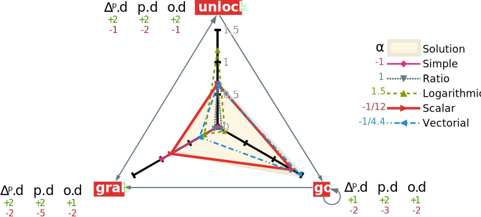

# Introduction {-}

Automated planning aims to synthesize a set of actions into an ordered plan to achieve the user's goals. Most academic research on general purpose planning was, until the end of the 90s, oriented toward plan space planning. It was praised for its least commitment orientation that makes it more efficient than classical planning and also more of an elegant solution for its flexibility. However, more recently, drastic improvements in state search planning was made possible by advanced and efficient heuristics. This allowed those planners to scale up more easily than plan-space search ones, notably thanks to approaches like GraphPlan [@blum_fast_1997], fast-forward [@hoffmann_ff_2001] and LAMA [@richter_lama_2011].

This search of scalability and performance shadows the greatest advantage of Partial-Order Planning (POP): flexibility. This advantage allows POP to efficiently build plans with the parallel use of actions. <!-- Nice idea about controlled loops with Mathis 2014-02-18 --> It also means that it can refine broken plans and optimize them further than a regular state-based planner. <!-- FIXME speculation --> This was shown clearly during the golden age of POP with UCPOP [@penberthy_ucpop_1992] <!-- No, it wasn't shown !-->. It was a reference in terms of quality and expressiveness for years, to such extends that other works tried to inject state-space planners with its advances [@gazen_combining_1997].

In this paper, we explore new ideas to revive POP as an attractive alternative to other totally ordered approach. Some papers like the appropriately named "Reviving partial order planning" [@nguyen_reviving_2001] and VHPOP [@younes_vhpop_2003] already tried to extend POP into such an interesting alternative. More recent efforts [@coles_forwardchaining_2010; @sapena_combining_2014] are trying to adapt the powerful heuristics from state-based planning to POP's approach.

Our approach is different: we want to build a robust and quality oriented planner without losing speed. <!-- we'll try at least --> In order to achieve this, the planner is implemented in its recursive form and takes a partial plan as an input. Our system prepopulates this plan with a proper domain plan that was processed during the domain compilation phase. This allows it to have a significant head-start in relation to most planners as the plan is already almost complete in most cases. This is described in @sec:properplan of the present paper.

The problem with this is that this partial plan contains problems that can break the POP algorithm (such as cycles) or that can drive it toward nonoptimal results. This is why we focus the @sec:negative of our paper on plan quality and negative refinements. This leads naturally toward the introduction of negative flaws that aims to optimise the plan: the cycle, the alternative and the orphan flaws.

This causes another problem since POP wasn't made to select these flaws as they can interfere with positive flaws by deconstructing their work. That is the reason behind the @sec:selection of our work: goal and flaw selection that aims to reduce the branching factor of our algorithm. This will allow greater speed and better plan quality.

This leads to a complete and coherent planning algorithm that gives optimised plans rather efficiently. The algorithm with its phases and properties is explained in the @sec:algorithm with the experimental result presented in detail in @sec:results.

In order to present our aLternative Optimization with partiaL pLan Injection Partial Ordered Planning (LOLLIPOP) system, we need to explain the classical POP framework and its limits.

# Classical Partial Order Planning Framework

In this paper, we decided to build our own planning framework based on PDDL's concepts.
 This new framework is called WORLD as it is inspired by more generalistic world description tools such as RDF Turtle [@w3c_rdf_2014]. It is about equivalent in expressiveness to PDDL 3.1 with object-fluents support [@kovacs_bnf_2011].

We chose this type of domain description because we plan to extend on the work of Göbelbecker et al. [@gobelbecker_coming_2010] in order to make this planner able to do soft resolution in future works. The next definitions are based on the ones exposed in this paper.

## Domain

Every planning paradigm needs a way to represent its fluents and operators. Our planner is based on a rather classical domain definition with lifted operators and representing the fluents as propositional statements

We define our **planning domain** as a tuple $\Delta = \langle T, C, P, F, O \rangle$ where

* $T$ are the **types**,
* $C$ is the set of **domain constants**,
* $P$ is the set of **properties** with their arities and typing signatures,
* $F$ represents the set of **fluents** defined as potential equations over the terms of the domain,
* $O$ is the set of optionally parameterized **operators** with preconditions and effects.

The symbol system is completed with a notion of **term** (either a constant, a variable parameter or a property) and a few relations. We provide types with a relation of **subsumption** noted $t_1 \prec t_2$ with $t_1, t_2 \in T$ meaning that all instances of $t_1$ are also instances of $t_2$.
On terms, we add two relations: the **assignation** (noted $\leftarrow$) and the **potential equality** (noted $\doteq$).

## Problem

Along with a domain, every planner needs a problem description in order to work. For this, we use a simplified version of the classical problem representation with some special additions.

From there we add the definition of a planning problem as the tuple $\Pi = \langle \Delta, C_\Pi, I, G, p\rangle$ where

* $\Delta$ is a planning domain,
* $C_\Pi$ is the set of **problem constant** disjoint from $C$,
* $I$ is the **initial state**,
* $G$ is the **goal**,
* $p$ is a given **partial plan**.

The framework uses the *closed world assumption* in wich all undefined predicates are false in the initial state and undefined properties doesn't have a value.

Even if the present framework is based upon classical plan space planning it introduces some key differences. For example, we need to add the partial plan as a problem parameter since our approach requires it. We define a partial plan as a tuple $\langle S, L, B\rangle$ with $S$ the set of **steps** (instantiated operators also called actions), $L$ the set of **causal links**, and $B$ the set of **binding constraints**.
In classic representations, we also add ordering constraints that were voluntarily omitted here. Since the causal links always are supported by an ordering constraint and since the only case where bare ordering constraints are needed is in threats we decided to represent them with "bare causal links". These are stored as causal links without bearing any fluents. The old ordering constraint can still be achieved using the transitive form of the causal links. That allows us to introduce the **precedence operator** noted $a_i \succ a_j$ iff there is a path of causal links that connects $a_i$ with $a_j$ with $a_i$ being anterior to $a_j$.

## Flaws

A specificity of Partial Order Planning is that it must fix flaws in a partial plan in order to refine it into a valid plan that is a solution to the given problem. In this section, we define the classical flaws.

What we call subgoal is the type of flaw that consists into a missing causal link to satisfy a precondition of a step. We can note a subgoal as:
$$a_p \xrightarrow{s} a_n \notin L \mid \{ a_p, a_n \} \subseteq S $$
with $a_n$ called the **needer** and $a_p$ an eventual **provider** of the fluent $s$. This fluent is called **proper fluent** of the subgoal.

We call a threat a type of flaws that consist of having an effect of a step that can be inserted between two actions with a causal link that is intolerant to said effect.
We can say that a step $a_b$ is said to threaten a causal link $a_p \xrightarrow{t} a_n$ iff
$$\neg t \in eff(a_b) \land a_p \succ a_b \succ a_n \models L$$
In this case we call the action $a_b$ the **breaker**, $a_n$ the needer and $a_p$ provider of the proper fluent $t$.

## Resolvers

These flaws are fixed via the application of a resolver to the plan. A flaw can have several resolvers that match its needs.

A resolver is a potential causal link. We can note it as a tuple $r = \langle a_s, a_t, f\rangle$ with :

* $a_s$ and $a_t$ being the source and target of the resolver,
* $f$ being the considered fluent.

For standard flaws, the resolvers are simple to find. For a *subgoal* the resolvers are a set of the potential causal links between a possible provider of the proper fluent and the needer. To solve a *threat* there is mainly two resolvers: a causal link between the needer and the breaker called **demotion** or a causal link between the breaker and the provider called **promotion**.

## Algorithm

The classical POP algorithm is pretty straight forward: it starts with a simple partial plan and refines its *flaws* until they are all resolved to make the found plan a solution of the problem.

\footnotesize
\Function{pop}{Queue of Flaws $agenda$, Problem $\Pi$}
    \State \Call{populate}{$agenda$, $\Pi$} \Comment{Only on first call}
    \If{$agenda = \emptyset$}
        \State \Return Success \Comment{Stop all recursion}
    \EndIf
    \State Flaw $f\gets agenda.popFromQueue$
    \Comment{First element of the queue}
    \State Resolvers $R \gets$ \Call{resolvers}{$f$, $\Pi$} \Comment{Ordered resolvers to try}
    \ForAll{$r \in R$} \Comment{Non deterministic choice operator}
        \State \Call{apply}{$r$, $\Pi.p$} \Comment{Apply resolver to partial plan}
        \If{\Call{consistent}{$\Pi.p$}} \Comment{$\Pi.p$ is the partial plan}
            \State \Call{pop}{$agenda \cup$ \protect\Call{relatedFlaws}{$f$}, $\Pi$}
            \State \Comment{Finding new flaws introduced by the resolver}
        \Else
            \State \Call{revert}{$r$, $\Pi.p$} \Comment{Undo resolver insertion}
        \EndIf
    \EndFor
    \State \Return Failure \Comment{Revert to last non deterministic choice of resolver}
\EndFunction

The @alg:pop was inspired by [@ghallab_planification_2001; @ghallab_automated_2004]. This POP implementation uses an agenda of flaws that is efficiently updated after each refinement of the plan. At each recursion, it selects the flaw at the top of the agenda pile and remove it for processing. It then selects a resolver and tries to apply it. If it fails to apply all resolvers the algorithm backtracks to last choice to try another one. The algorithm terminates when no more resolvers fit a flaw or when all flaws have been fixed.

## Limitations

This standard implementation has several limitations. First it can easily make poor choices that will lead to excessive backtracking. It also can't undo redundant or nonoptimal links if they don't fail. The last part is that if we input a partial plan that has problems into the algorithm it can break and either not returning a solution to a solvable problem or give an invalid solution.

{#fig:example}

To illustrate these limitations, we use the example described in @fig:example where a robot must fetch a lollipop in a locked room. This problem is quite easily solved by regular POP algorithms. However, we can observe that if we inserted an operator that has a similar effect as $go$ but that has impossible precondition (e.g. $false$), then the algorithm might select it and will need backtracking to solve the plan. This problem is solved via using simple goal selection methods. However, to our knowledge, this was never applied in the context of POP.

Another limitation is met when the input plan contains a loop or a contradiction. We consider a partial plan similar to $I \rightarrow go(robot, livingroom) \rightarrow grab(robot, keys) \rightarrow go(robot, corridor) \rightarrow go(robot, livingroom) …$.
There is a loop in that plan (between the two $go$ actions) that standard POP algorithms won't fix. In the literature this is not considered since classical POP doesn't take a partial plan as input or hypothesise out directly such inconsistencies. <!-- FIXME Not flagrant in current example, others could argue it is all artificial and that the problem doesn't really exists-->

# Proper Plan Generation and Injection {#sec:properplan}

One of the main contributions of the present paper is our use of what we call a *domain proper plan* in order to quickly derive a partial plan from it.

## Definition

First of all we need to define what is a domain proper plan.

The proper plan $\Delta^P$ of a planning dommain $\Delta$ is a labelled directed graph that binds two operators $o_1 \xrightarrow{f} o_2$ iff it exists at least an unifying fluent $f \in eff(o_1) \cap pre(o_2)$ between them.

This definition was inspired by the notion of domain causal graph as explained in [@gobelbecker_coming_2010] and originally used as heuristic in [@helmert_fast_2006]. That makes the proper plan a kind of dependency graph of the domain. With this information, we can know how potentially useful an operator can be in any plan and also where to look for providers of a fluent.

## Generation

This plan is computed during the domain compilation time and, therefore, gives an advantage to the POP algorithm. For more explanation of phases see @sec:algorithm.

\footnotesize
\Function{lollipop}{Queue of Flaws $agenda$, Problem $\Pi$}
    \State \Call{solveallworldsproblems}{$agenda$, $\Pi$} \Comment{Only on first call}
\EndFunction

 <!--TODO LOL -->

The @alg:properplan is based upon the previous definition. It will explore the operators space and build a causal map to know wich operator causes what. Once done it will iterate on every precondition and search for a satisfying cause in order to add the causal link to the proper plan.<!--FIXME rewrite that once the algorithm is done -->

This proper plan is saved for usage related to heuristics (cf. @sec:heuristics).

## Initial and Goal Step Injection

The next step is to derive a viable partial plan from the proper plan. The main problem with this is the lack of initial or goal step in it. Since it is made during domain compilation time the algorithm doesn't have access to the problem's data. That is why during the problem processing phase, an algorithm will inject the initial and goal step into the plan. This uses the same algorithm used to build the proper plan in the first place. It will bind the initial step to the operators that can be used in the initial world state and the goal step to the operators that can fulfil its preconditions. We decide to leave the operators uninstantiated for our cycle breaking mechanism to work. This mechanism is based on the alternative negative flaw (cf. @def:alternative)

{#fig:properplan}

In [@fig:properplan] we illustrate the proper plan mechanics with our previous example. The most notable feature of this graph is its coverage. It contains cycles wich can be proven problematic for POP.

However, cycles contain information regarding the dependencies of operators. We call *co-dependent* several operators that form a cycle. If the cycle is made of only one operator (self-loops) then it is called *auto-dependent*. This information help detects early inconsistencies in the plan when instantiating the operators in relation to the initial and goal step. The solution is then to simply remove inconsistent causal links while saving them as potentially problematic. Then the initialization algorithm only has to break the remaining loops using cycle flaws. This flaw is described in @sec:negative.

The last of these problems is that even if the proper plan can be coherent and even solve the problem, it may contain many unnecessary steps. This is the main reason why we introduce *negative refinements* in the next section.

# Negative Refinements and Plan Optimization {#sec:negative}

The Classical POP algorithm works upon a principle of positive plan refinements. The two standard flaws (subgoals and threats) are fixed by *adding* steps, causal links, or variable binding constraints to the partial plan. In our case, it is important to be able to *remove* part of the plan that isn't necessary or even dangerous to the solution.

## Negative Flaws

Since we are given a partial plan that is quite complete, we need to add new flaws to optimize and fix this plan into the best one possible. These flaws are called *negative* since their resolvers differ from classical ones from their effects on the plan.

A cycle is a flaw corresponding to a set of causal links that forms a loop. A causal link $a_i \rightarrow a_j$ belongs to a cycle iff it exists a path from $a_j$ to $a_i$. This path can be of lenght $0$ in whitch case $a_i = a_j$ and the cycle is a self-loop.

The complete path of a cycle is called a **closed walk**. In order to improve runtime eficiency, the cycles are detected as the proper plan is built: durring domain compilation phase (see more about phases @sec:algorithm).

An alternative is a negative flaw that occurs when it exists a better provider choice for a given link.
We can say that an alternative to a causal link $a_p \xrightarrow{f} a_n$ is a provider $a_b$ that have a better *utility value* than $a_p$ (cf. @sec:heuritics)

The alternatives are expensive to find. For this reason, they are found only once during the initialization phase (cf. @sec:algorithm).

An orphan is a negative flaw that means that a step in the partial plan (that is not the initial or goal step) is not participating in the plan. In other words $a_o$ is an orphan iff $a_o \neq I \land a_o \neq G \land p.d^+(a_o) = 0$.

With $p.d^+(a_o)$ being the outgoing degree of $a_o$ in the dirrected graph formed by $p$.

## Negative Refinements

With the introduction of negative flaws comes the modification of resolvers to handle negative refinements.

We add onto the @def:resolver :

A signed resolver is a resolver with a notion of sign. We add to the resolver tuple $s$ as the sign of the resolver in $\{+, -\}$.

An alternative notation for the signed resolver is inspired by the causal link notation with simply the sign underneath :
$$r = a_s \xrightarrow[+/-]{f} a_t$$

The previously defined negative flaws have all their associated negative resolvers.

A *cycle* will have as negative resolvers each causal link belonging to its closed walk. This way the algorithm will know that there are no solution if there aren't any way to remove any causal links of the cycle. An improvement upon this would be to sort the links with the utility value of their target. <!-- FIXME actually do this-->

The solution to an alternative is a negative refinement that simply remove the targeted causal link. We count on the fact that this will create a new subgoal that will choose the better alternative.

The way to fix an orphan is quite simple. The negative refinement is only meant to remove the targeted action and its incoming causal link while tagging the sources of them as potential orphans.

## Possible Interferences

Even if these flaws improve the plan quality, they can also interfere with the standard flaws of POP and even each other. Indeed, we can have a subgoal and an alternative looping with each other if nothing prevents it.

<!--TODO explain precisely wich one interfere with wich one -->
Other interferences include alternatives and cycles where there is no actual need to find an alternative to a causal link belonging to a closed walk. <!-- TODO IMPORTANT IMPLEMENTATION--> Another problem arise with the competition between orphans and subgoals: a subgoal might need an orphan and, therefore, remove the need for removal. Removing orphans before being sure that they won't be needed can be counter productive. The last interference is quite known in the domain. It is the interation between subgoals and threats as subgoals can remove some threats without need of intervention.
<!-- TODO interference schema ?-->

This is the reason why we need a new goal and flaw selection mechanism in order to avoid all these interferences.

# Driving Resolver and Flaw Selection {#sec:selection}

Resolver and flaws selection are the keys to improvements in performances. Choosing a good resolver helps to reduce the branching factor that accounts for most of the time spent on running POP algorithms.

## Operator Oriented Heuristics {#sec:heuristics}
<!-- TODO redo all that !!!-->

A heuristic is a function that allows to rank operators. This is at the heart of the algorithm since it will try to make the best choice for goal selection. Driving choice was already shown as a performance improvement mechanism in [@younes_vhpop_2003] as several heuristics were combined to improve POP's efficiency.

In our case, we chose to have one main heuristic that aims to lower branching factor by trying to make the base operations more aware of the utility of the considered data. A good explanation of the mechanics behind this can be found in [@kambhampati_design_1994].

The aim is to create heuristics that have a sense of the usefulness of an operator or step. In order to do that, we need to create a fuunction that will give a higher value the more the action participates potentially or effectively in a plan and a lower value the more it is needy.

We tried different function that could accomplish this and compared them together. Since we rely heavily on the notion of positive and negative degree, we need to define them first:

Degrees are means to mesure the usefulness of an operator. The notion is derived from the incoming and outgoing degree of a node in a graph.

We note $g.d^+(o)$ and $g.d^-(o)$ respectively the outgoing and incoming degree of an operator in a plan. These represent the number of causal links that goes out or toward the operator. We call proper degree of an operator $o.d^+ = |eff(o)|$ and $o.d^- = |pre(o)|$ the number of potential usefulness of an operator based on its number of preconditions and effects.

With these notions we defined three heuristics :

$$h_1(o) = {p.d^+(o) \times \alpha^{-p.d^-(o)}
       \over
       {\Delta^p.d^+(o) \times \alpha^{-\Delta^p.d^-(o)}}
}$$ <!-- FIXME There is no way to compare steps and operators-->
$$h_2(o) = {{p.d^+(o) + o.d^+}
       \over
       {\alpha^{p.d^-(o) + o.d^-} }
}$$
$$h_3(o) ={{p.d^+(o) + \Delta^p.d^+(o) }
       \over
       { \alpha^{p.d^-(o) + \Delta^p.d^-(o)}}
}$$

These three heuristics have diferent behaviours based on wich data they handle. To illustrate this we plotted the values given by each of them in our example in @fig:heuristic.

{#fig:heuristic}

<!--TODO actually clever analytic of this …-->

## Resolver ordering
<!--TODO redo all that / merge with previous-->

Some flaws have a lot of resolvers to try. Knowing that chosing the wrong one can cause extensive backtracking its selection if crutial to the performance of the application. From there the selection is the most important for subgoals. This kind of flaws have resolvers with the most impact on the plan since they add a causal link and a new action. A subgoal resolver represents the choice of a provider for the open condition. Since we have a heuristic to rank them we use it to order the set of resolvers during the search. In order to improve even more on the performance, we can keep an ordered list of all available steps and operators updated. <!-- FIXME is that an actual good idea -->

## Flaws Type Priority

Another problem lies in the selection of flaws. Indeed, the order that they are fixed can cause big problems. For example, if all the subgoals of an alternative are computed before it will cause a big amount of unecessary computation. That is why we chose to compute the flaws that reduce ther search space the most at first. Our order is the following:

1. **Cycles** that comes from the original domain proper plan are an indication that some operators are co-dependent and that is often where problems arise. This step is also the most succeptible to cause an early failure wich is very beneficial for the speed of the algorithm.
2. **Alternatives** will cut causal links that have a better provider. It is necessary to do that first since they will add at least another subgoal to be fixed as a related flaw.
3. **Subgoals** are the flaws that cause the most branching factor for POP algorithms. This is why we need to make sure that all open conditions are fixed before proceding on finer refinements.
4. **Threats** occurs quite often in the computation and requires lots of computation to check if they are applicable and are one of the most side-effect heavies. That is why we prioritise all related subgoals before threats because they can actually add cuasal links that will fix the threat without needing to do anything.
5. **Orphans** are a fine optimisation of plans. They remove uneeded branches of the plan. However, these branches can be found out to be necessary for the plan in order to meet a subgoal. Since a branch can contain numerous actions it is preferable to let the orphan in the plan until we are sure that they won't be needed.

## Dynamic Flaw Selection

# LOLLIPOP Algorithm {#sec:algorithm}

<!--TODO redo all this plz-->

With all these mechanisms defined we can now present the complete algorithm of LOLLIPOP :

\footnotesize
\Function{lollipop}{Queue of Flaws $agenda$, Problem $\Pi$}
    \State \Call{solveallworldsproblems}{$agenda$, $\Pi$} \Comment{Only on first call}
\EndFunction

 <!--TODO LOL -->

## Domain Phase

The domain compilation phase is the first to quick in. It needs to parse and interpret a domain description input and make it usable by POP algorithms. This phase includes a cleaning phase that rules out illegal defects present in the initial description in order to be resilient to basic logic errors. <!--FIXME explains that more -->Most of that compilation include a translation from the expressive complexity of the input to a much simpler representation used in algorithms for performance. In this step, we also add our proper plan creation algorithm along with cycle detection on the result. This is used to cache cycle flaws in order to make the agenda population easier during runtime. We also keep a copy of the proper plan in memory and start ordering operators to allow fast goal selection.

## Initialization

This phase comes as the problem is provided. It contains multiple steps.

1. Initial and Goal insertion into the proper plan to construct the initial partial plan.
2. Binding variables and inconsistencies detection.
3. Add the cached cycle flaws to the top of the agenda.
4. Search and add alternative flaws that aren't in cycles.
5. Search and add all obvious subgoals left unfulfilled in the plan.
6. Search for early threats in the partial plan and add them to the bottom of the agenda.
7. Search for all orphans and add them last to the agenda.

## Main Loop

That part is similar to regular POP algorithms as it will almost only take flaws from the agenda and try to fix them one by one. On of the differences is that each time a flaw is fixed, it calls a special function that provides related flaws. In the case of cycles or alternative, we can have potential orphans and new subgoals that need to be fixed. In the case of subgoals, it can lead to new subgoals or threats. Threats are a bit special in that regard. They can't cause other flaws but are treated differently. The algorithm will always delay them, after all, curent subgoals have been fixed. Then all orphans that are kept last may only cause other orphans <!-- what a sad world -->.

## Properties and Proofs
<!--FIXME better title or something ? -->

The proof

# Experimental Results {#sec:results}

<!-- TODO add all the things-->

# Conclusion {-}

<!-- TODO
* Discussion of results and properties
* Summary of improvements
* Introducing soft solving and online planning.
* Online planning
* plan recognition and constrained planning-->

# References
