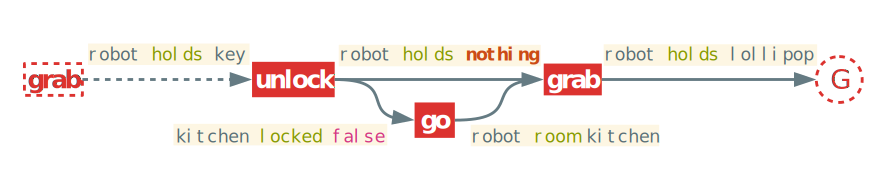
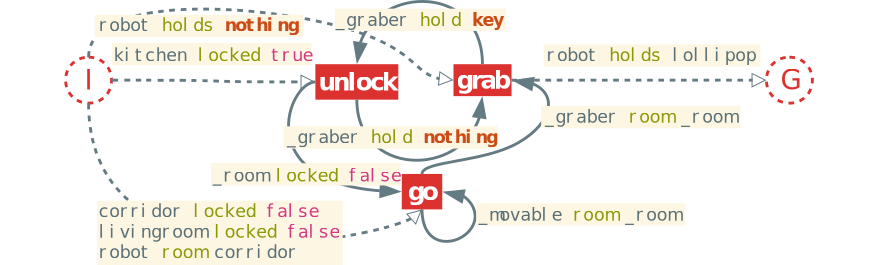
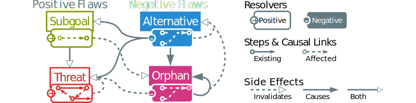
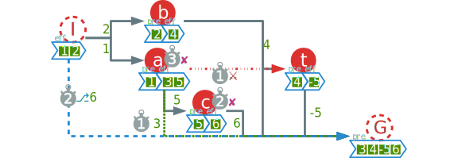

<!-- IDEAS
[Plan Space]        Approach:: idea
[POCL]                Method:: Formalism
[Flaws, Refinement]    Model:: Element of formalism
[Flaw selection]    Mechanism:: Algorithm is the implementation of mechanism
[POP Algorithm]        System:: implementation
-->

<!-- FIXME
* Examples pour chaque notion + solution de l'example et explicitation des défauts
* Étude formelle: choix + propriété + complexité
* Style: moins parlé et plus formel - tentative + consciousness
-->

# Introduction {-}

Until the end of the 90s, Plan-Space Planning (PSP) was generally preferred by the automated planning community. But, more recently, drastic improvements in state search planning (SSP) were made possible by advanced and efficient heuristics. This allowed those planners to scale up more efficiently than plan-space search ones, notably thanks to approaches like GraphPlan [@blum_fast_1997], fast-forward [@hoffmann_ff_2001], LAMA [@richter_lama_2011] and Fast Downward Stone Soup [@helmert_fast_2011].
This evolution led to a preference for performances upon other aspects of the problem of automated planning like expressiveness and flexibility, which are clear advantages of PSP over SSP. For instance, Partial Order Planning (POP), also known as Partial Order Causal Link (POCL), can take advantage of its least commitment strategy [@mccluskey_engineering_1997]. It allows to describe a partial plan with only the necessary order of the actions and not a fixed sequence of steps. Thus, POP has greater flexibility at plan execution time as explained in [@muise_monitoring_2011-1].
It has also been proven to be well suited for multi-agent planning [@kvarnstrom_planning_2011] and temporal planning [@benton_temporal_2012] <!-- Refs from [@shekhar_learning_2016] -->. These advantages made UCPOP [@penberthy_ucpop_1992] one of the preferred POP planners of its time with works made to import some of its characteristics into state-based planning [@gazen_combining_1997].

Related works already tried to explore new ideas to make POP an attractive alternative to regular state-based planners like the appropriately named "Reviving partial order planning" [@nguyen_reviving_2001] and VHPOP [@younes_vhpop_2003]. More recent efforts [@coles_popf2_2011; @sapena_combining_2014] are trying to adapt the powerful heuristics from state-based planning to POP's approach. An interesting approach of these last efforts is found in [@shekhar_learning_2016] with meta-heuristics based on offline training on the domain. Yet, we clearly note that only a few papers lay the emphasis upon plan quality using POP [@ambite_planning_1997].

The present paper lays the base for a project that aims to assist dependent persons in accomplishing tasks and so, to infer the pursued goals of the persons. One way of achieving goal recognition is to use inverted planning for plan inference, as for instance in [@ramirez_plan_2009]. This requires performing online planning with a feed of observational data. In a real world context, we also need to handle data derived from limited or noisy sensors. In this context, using inverted planning requires that the planner should be resilient to misleading input plans. From that perspective, we need a planner able to meet the following criteria:

* repair and optimize existing plans,
* perform online planning efficiently
* preserve performances on complex but medium sized problems

In this article, we propose to improve POP with better refining techniques and resolver selection for online partial order planning.
Classical POP algorithms don't meet most of these criteria but can be enhanced to fit the first one to fit plan repairing, as for instance in [@vanderkrogt_plan_2005]. Usually, POP algorithms take a problem as an input and use a loop or a recursive function to refine the plan into a solution. We can't solely use the refining recursive function to be able to use our existing partial plan. This causes multiples side effects if the input plan is suboptimal. This problem was already explored as of LGP-adapt [@borrajo_multi-agent_2013] that explains how re-using a partial plan often implies replanning parts of the plan.
*Our view* on the problem diverges from other works: PSP is a  different approach compared to SSP. It is usually more computationally expensive than modern state space planners but brings several advantages. We want to make the most of them instead of trying to change POP's fundamental nature.
That view is at the core of our model: we use the refining and least commitment abilities of POP to improve online performances and quality. In order to achieve this, we start by computing an *operator graph* that is computed offline with the input of the domain. Operator graph definition and generation are given in @sec:operatorgraph.
Using existing partial plans as POP's input leads to several issues, mainly because of new flaw types that aren't treated in classical POP. This is why we focus the @sec:negative of our paper on plan quality and negative refinements. We introduce new negative flaws and resolvers that aim to fix and optimize the plan.
Side effects of negative flaws and resolvers can lead to conflicts. In order to avoid them and to enhance performances and quality, the algorithm needs resolver and flaw selection mechanisms that are explained in the @sec:selection.
All these mechanisms are part of our aLternative Optimization with partiaL pLan Injection Partial Ordered Planning (LOLLIPOP) algorithm presented in detail in @sec:algorithm. We prove that the use of these new mechanisms keeps LOLLIPOP sound and complete in @sec:analysis. Experimental results and benchmarks are presented in the @sec:results of this paper.

# Partial Order Planning Preliminaries

## Notation

In this paper, we use the notation defined in @tbl:symbols. These symbols are adapted from the ones described in [@ghallab_automated_2004].We use the symbol $\pm$ to signify that there is a notation for the positive and negative symbols but the current formula works regardless of the sign. All related notions will be defined later.

**Symbol**                          **Description**
----------                          ---------------
$pre(o)$, $eff(o)$                  Preconditions and effects of the operator $o$
$\mathcal{D}$                       Planning domain
$\mathcal{P}$                       Planning problem
$l_{\rightarrow}$, $l_{\leftarrow}$ Source and target of the causal link $l$
$o_1 \succ o_2$                     Precedence operator ($o_1$ precedes $o_2$)
$O^\Pi$                             Operator graph of the set of operators $O$
$d^\pm_\pi(o)$                      Outgoing and incoming degrees of $o$
$d^\pm(o)$                          Proper degrees of $o$ ($|pre(o)|$ and $|eff(o)|$)
$L^\pm_\pi(o)$                        Outgoing and incoming causal links of $o$
$C(\pi)$                            Set of cycles in partial plan $\pi$
$C_o(\pi)$                          Set of cycles in $\pi$ which $o$ is part of
$C^s_o(\pi)$                        $\{o\}$ if $o$ has a self cycle in $\pi$, $\emptyset$ otherwise
$\mathcal{F}^\pm(\pi)$              Set of flaws in $\pi$
$r(f)$                              Resolvers of the flaw $f$
$f.n$                               Needer of the flaw $f$
$f(\pi)$                            Application of the flaw $f$ on plan $\pi$
$\Downarrow \pi$                    Full support of $\pi$
$\pi \models \mathcal{P}$           The partial plan $\pi$ is a valid solution of $\mathcal{P}$

: Most used symbols in the paper. {#tbl:symbols}

## Basic Definitions

<!--With the aim to respect the constraints of our application field, we need to define our own planning framework. Indeed, classical planning framework is usually compiled away to quicken a single benchmark run and are not thought for dynamical online planning in complex environments.--> <!--While needing expressiveness and simplicity in our domain definition we also need speed and flexibility for online planning on robots. <!--This led to a new framework named WORLD, as it is intended for more generalist world description purpose.--> <!--Our framework is inspired by existing multipurpose semantic tools such as RDF Turtle [@w3c_rdf_2014] and has an expressiveness similar to that of PDDL 3.1 with object-fluents support [@kovacs_bnf_2011]. This particular type of domain description was chosen because we intend to extend works on soft solving to handle corrupted data better in future papers.-->

Planning systems need a representation of its fluents and operators. Our framework is based on a classical domain definition. This is defined in the following definition from [@gobelbecker_coming_2010].

We define our planning domain as a tuple $\mathcal{D} = \langle T, C, R, F, O \rangle$ where

* $T$ are the **types**,
* $C$ is the set of **domain constants**,
* $R$ is the set of **relations** with their arities and typing signatures,
* $F$ represents the set of **fluents** defined as potential equations over the terms of the domain,
* $O$ is the set of optionally parameterized **operators** with preconditions and effects.

<!--
**#This part isn't used after and is relevant only to the WORLD framework**

The symbol system is completed with a notion of **term** (either a constant, a variable parameter or a property) and a few relations. We provide types with a relation of **subsumption** noted $t_1 \prec t_2$ with $t_1, t_2 \in T$ meaning that all instances of $t_1$ are also instances of $t_2$.
On terms, we add two relations: the **assignation** (noted $\leftarrow$) and the **potential equality** (noted $\doteq$).-->

Along with a domain, every planner needs a problem representation. We use the classical problem representation with some special additions.

The planning problem is defined as a tuple $\mathcal{P} = \langle \mathcal{D}, C_\mathcal{P}, I, G, \pi\rangle$ where

* $\mathcal{D}$ is a planning domain,
* $C_\mathcal{P}$ is the set of **problem constants** disjoint from the domain constants $C$,
* $I$ is the **initial state**,
* $G$ is the **goal**,
* $\pi$ is a given **partial plan**.

The framework uses the *closed world assumption* in which all predicates and relations that aren't defined in the initial step are assumed false or don't have a value. <!--FIXME: Implementation non-conform-->

@Fig:example portrays an example of a planning domain and problem that we use as a guideline throughout the article.

{#fig:example}

In order to simplify this framework, we need to introduce some differences from the classical partial plan representation. First, the partial plan is a part of the problem tuple as it is a needed input of the LOLLIPOP algorithm.

We define a partial plan as a tuple $\langle S, L, B\rangle$ with $S$ the set of **steps** (semi or fully instantiated operators also called *actions*), $L$ the set of **causal links**, and $B$ the set of **binding constraints**.

Second we factorize the set of *ordering constraints*, used in classical representations, as being part of the causal links. Indeed, causal links are always supported by an ordering constraint. The only case where bare ordering constraints are needed is in threats. We represent them with **bare causal links**. These are stored as causal links without bearing any fluents. Causal links can be represented by their labeled fluents called *causes*. We note $f \in l$ the fact that a causal link $l$ bears the fluent $f$ (bare causal links are noted $l = \emptyset$).
That allows us to introduce the **precedence operator** noted $a_i \succ a_j$ with $a_i, a_j \in S$ iff there is a path of causal links that connects $a_i$ to $a_j$. We call $a_i$ *anterior* to $a_j$.

A specificity of Partial Order Planning is that it fixes flaws in a partial plan to refine it into a valid plan that is a solution to the given problem. Next, we define the classical flaws in our framework.

A flaw in a partial plan, called subgoal, is a missing causal link required to satisfy a precondition of a step. We can note a subgoal as:
$a_p \xrightarrow{s} a_n \notin L \mid \{ a_p, a_n \} \subseteq S$
with $a_n$ called the **needer** and $a_p$ a possible **provider** of the fluent $s$. This fluent is called *open condition* or **proper fluent** of the subgoal.

A flaw in a partial plan called threat consists of having an effect of a step that can be inserted between two actions with a causal link that is threatened by the said effect.
We say that a step $a_b$ is threatening a causal link $a_p \xrightarrow{t} a_n$ iff
$a_b \neq a_p \neq a_n \land \neg t \in eff(a_b) \land a_p \succ a_b \succ a_n$
with $a_b$ being the **breaker**, $a_n$ the *needer* and $a_p$ a *provider* of the *proper fluent* $t$.

Flaws are fixed via the application of a resolver to the plan. A flaw can have several resolvers that match its needs.

A resolver is a potential causal link defined as a tuple $r = \langle a_s, a_t, f\rangle$ with:

* $a_s, a_t \in S$ being the source and the target of the resolver,
* $f$ being the considered fluent.

For classical flaws, the resolvers are simple to find. For a *subgoal* the resolvers are sets of the potential causal links between a possible provider of the proper fluent and the needer. To solve a *threat* there are mainly two resolvers: a causal link between the needer and the breaker called **demotion** or a causal link between the breaker and the provider called **promotion**.

Once the resolver is applied, another important step is needed to be able to keep refining. The algorithm needs to take into account the **side effects** the application of the resolver had on the partial plan. Side effects are searched by type.

Flaws that arise because of the application of a resolver on the partial plan are called causal side effects or *related flaws*. They are caused by an action $a_t$ called the **trouble maker** of a resolver. This action is the *source* of the resolver applied onto the plan.

We can derive this definition for subgoals and threats:

* **Related Subgoals** are all the open conditions inserted with the *trouble maker*. The subgoals are often searched using the preconditions of the trouble maker and added when no causal links satisfy them.
* **Related Threats** are the causal links threatened by the insertion of the *trouble maker*. They are added when there is no causal path that prevents the action to interfere with the threatened causal link.

{#fig:partialplan1}

In the partial plan presented in @fig:partialplan1, we consider that a resolver providing the fluent `robot holds key` is considered. This resolver will introduce the open conditions `robot holds nothing, key room _room, robot room _room` since it just introduced this instantiation of the `grab` operator in the partial plan. This resolver triggers related subgoals with new `grab` operator as needer. The potentially related threat of this resolver is that the effect `robot holds key` might threaten the link between the existing `unlock` and `grab` steps, but won't be considered since there are no way the new step can be inserted after `unlock`.

## Classical POP Algorithm

The classical POP algorithm starts with a simple partial plan that contains only the initial and goal steps and refines its *flaws* until they are all resolved to make the found plan a solution of the problem.

\footnotesize
\Function{pop}{Queue of Flaws $a$, Problem $\mathcal{P}$}
    \State \Call{populate}{$a$, $\mathcal{P}$} \Comment{Populate agenda only on first call}
    \If{$G = \emptyset$} \Comment{Goal is empty, default solution is provided}
        \State $L \gets (I \rightarrow G)$ \label{line:emptygoal}
    \EndIf
    \If{$a = \emptyset$}
        \State \Return Success \Comment{Stop all recursion}
    \EndIf
    \State Flaw $f \gets$ \Call{choose}{$a$} \label{line:flawselection}
    \Comment{Non deterministic choice}
    \State Resolvers $R \gets$ \Call{resolvers}{$f$, $\mathcal{P}$}
    \ForAll{$r \in R$} \Comment{Non deterministic choice operator}
        \State \Call{apply}{$r$, $\pi$} \label{line:resolverapplication} \Comment{Apply resolver to partial plan}
        \State SideEffects $s \gets$ \Call{sideEffect}{$r$} \label{line:sideeffectapplication}
        \State \Call{apply}{$s$, $a$} \Comment{Side effects of the resolver}
        \If{\protect\Call{pop}{$a$, $\mathcal{P}$} = Success} \Comment{Refining recursively}
            \State \Return Success
        \EndIf
        \State \Call{revert}{$r$, $\pi$} \Comment{Failure, undo resolver insertion}
        \State \Call{revert}{$s$, $a$} \Comment{Failure, undo side effects application}
    \EndFor
    \State \Return Failure \Comment{Revert to last non deterministic choice of resolver}
\EndFunction

The @alg:pop is inspired by [@ghallab_automated_2004]. This POP implementation uses an agenda of flaws that is efficiently updated after each refinement of the plan. At each iteration, a flaw is selected and removed from the agenda (@line:flawselection). A resolver for this flaw is then selected and applied (@line:resolverapplication). If all resolvers cause failures, the algorithm backtracks to the last resolver selection to try another one. The algorithm terminates when no more resolver fits a flaw (`Failure`) or when all flaws have been fixed (`Success`).

This standard implementation has several limitations. First, it can easily make poor choices that will lead to excessive backtracking. It also can't undo redundant or non-optimal links if they don't lead to backtracking.
To explain these limitations, we use the example described in @fig:example where a robot must fetch a lollipop in a locked room. This problem is solvable by regular POP algorithms. Yet, we can have some cases where small changes in POP's inputs can cause a lot of unnecessary backtrackings. For example, if we add a new action called `dig_through_wall` that has as effect to be in the desired room but that requires a *jackhammer*, the algorithm will need to meet more preconditions and will produce a partial plan of poor quality. The effects could be worse if obtaining a jackhammer would require many steps (for example building it). This problem can be solved most of the time using simple flaw selection mechanisms. The other limitation arises when the plan has been modified. This can occur in the context of dynamic environments of online planning applications. When POP is modified to use input plans [@sebastia_graph-based_2000], these partial plans are carefully designed to avoid violating the properties required by POP to operate. In our case, the plan can contain misleading information and this can cause a variety of new problems that can only be fixed using new refinements methods.

# LOLLIPOP's Approach

In this section, operator graph generation used by LOLLIPOP to ease the initial backchaining of POP is presented. Then we introduced new negative flaws for online planning refinements. LOLLIPOP algorithm and its resolvers and flaws selection based on the operator graph are finally detailed.

## Operator Graph Generation {#sec:operatorgraph}

One of the main contributions of the present paper is our use of the concept of *operator graph*. First of all, we define this notion.

An operator graph $O^\Pi$ of a set of operators $O$ is a labeled directed graph that binds two operators with the causal link $o_1 \xrightarrow{f} o_2$ iff there exists at least one unifying fluent $f \in eff(o_1) \cap pre(o_2)$.

This definition was inspired by the notion of domain causal graph as explained in [@gobelbecker_coming_2010] and originally used as a heuristic in [@helmert_fast_2011]. Causal graphs have fluents as their nodes and operators as their edges. Operator graphs are the opposite: an *operator dependency graph* for a set of actions. A similar structure was used in [@smith_postponing_1993] that builds the operator dependency graph of goals and uses precondition nodes instead of labels.
Cycles in this graph denote the dependencies of operators. We call *co-dependent* operators that form a cycle. If the cycle is made of only one operator (self-loop), then it is called *auto-dependent*.

While building this operator graph, we need a **providing map** that indicates, for each fluent, the list of operators that can provide it. This is a simpler version of the causal graphs that is reduced to an associative table easier to update. The list of providers can be sorted to drive resolver selection (as detailed in @sec:selection). A **needing map** is also built but is only used for operator graph generation. We note $\mathcal{D}^\Pi$ the operator graph built with the set of operators in the domain $\mathcal{D}$. In the @fig:operatorgraph, we illustrate the application of this mechanism on our example from @fig:example. Continuous lines correspond to the *domain operator graph* computed during domain compilation time.

{#fig:operatorgraph}

The generation of the operator graph is detailed in @alg:operatorgraph. It explores the operators space and builds a providing and a needing map that gives the provided and needed fluents for each operator. Once done it iterates on every precondition and searches for a satisfying cause to add the causal links to the operator graph.

\footnotesize
\Function{addVertex}{Operator $o$}
    \State \Call{cache}{$o$} \Comment{Update of the providing and needing map}
    \If {binding} \Comment{boolean that indicates if the binding was requested}
        \State \Call{bind}{$o$}
    \EndIf
\EndFunction
\Function{cache}{Operator $o$}
    \ForAll{$eff \in eff(o)$} \Comment{Adds $o$ to the list of providers of $eff$}
        \State \Call{add}{$providing, eff, o$}
    \EndFor
    \State … \Comment{Same operation with needing and preconditions}
\EndFunction
\Function{bind}{Operator $o$}
    \ForAll{$pre \in pre(o)$}
        \If{$pre \in providing$}
            \ForAll{$\pi \in$ \Call{get}{$providing$, $pre$}}
                \State Link $l \gets$ \Call{getEdge}{$\pi$, $o$} \Comment{Create the link if needed}
                \State $l \gets l \cup \{pre\}$ \Comment{Add the fluent as a cause}
            \EndFor
        \EndIf
    \EndFor
    \State … \Comment{Same operation with needing and effects}
\EndFunction

To apply the notion of operator graphs to planning problems, we just need to add the initial and goal steps to the operator graph. In @fig:operatorgraph, we depict this insertion with our previous example using dotted lines. However, since operator graphs may have cycles, they can't be used directly as input to POP algorithms to ease the initial backchaining. Moreover, the process of refining an operator graph into a usable one could be more computationally expensive than POP itself.

In order to give a head start to the LOLLIPOP algorithm, we propose to build operator graphs differently with the algorithm detailed in @alg:safeoperatorgraph. A similar notion was already presented as "basic plans" in [@sebastia_graph-based_2000]. These "basic" partial plans use a more complete but slower solution for the generation that ensures that each selected steps are *necessary* for the solution. In our case, we built a simpler solution that can solve some basic planning problems but that also make early assumptions (since our algorithm can handle them). It does a simple and fast backward construction of a partial plan driven by the providing map. Therefore, it can be tweaked with the powerful heuristics of state search planning.

\footnotesize
\Function{safe}{Problem $\mathcal{P}$}
    \State Stack<Operator> $open \gets [G]$
    \State Stack<Operator> $closed \gets \emptyset$
    \While{$open \neq \emptyset$}
        \State Operator $o \gets$ \Call{pop}{$open$} \Comment{Remove $o$ from $open$}
        \State \Call{push}{$closed$, $o$}
        \ForAll {$pre \in pre(o)$}
            \State Operators $p \gets$ \Call{getProviding}{$\pi$, $pre$} \Comment{Sorted by usefulness}
            \If{$p = \emptyset$} \Comment{(see section~\ref{sec:selection})} <!-- Markdown breaks inside LaTeX commands … obviously-->
                \State $S \gets S \setminus \{\pi\}$
                \Continue
            \EndIf
            \State Operator $o' \gets$ \Call{getFirst}{$\pi$} \label{line:safefirst}
            \If{$o' \in closed$}
                \Continue
            \EndIf
            \If{$o' \not \in S$}
                \State \Call{push}{$open$, $o'$}
            \EndIf
            \State $S \gets S \cup \{o'\}$
            \State Link $l \gets$ \Call{getEdge}{$o'$, $o$} \Comment{Create the link if needed}
            \State $l \gets l \cup \{pre\}$ \Comment{Add the fluent as a cause}
        \EndFor
    \EndWhile
\EndFunction

This algorithm is useful since it is specifically used on goals. The result is a valid partial plan that can be used as input to POP algorithms.

## Negative Refinements and Plan Optimization {#sec:negative}

The classical POP algorithm works upon a principle of positive plan refinements. The two standard flaws (subgoals and threats) are fixed by *adding* steps, causal links, or variable binding constraints to the partial plan. Online planning needs to be able to *remove* parts of the plan that are not necessary for the solution.
Since we assume that the input partial plan is quite complete, we need to define new flaws to optimize and fix this plan. These flaws are called *negative* as their resolvers apply subtractive refinements on partial plans.

An alternative is a negative flaw that occurs when there is a better provider choice for a given link.
An alternative to a causal link $a_p \xrightarrow{f} a_n$ is a provider $a_b$ that has a better *utility value* than $a_p$.

The **utility value** of an operator is a measure of usefulness at the heart of our ranking mechanism detailed in @sec:selection. It uses the incoming and outgoing degrees of the operator in the domain operator graph to measure its usefulness.

Finding an alternative to an operator is computationally expensive. It requires searching a better provider for every fluent needed by a step. To simplify that search, we select only the best provider for a given fluent and check if the one used is the same. If not, we add the alternative as a flaw. This search is done only on updated steps for online planning. Indeed, the safe operator graph mechanism is guaranteed to only choose the best provider (@alg:safeoperatorgraph at @line:safefirst). Furthermore, subgoals won't introduce new fixable alternative as they are guaranteed to select the best possible provider.

An orphan is a negative flaw that occurs when a step in the partial plan (other than the initial or goal step) is not participating in the plan. Formally, $a_o$ is an orphan iff $a_o \neq I \land a_o \neq G \land \left( d_\pi^+(a_o) = 0 \right) \lor \forall l \in L_\pi^+(a_o), l=\emptyset$.

With $d_\pi^+(a_o)$ being the *outgoing degree* of $a_o$ in the directed graph formed by $\pi$ and $L_\pi^+(a_o)$ being the set of *outgoing causal links* of $a_o$ in $\pi$. This last condition checks for *hanging orphans* that are linked to the goal with only bare causal links (introduced by threat resolution).

The introduction of negative flaws requires modifying the resolver definition (cf. @def:resolver).

A signed resolver is a resolver with a notion of sign. We add to the resolver tuple the sign of the resolver noted $s \in \{+, -\}$.

<!--An alternative notation for the signed resolver is inspired by the causal link notation with simply the sign underneath:
$$r = a_s \xrightarrow[+/-]{f} a_t$$-->

The solution to an alternative is a negative refinement that simply removes the targeted causal link. This causes a new subgoal as a side effect, that will focus on its resolver by its rank (explained in @sec:selection) and then pick the first provider (the most useful one).
The resolver for orphans is the negative refinement that is meant to remove a step and its incoming causal link while tagging its providers as potential orphans.

{#fig:sideeffects}

The side effect mechanism also needs an upgrade since the new kind of flaws can interfere with one another. This is why we extend the side effect definition (cf. @def:sideeffect) with a notion of sign.

A signed side effect is either a regular *causal side effect* or an *invalidating side effect*. The sign of a side effect indicates if the related flaw needs to be added or removed from the agenda.

The @fig:sideeffects exposes the extended notion of signed resolvers and side effects. When treating positive resolvers, nothing needs to change from the classical method. When dealing with negative resolvers, we need to search for extra subgoals and threats. Deletion of causal links and steps can cause orphan flaws that need to be identified for removal.

In the method described in [@peot_threatremoval_1993], a **invalidating side effect** is explained under the name of *DEnd* strategy. In classical POP, it has been noticed that threats can disappear in some cases if subgoals or other threats were applied before them. For our mechanisms, we decide to gather under this notion every side effect that removes the need to consider a flaw. For example, orphans can be invalidated if a subgoal selects the considered step. Alternatives can remove the need to compute further subgoal of an orphan step as orphans simply remove the need to fix any flaws that concern the selected step.

These interactions between flaws are decisive for the validity and efficiency of the whole model, that is why we aim to drive flaw selection in a rigorous manner.

## Driving Flaws and Resolvers Selection {#sec:selection}

Resolvers and flaws selection are the keys to improving performances. Choosing a good resolver helps to reduce the branching factor that accounts for most of the time spent on running POP algorithms [@kambhampati_design_1994 ]. Flaw selection is also important for efficiency, especially when considering negative flaws which can conflict with other flaws.

Conflicts between flaws occur when two flaws of opposite sign target the same element of the partial plan. This can happen, for example, if an orphan flaw needs to remove a step needed by a subgoal or when a threat resolver tries to add a promoting link against an alternative. The use of side effects will prevent most of these occurrences in the agenda but a base ordering will increase the general efficiency of the algorithm.

Based on the @fig:sideeffects, we define a base ordering of flaws by type. This order takes into account the number of flaw types affected by causal side effects.

1. **Alternatives** will cut causal links that have a better provider. It is necessary to identify them early since they will add at least another subgoal to be fixed as a related flaw.
2. **Subgoals** are the flaws that cause most of the branching factor in POP algorithms. This is why we need to make sure that all open conditions are fixed before proceeding on finer refinements.
3. **Orphans** remove unneeded branches of the plan. Yet, these branches can be found out to be necessary for the plan to meet a subgoal. Since a branch can contain many actions, it is preferable to leave the orphan in the plan until they are no longer needed. Also, threats involving orphans are invalidated if the orphan is resolved first.
4. **Threats** occur quite often in the computation. Searching and solving them is computationally expensive since they need to check if there are no paths that fix the flaw already. Many threats are generated without the need of resolver application [@peot_threatremoval_1993]. That is why we rank all related subgoals and orphans before threats because they can add causal links or remove threatening actions that will fix the threat.

Resolvers need to be ordered as well, especially for the subgoal flaws. Ordering resolvers for a subgoal is the same operation as choosing a provider. Therefore, the problem becomes "how to rank operators?". The most relevant information on an operator is its usefulness and hurtfulness. These show how much an operator will help and how much it may cause branching after selection.

Degrees are a measurement of the usefulness of an operator. Such a notion is derived from the incoming and outgoing degrees of a node in a graph.

We note $d_\pi^+(o)$ and $d_\pi^-(o)$ respectively the outgoing and incoming degrees of an operator in a plan $\pi$. These represent the number of causal links that goes out or toward the operator. We call proper degree of an operator $d^+(o) = |eff(o)|$ and $d^-(o) = |pre(o)|$ the number of preconditions and effects that reflect its intrinsic usefulness.

There are several ways to use the degrees as indicators. *Utility value* increases with every $d^+$, since this reflects a positive participation in the plan. It decreases with every $d^-$ since actions with higher incoming degrees are harder to satisfy. The utility value bounds are useful when selecting special operators. For example, a user-specified constraint could be laid upon an operator to ensure it is only selected as a last resort. This operator will be affected with the smallest utility value possible. More commonly, the highest value is used for initial and goal steps to ensure their selection.

Our ranking mechanism is based on scores noted $s^\pm(o)$. A score contains two components: a positive subscore array that acts as a participation measurement and a negative subscore array that represents the dependencies of the operator. Each component of the score is an array of *subscores*.

The first step is the computation of the **base scores**. They are computed according to the following:

* $s^+(o)$ contains only $d_{\mathcal{D}^\Pi}^+(o)$, the positive degree of $o$ in the domain operator graph. This will give a measurement of the predicted usefulness of the operator.
* $s^-(o)$ containing the following subscores:
    1. $d^-(o)$ the proper negative degree of $o$. Having more preconditions can lead to a potentially higher need for subgoals.
    2. $\sum_{c \in C_o(\mathcal{D}^\Pi)}|c|$ with $C_o(\mathcal{D}^\Pi)$ being the set of cycles where $o$ participates in the domain operator graph. If an action is co‑dependent (cf. @sec:operatorgraph) it may lead to a dead-end as its addition will cause the formation of a cycle.
    3. $|C_o^s(\mathcal{D}^\Pi)|$ is the number of self-cycle ($0$ or $1$) $o$ participates in. This is usually symptomatic of a *toxic operator* (cf. @def:toxic). Having an operator behaving this way can lead to backtracking because of operator instantiation.
    4. $\left|pre(o) \setminus L_{\mathcal{D}^\Pi}^-(o)\right|$ with $L_{\mathcal{D}^\Pi}^-(o)$ being the set of incoming causal links of $o$ in the domain operator graph. This represents the number of open conditions. This is symptomatic of action that can't be satisfied without a compliant initial step.

Once these subscores are computed, the ranking mechanism starts the second phase, which computes the **realization scores**. These scores are potential bonuses given once the problem is known. It first searches the *inapplicable operators* that are all operators in the domain operator graph that have a precondition that isn't satisfied with a causal link. Then it searches the *eager operators* that provide fluents with no corresponding causal link (as they are not needed). These operators are stored in relation with their inapplicable or eager fluents.

The third phase starts with the beginning of the solving algorithm, once the problem has been provided. It computes the **effective realization scores** based on the initial and goal steps. It will increment $s_1^+(o)$ for each realized eager links (if the goal contains the related fluent) and decrement $s_4^-(o)$ for each inapplicable preconditions realized by the initial step.

Last, the **final score** of each operator $o$, noted $h(o)$, is computed from positive and negative scores using the following formula: 

$$h(o) = \sum_{n=1}^{|s^\pm(o)|}{\pm p_n^\pm s^\pm_n(o)}$$

A parameterized coefficient is associated to each subscore. It is noted $p_n^\pm$ with $n$ being the index of the subscore in the array $s^\pm$. This respects the criteria of having a bound for the *utility value* as it ensures that it remains positive with $0$ as a minimum bound and $+\infty$ for a maximum. The initial and goal steps have their utility values set to the upper bound to ensure their selections over other steps.

Choosing to compute the resolver selection at operator level has some positive consequences on the performances. Indeed, this computation is much lighter than approaches with heuristics on plan space [@shekhar_learning_2016] as it reduces the overhead caused by real time computation of heuristics on complex data. In order to reduce this overhead more, the algorithm sorts the providing associative array to easily retrieve the best operator for each fluent. This means that the evaluation of the heuristic is done only once for each operator. This reduces the overhead and allows for faster results on smaller plans.

## The LOLLIPOP Algorithm {#sec:algorithm}

The LOLLIPOP algorithm uses the same refinement algorithm as described in @alg:pop. The differences reside in the changes made on the behavior of resolvers and side effects. In @line:resolverapplication of @alg:pop, LOLLIPOP algorithm applies negative resolvers if the selected flaw is negative. In @line:sideeffectapplication, it searches for both signs of side effects. Another change resides in the initialization of the solving mechanism and the domain as detailed in @alg:lollipopinit. This algorithm contains several parts. First, the domainInit function corresponds to the code computed during the domain compilation time. It will prepare the rankings, the operator graph, and its caching mechanisms. It will also use strongly connected component detection algorithm to detect cycles. These cycles are used during the base score computation (@line:basescore). We add a detection of illegal fluents and operators in our domain initialization (@line:isillegal). Illegal operators are either inconsistent or toxic.

\footnotesize
\Function{domainInit}{Operators $O$}
    \State operatorgraph $\mathcal{D}^\Pi$
    \State Score $S$
    \ForAll{Operator $o \in O$}
        \If{\Call{isIllegal}{$o$}} \Comment{Remove toxic and useless fluents} \label{line:isillegal}
            \State $O \gets O \setminus \{o\}$  \Comment{If entirely toxic or useless}
            \Continue
        \EndIf
        \State \Call{addVertex}{$o, \mathcal{D}^\Pi$} \Comment{Add and bind all operators}
        \State \Call{cache}{$p, o$} \Comment{Cache operator in providing map}
    \EndFor
    \State Cycles $C \gets$ \Call{stronglyConnectedComponent}{$\mathcal{D}^\Pi$} \Comment{Using DFS}
    \State $S \gets$ \Call{baseScores}{$O$, $\mathcal{D}^\Pi$} \label{line:basescore}
    \State $i \gets$ \Call{inapplicables}{$\mathcal{D}^\Pi$}
    \State $e \gets$ \Call{eagers}{$\mathcal{D}^\Pi$}
\EndFunction
\Function{lollipopInit}{Problem $\mathcal{P}$}
    \State \Call{realize}{$S, \mathcal{P}$} \Comment{Realize the scores}
    \State \Call{cache}{$providing, I$} \Comment{Cache initial step in providing …}
    \State \Call{cache}{$providing, G$} \Comment{… as well as goal step}
    \State \Call{sort}{$providing, S$} \Comment{Sort the providing map}
    \If{$L = \emptyset$}
        \State $\mathcal{P}^\Pi \gets$ \Call{safe}{$\mathcal{P}$} \Comment{Computing the safe operator graph if the plan is empty}
    \EndIf
    \State \Call{populate}{$a$, $\mathcal{P}$} \Comment{populate agenda with first flaws} \label{line:populate}
\EndFunction
\Function{populate}{Agenda $a$, Problem $\mathcal{P}$}
    \ForAll{Update $u \in U$} \Comment{Updates due to online planning}
        \State Fluents $F \gets eff(u.new) \setminus eff(u.old)$ \Comment{Added effects}
        \ForAll{Fluent $f \in F$}
            \ForAll{Operator $o \in$ \Call{better}{$providing$, $f$, $o$}}
                \ForAll{Link $l \in L^+(o)$}
                    \If{$f \in l$}
                        \State \Call{addAlternative}{$a$, $f$, $o$, $l_{\leftarrow}$, $\mathcal{P}$} \Comment{With $l_{\leftarrow}$ the target of $l$}
                    \EndIf
                \EndFor
            \EndFor
        \EndFor
        \State $F \gets eff(u.old) \setminus eff(u.new)$ \Comment{Removed effects}
        \ForAll{Fluent $f \in F$}
            \ForAll{Link $l \in L^+(u.new)$}
                \If{\Call{isLiar}{$l$}}
                    \State $L \gets L \setminus \{l\}$
                    \State \Call{addOrphans}{$a$, $u$, $\mathcal{P}$}
                \EndIf
            \EndFor
        \EndFor
        \State … \Comment{Same with removed preconditions and incomming liar links}
    \EndFor
    \ForAll{Operator $o \in S$}
        \State \Call{addSubgoals}{$a$, $o$, $\mathcal{P}$}
        \State \Call{addThreats}{$a$, $o$, $\mathcal{P}$}
    \EndFor
\EndFunction

An operator $a$ is contradictory iff $\exists f \{f, \lnot f \} \in eff(o) \lor \{f, \lnot f \} \in pre(o)$

Toxic operators have effects that are already in their preconditions or empty effects. An operator $o$ is toxic iff $pre(o) \cap eff(o) \neq \emptyset \lor eff(o) = \emptyset$

Toxic actions can damage a plan as well as make the execution of POP algorithm longer than necessary. This is fixed by removing the toxic fluents ($pre(a) \nsubseteq eff(a)$) and by updating the effects with $eff(a) = eff(a) \setminus pre(a)$. If the effects become empty, the operator is removed from the domain.

The lollipopInit function is executed during the initialization of the solving algorithm. We start by realizing the scores, then we add the initial and goal steps in the providing map by caching them. Once the ranking mechanism is ready, we sort the providing map. With the ordered providing map, the algorithm runs the fast generation of the safe operator graph for the problem's goal.

The last part of this initialization (@line:populate) is the agenda population that is detailed in the populate function. During this step, we perform a search of alternatives based on the list of updated fluents. Online updates can make the plan outdated relative to the domain. This forms liar links :

A liar link is a link that doesn't hold a fluent in the preconditions or effect of its source and target. We note:
$$a_i \xrightarrow{f} a_j | f \notin eff(a_i) \cap pre(a_j)$$

A liar link can be created by the removal of an effect or preconditions during online updates (with the causal link still remaining).

We call lies the fluents that are held by links without being in the connected operators. To resolve the problem, we remove all lies. We delete the link altogether if it doesn't bear any fluent as a result of this operation. This removal triggers the addition of orphan flaws as side effects.

While the list of updated operators is crucial for solving online planning problems, a complementary mechanism is used  to ensure that LOLLIPOP is complete. User provided plans have their steps tagged. If the failure has backtracked to a user-provided step, then it is removed and replaced by subgoals that represent each of its participation in the plan. This mechanism loops until every user provided steps have been removed.

# Theoretical Analysis {#sec:analysis}

As proven in [@penberthy_ucpop_1992], the classical POP algorithm is *sound* and *complete*.

First, we define some new properties of partial plans. The following properties are taken from the original proof. We present them again for convenience.

A partial plan $\pi$ is fully supported if each of its steps $o \in S$ is fully supported. A step is fully supported if each of its preconditions $f \in pre(o)$ is supported. A precondition is fully supported if there exists a causal link $l$ that provides it. We note:
$$\Downarrow \pi \equiv
\begin{array}{l}
    \forall o \in S \thickspace \forall f \in pre(o) \thickspace \exists l \in L_\pi^-(o): \\
        \left(f \in l \land \not \exists t \in S (l_{\rightarrow} \succ t \succ o \land \lnot f \in eff(t))\right)
\end{array}$$
with $L_\pi^-(o)$ being the incoming causal links of $o$ in $\pi$ and $l_{\rightarrow}$ being the source of the link.

A partial plan is a **valid solution** of a problem $\mathcal{P}$ iff it is *fully supported* and *contains no cycles*. The validity of $\pi$ regarding a problem $\mathcal{P}$ is noted $\pi \models \left( \mathcal{P} \equiv \Downarrow \pi \land \left(C(\pi) = \emptyset \right) \right)$ with $C(\pi)$ being the set of cycles in $\pi$.

##Proof of Soundness

In order to prove that this property applies to LOLLIPOP, we need to introduce some hypothesis:

* operators updated by online planning are known.
* user provided steps are known.
* user provided plans don't contain illegal artifacts. This includes toxic or inconsistent actions, lying links and cycles.

Based on the @def:partialplanvalidity we state that:
$$
\left(
\begin{array}{l}
    \forall pre \in pre(G): \\
    \Downarrow pre \land
    \begin{array}{l}
        \forall o \in L_\pi^-(G)_{\rightarrow} \thickspace \forall pre' \in pre(o): \\
        \left(\Downarrow pre'\land C_o(\pi) = \emptyset\right)
    \end{array}
\end{array}
\right) \implies \pi \models \mathcal{P}$$ {#eq:recursivevalidity}
where $L_\pi^-(G)_{\rightarrow}$ is the set of direct antecedents of $G$ and $C_o(\pi)$ is the set of fluents containing $o$ in $\pi$.

This means that $\pi$ is a solution if all preconditions of $G$ are satisfied. We can satisfy these preconditions using operators iff their preconditions are all satisfied and if there is no other operator that threatens their supporting links.

First, we need to prove that @eq:recursivevalidity holds on LOLLIPOP initialization. We use our hypothesis to rule out the case when the input plan is invalid. The @alg:safeoperatorgraph will only solve open conditions in the same way subgoals do it. Thus, safe operator graphs are valid input plans.

Since the soundness is proven for regular refinements and flaw selection, we need to consider the effects of the added mechanisms of LOLLIPOP.
The newly introduced refinements are negative, they don't add new links:

$$\forall f \in \mathcal{F}(\pi) \thickspace \forall r \in r(f): C_\pi(f.n) = C_{f(\pi)}(f.n)$$ {#eq:nocycle}
with $\mathcal{F}(\pi)$ being the set of flaws in $\pi$, $r(f)$ being the set of resolvers of $f$, $f.n$ being the needer of the flaw and $f(\pi)$ being the resulting partial plan after application of the flaw. Said otherwise, an iteration of LOLLIPOP won't add cycles inside a partial plan.

The orphan flaw targets steps that have no path to the goal and so can't add new open conditions or threats. The alternative targets existing causal links. Removing a causal link in a plan breaks the full support of the target step. This is why an alternative will always insert a subgoal in the agenda corresponding to the target of the removed causal link. Invalidating side effects also don't affect the soundness of the algorithm since the removed flaws are already solved. This makes:
$$
\forall f \in \mathcal{F}^-(\pi): \Downarrow \pi \implies \Downarrow f(\pi)
$$ {#eq:conssupport}
with $\mathcal{F}^-(\pi)$ being the set of negative flaws in the plan $\pi$. This means that negative flaws don't
 compromise the full support of the plan.

[@Eq:nocycle;@eq:conssupport] lead to @eq:recursivevalidity being valid after the execution of LOLLIPOP. The algorithm is sound.

##Proof of Completeness

The soundness proof shows that LOLLIPOP's refinements don't affect the support of plans in term of validity. It was proven that POP is complete. There are several cases to explore to transpose the property to LOLLIPOP:

If the input plan is a valid solution, LOLLIPOP returns a valid solution.

With [@eq:nocycle; @eq:conssupport] and the proof of soundness, the conservation of validity is already proven. \qedhere

If the input plan is incomplete, LOLLIPOP returns a valid solution if it exists.

Since POP is complete and the @eq:conssupport proves the conservation of support by LOLLIPOP, then the algorithm will return a valid solution if the provided plan is an incomplete plan and the problem is solvable. \qedhere

If the input plan is empty and the problem is solvable, LOLLIPOP returns a valid solution.

This is proven using @lem:incompletevalidity and POP's completeness. However, we want to add a trivial case to the proof: $pre(G) = \emptyset$. In this case the @line:emptygoal of the @alg:pop will return a valid plan. \qedhere

If the input plan is in a dead-end, LOLLIPOP returns a valid solution.

Using input plans that can be in an undetermined state is not covered by the original proof. The problem lies in the existing steps in the input plan. Still, using our hypothesis we add a failure mechanism that makes LOLLIPOP complete. On failure, the needer of the last flaw is deleted if it wasn't added by LOLLIPOP. User defined steps are deleted until the input plan acts like an empty plan. Each deletion will cause corresponding subgoals to be added to the agenda. In this case, the backtracking is preserved and all possibilities are explored as in POP. \qedhere

Since all cases are covered, this proves the property of completeness.

# Experimental Results {#sec:results}

The experimental results focused on the properties of LOLLIPOP for online planning. Since classical POP is unable to perform online planning, we tested our algorithm considering the time taken for solving the problem for the first time. We profiled the algorithm on a benchmark problem containing each of the possible issues described earlier.

{#fig:experiment}

In @fig:experiment, we expose the planning domain used for the experiments.
During the domain initialization, the actions $u$ and $v$ are eliminated from the domain since they serve no purpose in the solving process. The action $x$ is stripped of its negative effect because it is inconsistent with the effect $2$.

As the solving starts, LOLLIPOP computes a safe operator graph (full lines in @fig:experimentplan). As we can see this partial plan is nearly complete already. When the main refining function starts it receives an agenda with only a few flaws remaining.

{#fig:experimentplan}

Then the main refinement function starts (time markers **1**). LOLLIPOP selects as resolver a causal link from $a$ to satisfy the open condition of the goal step.
Once the first threat between $a$ and $t$ is resolved the second threat is invalidated. On a second execution, the domain changes for online planning with $6$ added to the initial step. This solving (time markers **2**) add as flaw an alternative on the link from $c$ to the goal step. A subgoal is added that links the initial and goal step for this fluent. An orphan flaw is also added that removes $c$ from the plan. Another solving takes place as the goal step doesn't need $3$ as a precondition (time markers **3**). This causes the link from $a$ to be cut since it became a liar link. This adds $a$ as an orphan that gets removed from the plan even if it was hanging by the bare link to $t$.

The measurements exposed in @tbl:results were made with an Intel® Core™ i7-4720HQ with a 2.60GHz clock. Only one core was used for the solving. The same experiment done only with the chronometer code gave a result of $70 ns$ of error. We can see an increase of performance in the online runs because of the way they are conducted by LOLLIPOP.

**Experiment**  | *Single*      | *Online 1*    |   *Online 2*
----------------|:--------------|:--------------|:------------
**Time ($ms$)** | $0.86937$     | $0.38754$     |   $0.48123$

: Average times of $1.000$ executions on the problem. The first column is for a simple run on the problem. Second and third columns are times to replan with one and two changes done to the domain for online planning. {#tbl:results}

# Conclusion {-}

In this paper, we have presented a set of new mechanisms to perform online partial order planning. These mechanisms allow negative refinements to be made upon existing plans to improve their quality. This allows LOLLIPOP to use pre-calculated plans to improve the resulting plan. This input can be used in online planning and make LOLLIPOP suitable for use in dynamic environments often encountered in robotic applications. We proved that LOLLIPOP is sound and complete like POP.

For future works, we plan to improve the performance and expressiveness of our algorithm to represent complex real-life problems encountered by dependent persons. We also aim to develop a soft solving mechanism that aims to give the best incomplete plan in the cases where the problem is unsolvable. Then this planner could be used for plan recognition using inverted planning.

# Acknowledgments {-}

This work was supported by the ARC2 (Academic Research Comunity) of the region Rhône-Alpes. <!---->

# References {-}
