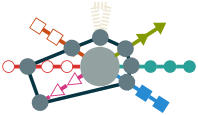

# Introduction {-}

The domain of automated planning is considered a basis of artificial intelligence. As such it must adapt to suit very different needs. Some works might require a fast real time scheduling process to build a path in complex environments. Other works will require flexibility for cooperation or competition with other agents. That is the reason behind the diversity of the planning comunity approach wise. 

Our research aims at a totally separated domain : intent recognition and robotics. In the recent years several works extended what is known in psycology as the *theory of mind*. That theory suposes that to recognise other's intents and goals we often use to transpose our own. That is like saying "*what would **I** do ?*" when observing actions of another person. This leads to new ways to use *invert planning* as an inference tool.

One of the first to propose that idea was Baker et al. [@baker_goal_2007] that uses bayesian planning to infer intentions. Another one was Ramirez et al. [@ramirez_plan_2009] that found an elegant way to transform a plan recognition problem into classical planning. This is done simply by encoding observation constraints into the planning domain [@baioletti_encoding_1998] to ensure the selection of actions in the order that they were observed. A cost comparison will then give us a probability of the goal being pursued given the observations. Some works extended this with multi-goal recognition [@chen_planning_2013] and robotic applications [@talamadupula_coordination_2014].

Very recently, another paper extended this approach significantly. The method proposed by Sohrabi et al. [@sohrabi_plan_2016] make the recognition at the fluent level instead of actions. It assign costs to missing or noisy observed fluents by using soft constraints (often called user preferences). This method also uses a meta-goal that combine each possible goal and is realised when at least one of them is reached.

Sohrabi et al. states that the quality of the recognition is directly linked to the quality of the generated plans. This is why guided diverse planning was prefered along with the posibilities to infer several possible goals at once. 

Since our applicative domain also include robotics, we wish to account also for the real time aspect of the prediction. Indeed, a prediction is only useful *before* it happens. The human aspect of our context also asks for high level description and extensive domains.

Obviously these work hypothesis are in direct contradiction : the harder the problem, the longer the resolution. And this is especially true in automated planning as it has been proven to be a P-SPACE problem if not harder. A big and complex domain is intractable on limited embeded robotics.

Our interest was on the following question : what happens when one *can't* find the solution to the problem ? What if the problem can't be solved ? What if we ran out of time ? This question has been partially threated in [@gobelbecker_coming_2010] where "excuses" are being investigated as response to unsolvability.

{#fig:logo}

**NOT PROVEN YET : **
In our approach we show that partial solutions are often enough if not better suited for human interaction. The key is in better domain description and use. Using Hierarchical Task Networks (HTN) and Partial Order Planning (POP) we can build iteratively better and more complete plans while being able to provide abstract plans whenever it is needed. The last interest of this work is in perspective shifting or how a robot can resume a job started by a human with different capabilities.

The paper starts in @sec:planning with a descriptive framework for automated planning that makes the caracteristics of planners easier to compare. Then we describe the way we chose to represent abstract domains in @sec:knowledge. An explanation of our take on abstract planning is detailed in @sec:abstract. The @sec:perspective explains how plan repairs allows for perspective shifting in assistive robotics. @Sec:properties is for details about all properties of the present approach. We end this paper with results in @sec:results

# General framework of planning {#sec:planning}

A consistant structure always underlays any planners : they are at their heart an exploration in the space of possible solutions. This reduction makes more obvious all characteristics of the planners and eases the comparison between one another. It also helps in knowing their properties and to chose the one best suited for the job at hand.

## Taxonomy

Making a coherent and extensive taxonomy on the automated planning domain is hard. The current reference in the domain is the latest book of Ghallab and Malik [@ghallab_automated_2016] that aims to survey most works in the field. By combining the way planners are categorized in this book, the previous one [@ghallab_automated_2004] and various works and state of the arts, and factorizing the result as much as possible, we produced our own taxonomy of the field.

{#fig:taxonomy}

This taxonomy is inspired for the method of the '*6 Ws*' that aims to ask questions about all aspect of a concept to better analyse it. Since planning is a search, we ask the question about that search. Iterestingly the answers addresses some symetrical properties on the search and the expected solutions.

### Search characteristics

* *Where ?* **Space** : It influence greatly the way the planner behaves. We present the classical search spaces (one can always build a custom structure around one of them and search in it) :
	- *Action* : States are fluent sets linked with actions,
	- *Local* : Neighboorhood of actions are considered when planning,
	- *Tasks* : Usually through composite action with HTN techniques,
	- *Plan* : This covers Plan Space Planning (PSP), case based planning and policies.
* *hoW ?* **Iteration** : This is the way the planner builds the plan. Here is the different kinds :
	- *Direct* : Forward or backward chaining throught the search space (usually actions),
	- *Refine* : Incrementally selecting entities in the search space to find a solution,
	- *Repair* : Tweaking existing solutions to fit them to the current problem.
* *When ?* **Timing** : The timing of the planning can affect how much time the process should take. More constraints on time means the planning process should be faster. We decided to divide timing in three :
	- *Optimal* : Which means "take your time", 
	- *Complete* : Asking the best result available when a solution is found, 
	- *Anytime* : This means that even if interupted we expect a result. It is essential to note that we put more importance on the "any" part of the notion as other works usually do.

### Solution characteristics

* *Who ?* **Expressivity** : Who makes problems ? Not everyone can encode planning domains and problems. Here are the elements to take into account when selecting the expressivity for the targeted user :
	- *Grounded* : Easier and usually faster but very limited and not memory friendly.
	- *Lifted* : Variable handling complexify the planning process but makes it much more flexible.
	- *Quantified* : Allows for more general actions in the domain. Exponancially harder to solve with the domain size.
	- *Abstract* : Very human way of representing tasks and methods in an abstract way (used for HTN).
* *Why ?* **Criteria** : The preference over the solution. Depends heavily on the purpose of the planner :
	- *Quality* : When optimal plans are important,
	- *Stability* : When constistency is welcomed (especially in human environements),
	- *Diversity* : When one wants alternatives to achieve the goal.
* *What ?* **Order** : The form of the plan can be very important depending on the application :
	- *Total* : Totally ordered sequence of acctions to be executed. Precise but restrictive.
	- *Partial* : Allows for parallel execution and more flexibility.
	- *Temporal* : Specify duration of action and makes execution more time efficient.

### Context of the planning

One last question needs answering even if outside of the scope of the "*6 Ws*". It targets both the search and the solution as it is more linked to a global context being the chosen planning paradigm :

* *Sure ?* **Uncertainty** : Covers all that can go wrong during execution of the plan. There are several ways to handle it :
	- *Deterministic* : Not handling uncertainty or repairing plans after they fails.
	- *Posibilistic* : Giving alternative plans if uncertain actions fails or become unfeasible.
	- *Probabilistic* : Being so uncertains of the outcome of the execution that we plan by giving policies on what action to do next from any world state.

## Related planners

In this section we will present several panners that influenced this paper and will position them on a miniature version of @fig:taxonomy using a radar chart representation.

### Lamma

Lamma [@richter_lama_2010] is a classical Fast Forward [@hoffmann_ff:_2001] inspired planner. It is about as simple as it can get but it is often praised for its performances on classical problems.

### SHOP & SHOP2

SHOP [@nau_shop:_1999] is a HTN planner. It is working by fullfilling tasks instead of goals. Each task has a set of methods that can use other tasks in order to achieve their effects. It prefers more general operators durring the planning process and outputs regular totally ordered sequences.

### LPG and variations

Gerevini's LPG [@gerevini_lpg_2002] is a local search planner based on action graphs and constraints resoltuion.
It started as GPG [@gerevini_lagrange_2000] and was featuring a simple Walksat local search on an levelled action graph. Each step is a refinement of a subgraph following a global dynamic heuristic based on cost assesment and Lagrange multipliers. Its performances and its ability to optimize and adapt plans made LPG a base planners of several other works.

#### LPG-Adapt

LPG-Adapt [@fox_plan_2006] is a variation of LPG used for plan repair and reuse. It is used mostly in dynamic environments in order to ensure that reused plans are not altered too much from iteration to iteration. This stability is an interesting property for online planning and give a valuable metric for diverse planning methods.

#### LPG-d

LPG was also adapted for diverse planning. LPG-d [@nguyen_generating_2012] is a diverse planner that uses LPG's capacity to be driven by action costs in order to account for user preferences. It is derived from a an improved version of LPG [@gerevini_approach_2008] that already can do planning with multi-criteria for plan quality.

#### Duet

The Duet planner [@gerevini_combining_2008] is Gereveni's approach to HTN planning. It is a modified version of LPG that has an additional constraint violation type. This constraint violation aims to resolve abstract actions inserted with HTN planning by invoking SHOP2 [@nau_shop2:_2003] on the considered part of the problem.

### HiPOP

HiPOP [@bechon_hipop:_2014] is a planner that uses Partial Order Planning (POP) techniques with HTN planning. It adds upon VHPOP [@younes_vhpop_2003] with HTN based heuristics. The classical POP flaws must have been completed to adapt to abstract actions and how they introduce invisible flaws.

## Framework of general planning

**TODO but not useful outside of a survey/taxonomy/framework paper**

# Extended knowledge representation in planning {#sec:knowledge}

**NEEDS MORE RESEARCH AND CITATIONS FOR THAT : **
Knowledge representation in planning is not often treated. It remains one of the biggest issue in planning [@bundy_representation_2006] but its difficulty often discourage researcher to invest in trying to solve it. Most of the time they workaround the difficulty using problem transformation methods. Problem transformation, while easier, often lose all the advantages of the original representation. Very few planners are actually not fully instanciated [@ramoul_htn_2016]. And works on quantifiers and abstraction are even more so [@frances_9-strips:_2016].

## Encoding fluents in ontology like language

**NEEDS MORE RESEARCH + ANL + PANDA... :**
Some works try to use more advanced languages than STRIPS or PDDL to do planning. The ones oriented toward knowledge databases are trying to exploit OWL. As it being used mostly for web service description it is no surprise that almost all works tend toward Web Service Composition for cloud based usage [@ziaka_web_2011].

Ontology doesn't ease the planning representation in their classical form. Indeed, one cannot simply use reified statements as fluents. They lack variables and any other form of formal logic like expressions and quantifiers. This is why we needed to develop our own language.

## Adapting ontologies for planning (and more)

**NOT DONE YET, BUT ITS THE GOAL OF WORLD IDEALLY : ** 
We developped a language we called WORLD. It is inspired by simplified RDF. The language is self described using minimal lexical and inference rules. Its main advantage for planning is its ability to use statements as entities. It is therefore possible to express fluents as predicated triplets that can be matched with other fluents. Variable support also makes lifted planning possible. Quantifiers are also supported in the language and it can describe most expression, introducing new operators as needed.

## Framework definitions

We aim to define all necessary notions in order to make a framework in which we build our planner. This framework is based on reusability and recursive notions. Such properties make further definition simpler and factorize the work as we only need to define future notions for a reduced set of cases.

### Notations

In this paper, we use the notation defined in @tbl:symbols. Our notation is adapted from the one used in [@ghallab_automated_2004].We use the symbol $\pm$ to signify that there is a notation for the positive and negative symbols but the current formula works regardless of the sign. All related notions will be defined later.

**Symbol**                          **Description**
----------                          ---------------
$pre(o)$, $eff(o)$                  Preconditions and effects of the operator $o$
$\mathcal{D}$                       Planning domain
$\mathcal{P}$                       Planning problem
$l_{\rightarrow}$, $l_{\leftarrow}$ Source and target of the causal link $l$
$o_1 \succ o_2$                     Precedence operator ($o_1$ precedes $o_2$)
$\mathcal{F}^\pm(\pi)$              Set of flaws in $\pi$
$r(f)$                              Resolvers of the flaw $f$
$f.n$                               Needer of the flaw $f$
$f(\pi)$                            Application of the flaw $f$ on plan $\pi$
$\Downarrow \pi$                    Full support of $\pi$
$\pi \models \mathcal{P}$           The partial plan $\pi$ is a valid solution of $\mathcal{P}$

: Most used symbols in the paper. **TODO: Update that** {#tbl:symbols}

### Logic description

Before the planning specific definition, we must introduce the elements of our fluent representation. To simplify, it is first order logic mixed into RDF representation. 

An entity $e$ is an abstract object with a few attributes :

* a **name** that may be empty,
* a **type** that caracterize its nature.

Some entities have additional attributes in function of their type :

* **parameters** that is simply an ordered group of entities,
* a **value** that is intrisic to the given entity and that can eventually change.

In our representation, contrarily to standard RDF, everything is entity : types are entities, groups are entities, statements are entities, the language itself is an entity.

That means that we can represent *metastatements* a.k.a. statements about statements.

In this context, a fluent is a statement about the world. It can use parameters (in the scope of the current or host statement) and enventually quantifiers. 

**TODO Reformulate this**

* $T$ is the set of **types** used in the domain for variables and constants. We provide types with a relation of **subsumption** noted $t_1 \prec t_2$ with $t_1, t_2 \in T$ meaning that all instances of $t_1$ are also instances of $t_2$.
* $C_\mathcal{D}$ is the set of typed **domain specific constants**.
* $R$ is the set of **relations** (also called properties). They are used to express aspects and properties of the world. We note them as a tuple $r= \langle name, r_s, r_t\rangle$ with $name$ as the relation's name, $r_s$ and $r_t$ as the source and target type and arity (ex.: $Object^2$ signify a pair of objects). When a relation is instanciated it is called a *fluent* and binds an object to $n$ subjet(s) ($n$ being the arity of the relation).
* $F$ is the set of possible **fluents**. An additional unary relation is needed on the fluents : $\neg f$ is used to signify that the fluent is negative. We also add special behavior to sets of fluents. For exemple we note $F^\pm$ the set of positive/negative fluent present in $F$. A set of fluents can be either seen as a *state*, *effects* or *preconditions* :
    * *Preconditions* have a predicate of validity noted $s \models p : \left[ ( p^+ \in s ) \land ( p^- \notin s ) \right]$, meaning that all positive fluents must be present and all negative fluents absent in the state $s$ for the precondition $p$ to be valid.
    * *Effects* have an application operation noted $s+e = ( s \setminus e^- ) \cup e^+$. The values erasive, meaning that if a fluent is present with different target value the value in the state $s$ is erased by the value in $e$ except if the target arrity of the relation of the fluent is infinite. **TODO: example to explain maybe + open/closed world hypothesis**

### Domain definitions

Our domain definition takes into acount some modifications necessary to achieve the type of planning we aim for. A domain is a tuple $\mathcal{D} = \langle T, C_\mathcal{D}, R, F, O \rangle$ where

* $F$ is the set of **fluents** as described earlier. **TODO action in their dedicated section**
* $O$ is the set of **operators**. An operator is a tuple $o = \langle name, pre, eff, methods, lv \rangle$ with $name$ as the operator's name, $pre$ as the set of fluent coresponding to a conjonction that must be met to apply the operator using the set of fluent that represents the effect : $eff$. We note $methods$ is the set of *methods* of the operator that contains a partial plan to realise the operator. The set can be empty in witch case the operator is said to be *atomic*. $l$ is the abstraction level of the operator.

This definition lays some important bases of our framework. Our operators are **composite** meaning that a *method* must be chosen and instanciated as a partial plan in order to complete any plan containing an instanciation of this operator.

We note $lv_{max}(\mathcal{D})$ the maximum abstraction level of a given domain.

### Partial plan definitions

We define a partial plan as a tuple $\langle S, L, B\rangle$ with :

* $S$ the set of **steps**. A step is a partially or fully instantiated operators also called *actions*. It has two unary relations : 
    - $lv_i(a)$ whitch affects to each step an interval of integers that corresponds to the **abstraction levels of the step**.
    - $dummy(a)$ is a predicate that gives true iff the step is a **dummy action**. Dummy actions are always linked to their parent via a *hierarchical causal link* and cannot be removed without removing the parent action.
* $L$ the set of **causal links**.
* $B$ the set of **binding constraints**.

Partial plans can be seen as a simple form of planning graphs. It is a directed acyclic graph with action as vertices and causal links as edges. In the case of HTN we add another dimensionality to the planning graph with *abstraction levels*. On the highest level we use the most generic composite operators. The last level is for atomic actions belonging to the most specific composite operators. Each level can be seen as a plan by itself. We introduce the set of **hierarchical causal links** that is a subset of $L_H \subset L$. These links are not to be acounted for support (see @def:support). Another propriety of these levels is that $lv(o) <= lv_i(a)$ with $a$ being an instanciation of $o$. We can also extract regular partial plans from leveled partial plans at any level. $\pi_n$ is a restriction of the leveled partial plan $\pi$ at level $n$.

We note $l : a_s \xrightarrow{c} a_t$ the **causal link** $l$ that binds the *source step* $a_s$ to the *target step* $a_t$ using the *cause* $c$. A cause is a simple set of fluents that is provided by the source to the target.

We define support as a property of preconditions, steps and partial plans. A partial plan $\pi$ is fully supported if each of its steps $o \in S$ is fully supported. A step is fully supported if each of its preconditions $f \in pre(o)$ is supported. A precondition is fully supported if there exists a causal link $l$ that provides it. We note full support of a partial plan as :
$$\pi\Downarrow \equiv
\begin{array}{l}
    \forall a \in S \thickspace \forall f \in pre(a) \thickspace \exists l \in L_\pi^-(a) \setminus L_H: \\
        \left(f \in l \land \not \exists t \in S (l_{\rightarrow} \succ t \succ a \land \lnot f \in eff(t))\right)
\end{array}$$
with $L_\pi^-(a)$ being the incoming causal links of $a$ in $\pi$ and $l_{\rightarrow}$ being the source of the link.

This means that in order to be fully supported a partial plan needs to have all its step's precondition supplied with causal links without possible order that allows a step to threaten another link. We add the notation $\pi\downarrow$ for partial support, meaning that some preconditions might not be supported. Obviously preconditions cannot be partially supported.

A specificity of our definition is that the ordering constraints are part of causal links. When an ordering constraint doesn't have a cause we use a **bare causal links** (mostly used for threats). We also introduce the **precedence operator** noted $a_i \succ a_j$ with $a_i, a_j \in S$ iff there is a path of causal links that connects $a_i$ to $a_j$. We call $a_i$ *anterior* to $a_j$.

The notion of support can be extended to a single level $\pi \Downarrow^n$

### We have a problem

The planning problem is defined as a tuple $\mathcal{P} = \langle \mathcal{D}, C_\mathcal{P}, \Omega \rangle$, where

* $\mathcal{D}$ is a planning domain,
* $C_\mathcal{P}$ is the set of **problem constants** disjoint from the domain constants,
* $\Omega$ is the **root operator** which methods correspond to the solution of the problem. Its level is set to $lv_{max}(\mathcal{D}) + 1$.

The root operator contains the **initial state and goal** (noted respectively $I$ and $G$) of the problem. In the context of multiple planning, this operator may have several methods that corresponds to several result plans.

### Plan refinement definitions

Partial Order Planning fixes flaws in a partial plan to refine it into a valid plan that is a solution to the given problem. Since we work with a HTN approach the classical flaws must be adapted [@bechon_hipop:_2014]. Therefore, we present the updated flaws for our version of POP.

A flaw in a partial plan, called subgoal, is a missing causal link required to support a precondition of a step. We can note a subgoal as $a_n\not\Downarrow_s$
with $s$ being **proper fluent** of the subgoal (also called *open condition*) and also a unsuported precondition of the action $a_n$ called the **needer** of the subgoal.

It is to be noted that hierarchical causal links does not account for support and therefore doesn't solve subgoals. Also flaws can only be applied at a given abstraction level.

A flaw in a partial plan called threat consists of having an effect of a step that can be inserted between two actions with a causal link that is threatened by the said effect.
We say that a step $a_b$ is threatening a causal link $a_p \xrightarrow{t} a_n$ iff
$a_b \neq a_p \neq a_n \land \neg t \in eff(a_b) \land a_p \succ a_b \succ a_n$
with $a_b$ being the **breaker**, $a_n$ the *needer* and $a_p$ a *provider* of the *proper fluent* $t$.

Flaws are fixed via the application of a resolver to the plan. A flaw can have several resolvers that match its needs.

A resolver is a potential causal link defined as a tuple $r = \langle a_s, a_t, f\rangle$ with:

* $a_s, a_t \in S$ being the source and the target of the resolver,
* $f$ being the considered fluent.

For classical flaws, the resolvers are simple to find. For a *subgoal* the resolvers are sets of the potential causal links between a possible provider (along allowed operators or steps) of the proper fluent and the needer. To solve a *threat* there are mainly two resolvers: a causal link between the needer and the breaker called **demotion** or a causal link between the breaker and the provider called **promotion**.

Once the resolver is applied, the algorithm needs to take into account **side effects** of that application.

Flaws that arise because of the application of a resolver on the partial plan are called causal side effects or *related flaws*.

We can derive this definition for subgoals and threats:

* **Related Subgoals** are all the new open conditions inserted by new steps.
* **Related Threats** are the causal links threatened by the insertion of a new step or deletion of a causal link.

# Abstract planning {#sec:abstract}

# Plan repairs for perspective shifting {#sec:perspective}

# Properties of COLOR {#sec:properties}

# Results {#sec:results}

# Conclusions {- #sec:conclusions}

# References {-}

