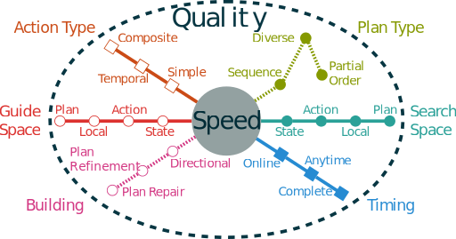

# Introduction {-}

The domain of automated planning is considered a basis of artificial intelligence. As such it must adapt to suit very different needs. Some works might require a fast real time scheduling process to build a path in complex environments. Other works will require flexibility for cooperation or competition with other agents.

That is the reason behind the diversity of the planning comunity approach wise. It is hard to define an universal taxonomy for the domain. We can sort planners by their search space, their completeness, their use of uncertainty, their heuristics (that are extremely diverse), etc. **TODO: citation binge.** With all these colors of planners we yet wish to add a new one.

Let us introduce our planner named Composite Operators & LOcal Refinement (COLOR)[pun inteded]. 

{#fig:logo}

Our research aims at a totally separated domain : intent recognition and robotics. In the recent years several works extended what is known in psycology as the *theory of mind*. That theory suposes that to recognise other's intents and goals we often use to transpose our own. That is like saying "*what would **I** do ?*" when observing actions of another person. This leads to new ways to use *invert planning* as an inference tool.

One of the first to propose that idea was Baker et al. [@baker_goal_2007] that uses bayesian planning to infer intentions. Another one was Ramirez et al. [@ramirez_plan_2009] that found an elegant way to transform a plan recognition problem into classical planning. This is done simply by encoding observation constraints into the planning domain [@baioletti_encoding_1998] to ensure the selection of actions in the order that they were observed. A cost comparison will then give us a probability of the goal being pursued given the observations. Some works extended this with multi-goal recognition [@chen_planning_2013] and robotic application [@talamadupula_coordination_2014].

Very recently, another paper extended this approach significantly. The method proposed by Sohrabi et al. [@sohrabi_plan_2016] make the recognition at the fluent level instead of actions. It assign costs to missing or noisy observed fluents by using soft constraints (often called user preferences). This method also uses a meta-goal that combine each possible goal and is realised when at least one of them is reached.

The preferred type of planners used in this work is multiple planning (planning with a set of plans as a result) as it will return naturally the $k$ best predictions **TODO: reword/introduce**. The paper also states that quality in the chosen planners is the principal criteria of selection. Since our applicative domain also include robotics, we wish to account also for the real time aspect of the prediction (a prediction is only useful *before* it happens).

This is the drive of the present paper. We therefore propose a planner with a focus on quality and anytime properties. It combines several planning approaches : it is based on Hierarchical Task Networks (HTN), Partial Order Planning (POP) and Local search heuristics.

**TODO: announce the superb plan of the paper**

# Related works

The sheer variety of planners out there makes dificult the act of comparing them. In order to siplify this task we propose a taxonomy of the deterministic planning domain. To our knowledge, no such taxonomy was proposed in recent works. 

## Taxonomy of deterministic planners

{#fig:taxonomy}

The @fig:taxonomy is a visual representation of the taxonomy we propose. The taxonomy is separated in six different *tracks*. Each track represent a category of characteristics. The characteristics closer to the center are considered to be lighter and faster than the one closer to the border that usually means more quality. In order to build this taxonomy we considered that every planning problems are explorational problems. Being inspired by the popular 6Ws method we simply asked the questions : 

* *Where ?* **Search Space** : State based planners are often considered faster when plan based planners usually means more flexibility.
* *What ?* **Plan Type** : Most planners find a totally ordered sequence of actions. Some prefer to find a partially ordered plan. Both can be found in sets (what we call *multiple planning*)
* *Who ?* **Action Type** : The actors of planning are actions. The action model determines how expressive a solution plan will be but also will decrease its performance accordingly.
* *Why ?* **Guide Space** : A guide or heuristic is giving a notion of sens to planners. This category is so diverse (meta-heuristics, machine learning, user preferences, HTN, etc) that our solution was to reflect the search space and to differentiate with the space on wich the guide works on. **TODO : reword?**
* *hoW ?* **Building** : In this category we describe how a planner builds its plans. A simple directional building (forward or backward) is often faster than more complex ones (like plan re-use or repair).
* *When ?* **Timing** : The timing of the planning can affect how much time the process should take. More constraints on time means the planning process should be faster.

<!--

-->

## Analyse of related planners

In this section we will present several panners that influenced this paper and will position them on a miniature version of @fig:taxonomy using a radar chart representation.

### SHOP & SHOP2

\begin{wrapfigure}{r}{0.16\textwidth}
  \vspace{-56pt}
  \begin{center}
    \includegraphics{graphics/taxo-shop.pdf}
  \end{center}
  \vspace{-20pt}
\end{wrapfigure}

SHOP [@nau_shop:_1999] is a HTN planner. It is working by fullfilling tasks instead of goals. Each task has a set of methods that can use other tasks in order to achieve their effects. It prefers more general operators durring the planning process and outputs regular totally ordered sequences.

### LPG and variations [^1]

\begin{wrapfigure}{r}{0.16\textwidth}
  \vspace{-56pt}
  \begin{center}
    \includegraphics{graphics/taxo-lpg.pdf}
  \end{center}
  \vspace{-20pt}
\end{wrapfigure}

[^1]: The taxonomy figure for LPG contains in dark blue the taxonomy for classical LPG and in grey the taxonomy for its variations.

Gerevini's LPG [@gerevini_lpg_2002] is a local search planner based on action graphs and constraints resoltuion.
It started as GPG [@gerevini_lagrange_2000] and was featuring a simple Walksat local search on an levelled action graph. Each step is a refinement of a subgraph following a global dynamic heuristic based on cost assesment and Lagrange multipliers. Its performances and its ability to optimize and adapt plans made LPG a base planners of several other works.

#### LPG-Adapt

LPG-Adapt [@fox_plan_2006] is a variation of LPG used for plan repair and reuse. It is used mostly in dynamic environments in order to ensure that reused plans are not altered too much from iteration to iteration. This stability is an interesting property for online planning and give a valuable metric for diverse planning methods.

#### LPG-d

LPG was also adapted for diverse planning. LPG-d [@nguyen_generating_2012] is a diverse planner that uses LPG's capacity to be driven by action costs in order to account for user preferences. It is derived from a an improved version of LPG [@gerevini_approach_2008] that already can do planning with multi-criteria for plan quality.

#### Duet

The Duet planner [@gerevini_combining_2008] is Gereveni's approach to HTN planning. It is a modified version of LPG that has an additional constraint violation type. This constraint violation aims to resolve abstract actions inserted with HTN planning by invoking SHOP2 [@nau_shop2:_2003] on the considered part of the problem.

### HiPOP : not a musical

\begin{wrapfigure}{r}{0.16\textwidth}
  \vspace{-56pt}
  \begin{center}
    \includegraphics{graphics/taxo-hipop.pdf}
  \end{center}
  \vspace{-20pt}
\end{wrapfigure}

Despite its name HiPOP has little to do with music and more with automated planning and HTN. HiPOP [@bechon_hipop:_2014] is a planner that uses Partial Order Planning (POP) techniques with HTN planning. It adds upon recent planners such as VHPOP [@younes_vhpop_2003] with HTN based heuristics. The classical POP flaws must have been completed to adapt to abstract actions and how they introduce invisible flaws.

## Positioning of COLOR

\begin{wrapfigure}{r}{0.16\textwidth}
  \vspace{-56pt}
  \begin{center}
    \includegraphics{graphics/taxo-color.pdf}
  \end{center}
  \vspace{-20pt}
\end{wrapfigure}

COLOR is a HTN diverse online planner made for inverted planning. It aims to use local search and plan refining techniques for fast and incomplete planning. The goal is to be able to obtain in a given time the most precise plans possible.

# Definitions

We aim to define all necessary notions in order to make a framework in which we build our planner. This framework is based on reusability and recursive notions. Such properties make further definition simpler and factorize the work as we only need to define future notions for a reduced set of cases.

## Notations

In this paper, we use the notation defined in @tbl:symbols. Our notation is adapted from the one used in [@ghallab_automated_2004].We use the symbol $\pm$ to signify that there is a notation for the positive and negative symbols but the current formula works regardless of the sign. All related notions will be defined later.

**Symbol**                          **Description**
----------                          ---------------
$pre(o)$, $eff(o)$                  Preconditions and effects of the operator $o$
$\mathcal{D}$                       Planning domain
$\mathcal{P}$                       Planning problem
$l_{\rightarrow}$, $l_{\leftarrow}$ Source and target of the causal link $l$
$o_1 \succ o_2$                     Precedence operator ($o_1$ precedes $o_2$)
$O^\Pi$                             Operator graph of the set of operators $O$
$d^\pm_\pi(o)$                      Outgoing and incoming degrees of $o$
$d^\pm(o)$                          Proper degrees of $o$ ($|pre(o)|$ and $|eff(o)|$)
$L^\pm_\pi(o)$                        Outgoing and incoming causal links of $o$
$C(\pi)$                            Set of cycles in partial plan $\pi$
$C_o(\pi)$                          Set of cycles in $\pi$ which $o$ is part of
$C^s_o(\pi)$                        $\{o\}$ if $o$ has a self cycle in $\pi$, $\emptyset$ otherwise
$\mathcal{F}^\pm(\pi)$              Set of flaws in $\pi$
$r(f)$                              Resolvers of the flaw $f$
$f.n$                               Needer of the flaw $f$
$f(\pi)$                            Application of the flaw $f$ on plan $\pi$
$\Downarrow \pi$                    Full support of $\pi$
$\pi \models \mathcal{P}$           The partial plan $\pi$ is a valid solution of $\mathcal{P}$

: Most used symbols in the paper. **TODO: Update that** {#tbl:symbols}

## Domain definitions

With the aim to respect the constraints of our application field, we need to define our own planning framework. We chose a level of expressiveness similar to that of PDDL 3.1 with object-fluents support [@kovacs_bnf_2011]. This particular type of domain description was chosen because values are more meaningful and therefore changing them makes repairs on plans easier.

Our domain definition takes into acount some modifications necessary to achieve the type of planning we aim for. A domain is a tuple $\mathcal{D} = \langle T, C_\mathcal{D}, R, F, O \rangle$ where

* $T$ is the set of **types** used in the domain for variables and constants. We provide types with a relation of **subsumption** noted $t_1 \prec t_2$ with $t_1, t_2 \in T$ meaning that all instances of $t_1$ are also instances of $t_2$.
* $C_\mathcal{D}$ is the set of typed **domain specific constants**.
* $R$ is the set of **relations** (also called properties). They are used to express aspects and properties of the world. We note them as a tuple $r= \langle name, r_s, r_t\rangle$ with $name$ as the relation's name, $r_s$ and $r_t$ as the source and target type and arity (ex.: $Object^2$ signify a pair of objects). When a relation is instanciated it is called a *fluent* and binds an object to $n$ subjet(s) ($n$ being the arity of the relation).
* $F$ is the set of possible **fluents**. An additional unary relation is needed on the fluents : $\neg f$ is used to signify that the fluent is negative. We also add special behavior to sets of fluents. For exemple we note $F^\pm$ the set of positive/negative fluent present in $F$. A set of fluents can be either seen as a *state*, *effects* or *preconditions* :
    * *Preconditions* have a predicate of validity noted $s \models p : \left[ ( p^+ \in s ) \land ( p^- \notin s ) \right]$, meaning that all positive fluents must be present and all negative fluents absent in the state $s$ for the precondition $p$ to be valid.
    * *Effects* have an application operation noted $s+e = ( s \setminus e^- ) \cup e^+$. The values erasive, meaning that if a fluent is present with different target value the value in the state $s$ is erased by the value in $e$ except if the target arrity of the relation of the fluent is infinite. **TODO: example to explain maybe + open/closed world hypothesis**
* $O$ is the set of **operators**. An operator is a tuple $o = \langle name, pre, eff, methods, lv \rangle$ with $name$ as the operator's name, $pre$ as the set of fluent coresponding to a conjonction that must be met to apply the operator using the set of fluent that represents the effect : $eff$. We note $methods$ is the set of *methods* of the operator that contains a partial plan to realise the operator. The set can be empty in witch case the operator is said to be *atomic*. $l$ is the abstraction level of the operator.

This definition lays some important bases of our framework. Our operators are **composite** meaning that a *method* must be chosen and instanciated as a partial plan in order to complete any plan containing an instanciation of this operator.

We note $lv_{max}(\mathcal{D})$ the maximum abstraction level of a given domain.

## Partial plan definitions

We define a partial plan as a tuple $\langle S, L, B\rangle$ with :

* $S$ the set of **steps**. A step is a partially or fully instantiated operators also called *actions*. It has two unary relations : 
    - $lv_i(a)$ whitch affects to each step an interval of integers that corresponds to the **abstraction levels of the step**.
    - $dummy(a)$ is a predicate that gives true iff the step is a **dummy action**. Dummy actions are always linked to their parent via a *hierarchical causal link* and cannot be removed without removing the parent action.
* $L$ the set of **causal links**.
* $B$ the set of **binding constraints**.

Partial plans can be seen as a simple form of planning graphs. It is a directed acyclic graph with action as vertices and causal links as edges. In the case of HTN we add another dimensionality to the planning graph with *abstraction levels*. On the highest level we use the most generic composite operators. The last level is for atomic actions belonging to the most specific composite operators. Each level can be seen as a plan by itself. We introduce the set of **hierarchical causal links** that is a subset of $L_H \subset L$. These links are not to be acounted for support (see @def:support). Another propriety of these levels is that $lv(o) <= lv_i(a)$ with $a$ being an instanciation of $o$. We can also extract regular partial plans from leveled partial plans at any level. $\pi_n$ is a restriction of the leveled partial plan $\pi$ at level $n$.

We note $l : a_s \xrightarrow{c} a_t$ the **causal link** $l$ that binds the *source step* $a_s$ to the *target step* $a_t$ using the *cause* $c$. A cause is a simple set of fluents that is provided by the source to the target.

We define support as a property of preconditions, steps and partial plans. A partial plan $\pi$ is fully supported if each of its steps $o \in S$ is fully supported. A step is fully supported if each of its preconditions $f \in pre(o)$ is supported. A precondition is fully supported if there exists a causal link $l$ that provides it. We note full support of a partial plan as :
$$\pi\Downarrow \equiv
\begin{array}{l}
    \forall a \in S \thickspace \forall f \in pre(a) \thickspace \exists l \in L_\pi^-(a) \setminus L_H: \\
        \left(f \in l \land \not \exists t \in S (l_{\rightarrow} \succ t \succ a \land \lnot f \in eff(t))\right)
\end{array}$$
with $L_\pi^-(a)$ being the incoming causal links of $a$ in $\pi$ and $l_{\rightarrow}$ being the source of the link.

This means that in order to be fully supported a partial plan needs to have all its step's precondition supplied with causal links without possible order that allows a step to threaten another link. We add the notation $\pi\downarrow$ for partial support, meaning that some preconditions might not be supported. Obviously preconditions cannot be partially supported.

A specificity of our definition is that the ordering constraints are part of causal links. When an ordering constraint doesn't have a cause we use a **bare causal links** (mostly used for threats). We also introduce the **precedence operator** noted $a_i \succ a_j$ with $a_i, a_j \in S$ iff there is a path of causal links that connects $a_i$ to $a_j$. We call $a_i$ *anterior* to $a_j$.

The notion of support can be extended to a single level $\pi \Downarrow^n$

## We have a problem

The planning problem is defined as a tuple $\mathcal{P} = \langle \mathcal{D}, C_\mathcal{P}, \Omega \rangle$, where

* $\mathcal{D}$ is a planning domain,
* $C_\mathcal{P}$ is the set of **problem constants** disjoint from the domain constants,
* $\Omega$ is the **root operator** which methods correspond to the solution of the problem. Its level is set to $lv_{max}(\mathcal{D}) + 1$.

The root operator contains the **initial state and goal** (noted respectively $I$ and $G$) of the problem. In the context of multiple planning, this operator may have several methods that corresponds to several result plans.

## Plan refinement definitions

Partial Order Planning fixes flaws in a partial plan to refine it into a valid plan that is a solution to the given problem. Since we work with a HTN approach the classical flaws must be adapted [@bechon_hipop:_2014]. Therefore, we present the updated flaws for our version of POP.

A flaw in a partial plan, called subgoal, is a missing causal link required to support a precondition of a step. We can note a subgoal as $a_n\not\Downarrow_s$
with $s$ being **proper fluent** of the subgoal (also called *open condition*) and also a unsuported precondition of the action $a_n$ called the **needer** of the subgoal.

It is to be noted that hierarchical causal links does not account for support and therefore doesn't solve subgoals. Also flaws can only be applied at a given abstraction level.

A flaw in a partial plan called threat consists of having an effect of a step that can be inserted between two actions with a causal link that is threatened by the said effect.
We say that a step $a_b$ is threatening a causal link $a_p \xrightarrow{t} a_n$ iff
$a_b \neq a_p \neq a_n \land \neg t \in eff(a_b) \land a_p \succ a_b \succ a_n$
with $a_b$ being the **breaker**, $a_n$ the *needer* and $a_p$ a *provider* of the *proper fluent* $t$.

Flaws are fixed via the application of a resolver to the plan. A flaw can have several resolvers that match its needs.

A resolver is a potential causal link defined as a tuple $r = \langle a_s, a_t, f\rangle$ with:

* $a_s, a_t \in S$ being the source and the target of the resolver,
* $f$ being the considered fluent.

For classical flaws, the resolvers are simple to find. For a *subgoal* the resolvers are sets of the potential causal links between a possible provider (along allowed operators or steps) of the proper fluent and the needer. To solve a *threat* there are mainly two resolvers: a causal link between the needer and the breaker called **demotion** or a causal link between the breaker and the provider called **promotion**.

Once the resolver is applied, the algorithm needs to take into account **side effects** of that application.

Flaws that arise because of the application of a resolver on the partial plan are called causal side effects or *related flaws*.

We can derive this definition for subgoals and threats:

* **Related Subgoals** are all the new open conditions inserted by new steps.
* **Related Threats** are the causal links threatened by the insertion of a new step or deletion of a causal link.

# Algorithm

The algorithm of COLOR works in several phases. It first need to compile the domain in a particular way. Then it will plan on each abstraction level and do some additional processing between each levels.

## Domain compilation

This is the first phase. It is running when processing files describing the planning domain. It contains several mecanisms that are added to the standard domain compilation.

### Classical mecanisms

The standard compilation mecanisms are straightforward. First the software will parse the files into the correct memory representation of the domain. While doing so it checks some basic sytax and semantic constraints. It also check for inconsistancies in the domain (action with contradicting effects, non realisable preconditions) and either remove them or throw an error. It also prepare the instanciation inertia in order to quicken the planning procedure.

The mecanism searches for operator that matches 
$$o\in O \land 
\left[ \begin{array}{l} 
pre(o) \cap eff(o) \neq \emptyset \lor \\
\exists \{f, \lnot f\} \subset pre(o) \lor 
\exists \{f, \lnot f\} \subset eff(o) 
\end{array}\right]$$

### Method binding constraints

From there, the process do the basic intertia on each methods of abstract operators. This inertia is used to give an application formula that gives the instanciation constraints regarding variable affectation and typing. This formula is cached for the planning process to access. **TODO : How to compute that exactly, see Damien**

### Abstraction level computation

In order for the algorithm to work, abstract operators need an appropriately set abstraction level.

The abstraction level of an operator is equal to the highest abstraction level used in its methods plus one.
We can note : $lv(o) = 1+\left\{ \max(lv(o_{sub}),0) | o_{sub} \in m_o \in methods(o) \right\}$

In order to find this level for every operator, the algorithm needs two more steps :

* Looping on every operators to find cycles in the dependencies of abstract operators. The cycles happens when an operator uses in its method a parent operator. The cycles are cut ate the weakest point (smallest operator/method)
* Recursively increasing abstraction levels after initialization at $1$ on all operators. This step stops once the levels stay stable. **TODO : maybe better way to do this but whatever ?**

## Online phase

This phase starts when the problem is first provided. 

### Instanciation inertia

Instanciation inertia is imediatly started, begining by the highest level operators. The intertia can remove methods right away as their instanciation constraints might be impossible in the context of the given problem. This will reduce greatly the branching factor and therefore quicken the planning process. In order to do this we use methods described in [@ramoul_approche_2016]. **TODO: see with Damien about that**

### Levelled planning

The algorithm for each level is the same. It is a variation of classical POP with LPG like heuristics. The local search is done at the method level (between the start and end dummy actions). If not in a method the scope starts at the last end dummy action and ends at the next start dummy action.

If we are planning at abstraction level $n$, the we can only instanciate operators of level $n$ or above. This is done to restrict the search space according to user's intent [@kambhampati_hybrid_1998]. Obviously, using standard POP algorithm the planning will quickly fail if these high level operators can't achieve the goal. This failure is part of the extended algorithm.

When a subgoal can't find a resolver in the set of available operators it backtracks in a special way. The flaw is discarded in a separated agenda and the planning continues. Once there is no more flaws or the planning process efectively fails, all flaws are gathered along with the current state of the partial plan.

### Changing level

Once a level finishes its partial plans found are copied into the next level, namely $n-1$. For each plan the algorithm takes all the abstract actions and replace it with instanciations of its available methods framed by dummy start and end actions. All incoming causal links are copied to the start action and the outgoing ones to the end one. The algorithm also adds hierarchical causal links to the parent action.

One can note that unallowed action can happens in the methods. These are allowed only when changing level and are then behaving like normal steps of the partial plan. Flaws can use such a step even if the related operator is forbiden.

### Finalization

Once the level $1$ is reached, all operators becomes available to use and the planning reaches completude. The formal fail and success of the algorithm happens only at that level. If the algorithm succeeds, all found plans are processed by an upward propagation of actions. If an action doesn't have a parent, it is propagated in the superior levels with their causal links (adapted for parent actions if needed). The result is a set of consistent plan across all levels.

The advantages of this is that each plan can be used as "hints" for intent recognition.
**TODO: Next part on properties + more formalization**

#References {-}

