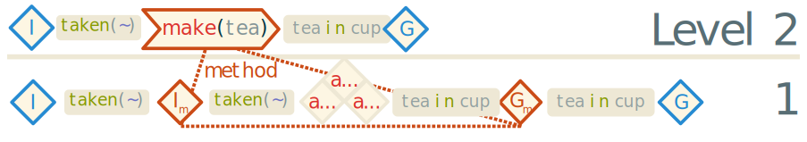
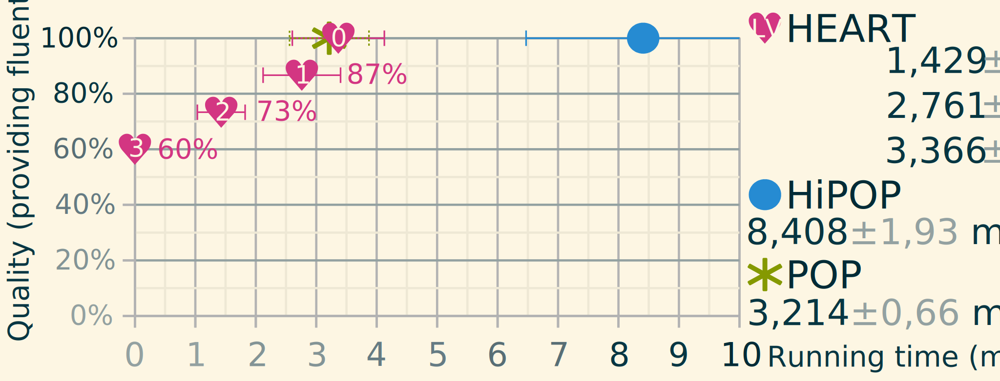
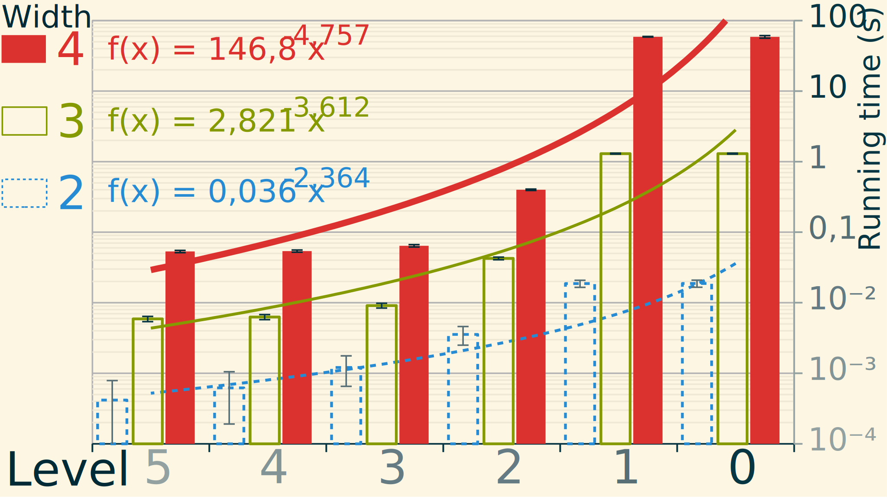

# Introduction {-}

The domain of automated planning is considered a basis of artificial intelligence. As such it must adapt to suit very different needs. Some works might require a fast real time scheduling process to build a path in complex environments. Other works will require flexibility for cooperation or competition with other agents. That is the reason behind the diversity of the planning comunity approach wise.

Our research aims at a totally separated domain : intent recognition and robotics. In the recent years several works extended what is known in psycology as the *theory of mind*. That theory suposes that to recognise other's intents and goals we often use to transpose our own. That is like saying "*what would **I** do ?*" when observing actions of another person. This leads to new ways to use *invert planning* as an inference tool.

One of the first to propose that idea was Baker et al. [@baker_goal_2007] that uses bayesian planning to infer intentions. Another one was Ramirez et al. [@ramirez_plan_2009] that found an elegant way to transform a plan recognition problem into classical planning. This is done simply by encoding observation constraints into the planning domain [@baioletti_encoding_1998] to ensure the selection of actions in the order that they were observed. A cost comparison will then give us a probability of the goal being pursued given the observations. Some works extended this with multi-goal recognition [@chen_planning_2013] and robotic applications [@talamadupula_coordination_2014].

Very recently, another paper extended this approach significantly. The method proposed by Sohrabi et al. [@sohrabi_plan_2016] make the recognition at the fluent level instead of actions. It assign costs to missing or noisy observed fluents by using soft constraints (often called user preferences). This method also uses a meta-goal that combine each possible goal and is realised when at least one of them is reached.

Sohrabi et al. states that the quality of the recognition is directly linked to the quality of the generated plans. This is why guided diverse planning was prefered along with the posibilities to infer several possible goals at once. 

Since our applicative domain also include robotics, we wish to account also for the real time aspect of the prediction. Indeed, a prediction is only useful *before* it happens. The human aspect of our context also asks for high level description and extensive domains.

Obviously these work hypothesis are in direct contradiction : the harder the problem, the longer the resolution. And this is especially true in automated planning as it has been proven to be a P-SPACE problem if not harder. A big and complex domain is intractable on limited embeded robotics.

Our interest was on the following question : what happens when one *can't* find the solution to the problem ? What if the problem can't be solved ? What if we ran out of time ? This question has been partially threated in [@gobelbecker_coming_2010] where "excuses" are being investigated as response to unsolvability.

**FIXME : Speak about POP and HTN**

**TODO : Introducing our work**

# Definitions

In this paper, we use the notation defined in @tbl:symbols. Our notations are adapted from the ones used in [@ghallab_automated_2004] and [@gobelbecker_coming_2010]. We also use graph theory notations. The symbol $\pm$ is used to signify that the notation is signed. All related notions will be defined later.

**Symbol**                      **Description**
----------                      ---------------
$pre(a)$, $eff(a)$              Preconditions and effects of the action $a$.
$methods(a)$                    Methods of the action $a$.
$\mathcal{D}, \mathcal{P}$      Planning domain and problem.
$lv(a), lv(\mathcal{D})$        Abstraction level of the action or domain.
$\phi^\pm(l)$                   Signed incidence function for partial order plans.
                                $\phi^-$ gives the source and $\phi^+$ the target step of $l$.
                                No sign gives a pair corresponding to link $l$.
$causes(l)$                     Gives the causes of causal link $l$.
$a_a \succ a_s$                 Step $a_a$ is anterior to successor step $a_p$.
$L^\pm(a)$                      Set of incoming ($L^-$) and 
                                outgoing ($L^+$) links of step $a$.
                                No sign gives all adjacent links.
$l \downarrow a$                Link $l$ participates in the partial support of step $a$.
$\downarrowbarred_f a$          Fluent $f$ isn't supported in step $a$.
$\pi \Downarrow a$              Plan $\pi$ fully supports $a$.
                                If no left side it means just full support.
$A_x$                           Proper actions set of $x$.
$[exp]$                         Iverson bracket : $0$ if $exp=false$, $1$ otherwise.

: Most used symbols in the paper. {#tbl:symbols}

Planners often work in two times : first we input the planning domain then we give the planner an instance of a planning problem to solve.

## Domain

The domain is the context of the planner. It specifies the allowed operators that can be used to plan and all the fluents they use for preconditions and effects.

::: {.definition name="Domain"} :::
A domain $\mathcal{D} = \langle C_\mathcal{D} , R, F, O \rangle$ is a tuple where :

* $C_\mathcal{D}$ is the set of **domain constants**.
* $R$ is the set of **relations** (also called *properties*) of the domain. These relations are similar to quantified predicates in first order logic.
* $F$ is the set of **fluents** used in the domain to describe operators.
* $O$ is the set of **operators** which are fully lifted *actions*.
:::::::::::::::::::::::::::::::::::

*Example*: The domain in @lst:domain we use as example is inspired from the kitchen domain of [@ramirez_probabilistic_2010] modified to suit our needs.

~~~~ {#lst:domain}
take(item) pre (taken(~), ?(item));
take(item) eff (taken(item));
heat(thing) pre (~(hot(thing)), taken(thing));
heat(thing) eff (hot(thing));
pour(stuff,into) pre (stuff ~(in) into, taken(stuff));
pour(stuff,into) eff (stuff in into);
put(ustensil) pre (~(placed(ustensil)), taken(ustensil));
put(ustensil) eff (placed(ustensil), ~(taken(ustensil)));
infuse :: Action;
make :: Action;
~~~~~~~~~~~~~~~~~~~~~~~~~~~~~~~~~~~~~~~~~~~~~~~~~~~~~~~~~~~~~~~~~~~~~~~~~~~~~~~~~~~~~~
: Domain file used in our planner. Composite actions have been truncated for lack of space. **FIXME: Show the whole domain or not and how ?**

A domain contains the definitions of all fluents that can be used in the operators.

::: {.definition name="Fluent"} :::
A fluent is a parameterized relation $f=r(arg_1, arg_2, … , arg_n)$ where :

* $r$ is the relation of the fluent under the form of a boolean predicate.
* $arg_i | i \in [1,n]$ are the arguments (possibly quantified).
* $n = |r|$ is the arity of $r$.

Fluents are signed. Negative fluents are noted $\neg f$ and behave as a logical complement. Quantifiers are affected by the sign of the fluents. We don't use the closed world hypothesis : fluents are not satisfied until provided whatever their sign. 
:::::::::::::::::::::::::::::::::::

*Example*: The precondition of operator $take(thing)$ is simply a single negative fluent noted $\neg taken(thing)$ ensuring the variable $thing$ isn't already taken.

The central notion of planning is operators. Instanciated operators are called *actions*. In our framework, actions can be partially instanciated and therefore we consider operators as a special case of actions.

::: {.definition #def:action name="Action"} :::
An action $a$ is an instanciated operator of the domain. It can have instanciation parameters. We note it $a=\langle name, pre, eff, methods \rangle$ where :

* $name$ is the **name** of the action.
* $pre$ and $eff$ are sets of fluents that are respectively the **preconditions and effects** of the action.
* $methods$ is a set of **methods** (partial order plans) that can realize the action.
::::::::::::::::::::::::::::::::::::::::::::::::::

*Example*: In the kitchen the action $take(thing)$ has a precondition of the parameter not being taken and an effect of the parameter being taken.

*Composite* actions are represented using methods. Each method is a partial order plan used in Partial Order Planning (POP). An action without methods is called *atomic*.

::: {.definition name="Plan"} :::
A partially ordered plan is an acyclic directed graph $\pi = (S, L)$ with :

* $S$ the set of **steps** of the plan as vertices. A step is an action belonging in the plan.
* $L$ the set of **causal links** of the plan as edges.
We note $l : a_s \xrightarrow{c} a_t$ the link between its source $a_s$ and target $a_t$ caused by $c$. 
:::::::::::::::::::::::::::::::::

In our representation *ordering constraints* are defined as the transitive cover of causal links over the set of steps. We note ordering constraints like this : $a_a \succ a_s$ with $a_a$ being *anterior* to its *successor* $a_s$. Ordering constraints can't form cycles meaning that the steps must be different and that the successor can't be also anterior to its anterior steps :
$a_a \neq a_s \land a_s \not \succ a_a$.

If we need to enforce order we simply add a causal link without cause. This graph representation along with the implicit ordering constraints makes for a simplified framework that still retain classical properties needed for POP.

**TODO speak about preconditions and effect inference**

## Problem

The other part of the input of most planners is the problem instance. This problem is often most simply described by two components : the initial state and the goal of the problem.

::: {.definition name="Problem"} :::
The planning problem is defined as a tuple $\mathcal{P} = \langle \mathcal{D}, C_\mathcal{P} , \Omega\rangle$ where :

* $\mathcal{D}$ is a planning domain.
* $C_\mathcal{P}$ is the set of **problem constants** disjoint from the domain constants.
* $\Omega$ is the problem's **root operator** which methods are solutions of the problem.

The root operator contains the initial state and goal (noted respectively $I$ and $G$ ) of the problem.
::::::::::::::::::::::::::::::::::::

*Example*: We use a simple problem for our example domain. The initial state provides that nothing is ready, taken or boiled and all containers are empty (all using quantifiers). The goal is to have tea ready and with sugar. For reference, here is the problem as stated in our file :

~~~~{#lst:problem}
init eff (ready(~), taken(~), boiled(~), * ~(in) *);
goal pre (ready(tea), sugar in cup);
~~~~~~~~~~~~~~~~~~~~~~~~~~~~~~~~~~~~~~~~~
: One problem instance used as an example for this paper.

In all cases, the root operator is initialized at $\Omega = \langle "", s_0, s^*, 
\lbrace \pi \rbrace\rangle$ with $s_0$ being the initial state and $s^*$ the goal specifications.

The method $\pi$ is a partial order plan with only the initial and goal steps linked together. Partial order plans are at the heart of Partial Order Planning (POP).

*Example*: The initial partial order plan is $\pi = (\lbrace I,G \rbrace, \lbrace I \rightarrow G \rbrace)$ with :

* $I = \langle "init", \emptyset, s_0, \emptyset\rangle$ and 
* $G = \langle "goal", \emptyset, s^*, \emptyset\rangle$.

The goal of the planner is to refine the plan $\pi$ until it becomes solution of the problem.

## Partial Order Planning

At the base of our method is the classical POP algorithm. It works by refining a partial plan until no more flaws are present and therefore it becomes a solution of the planning problem.

::: {.definition name="Flaws"} :::
A flaw in a partial plan is a contradiction with its validity. Flaws have a *proper fluent* $f$ and a related step often called the *needer* $a_n$. There exist two types of classical flaws :

* **Subgoals** are *open conditions* that are yet to be supported by another step $a_n$ often called *provider*.
* **Threats** are caused by steps that can break a causal link with their effects. They are called *breakers* of the threatened link. A step $a_b$ is threatenning a causal link $a_p \xrightarrow{f} a_n$ if and only if $\neg f \in eff(a_b) \land a_p \succ a_b \succ a_n$. Said otherwise, the breaker can cancel an effect of a providing step before it gets used by its needer.
::::::::::::::::::::::::::::::::::

*Example*: In our initial plan, there are two unsupported subgoals : one to make the tea ready and another to put sugar in it. In this case the needer is the goal step and the proper fluents are each of its preconditions.

These flaws need fixing before the plan can become a solution. In POP it is done by finding resolvers.

::: {.definition name="Resolvers"} :::
Classical resolvers are additional causal links. It is a kind of mirror image of flaws.

* For subgoals, the resolvers are a set of potential causal links containing the proper fluent $f$ in their causes while having the needer step $s_n$ as their target.
* For threats, their are usually only  two resolvers : *demotion* and *promotion* of the breaker relative to the threatened link.
::::::::::::::::::::::::::::::::::::::

*Example*: the subgoal for sugar in our example can be solved by using the action $pour(sugar,cup)$ as the source of a causal link carying the proper fluent as its only cause.

A plan cannot be solution until all of the flaws are fixed. Sometimes, that cannot be achieved because of constraints in the plan. Sometimes it is because the side effects of the resolver application causes incompatible flaws.

::: {.definition name="Side effects"} :::
Flaws that arise because of the application of a resolver are called *related flaws*. They are inserted in the *agenda* (a set of flaws supporting flaw selection) whith each application of a resolver :

* *Related subgoals* are all the new open conditions inserted by new steps.
* *Related threats* are the causal links threatened by the insertion of a new step or deletion of a guarding link.

Flaws can also become irrelevant when a resolver is applied. It is always the case of the targeted flaw but can also affect other flaws. Those *invalidated flaws* are removed from the agenda upon detection :

* *Invalidated subgoals* are subgoals satisfied by the new causal links or removal of needer.
* *Invalidated threats* happen when the breaker no longer threaten the causal link because order got guaranteed or the causal link or breaker have been removed.
:::::::::::::::::::::::::::::::::::::::::

*Example*: adding the action $pour(sugar, cup)$ causes another subgoal with each of the action's preconditions which are that the cup and the sugar must be taken and sugar not already in the cup.

In that last definition we mentioned effects that aren't present in classical POP, namely *negative effects*. All classical resolvers only add elements to the partial plan. Our method needs to ocasionally remove steps so we plan ahead acordingly.

Our version of the POP algorithm is based on [@ghallab_automated_2004, section 5.4.2]. In @alg:pop we present our generic version of POP.

::: {.algorithm #alg:pop name="Partial Order Planner" startLine="1"}
\Function{pop}{Agenda $a$, Problem $\mathcal{P}$}
    \If{$a = \emptyset$} \Comment{Populated agenda of flaws needs to be provided}
        \State \Return Success \Comment{Stops all recursion}
    \EndIf
    \State Flaw $f \gets$ \Call{choose}{$a$} \label{line:flawselection}
    \Comment{Chosen flaw removed from agenda}
    \State Resolvers $R \gets$ \Call{solve}{$f$, $\mathcal{P}$}
    \ForAll{$r \in R$} \Comment{Non deterministic choice operator}
        \State \Call{apply}{$r$, $\pi$} \label{line:resolverapplication} 
		\Comment{Apply resolver to partial plan}
        \State Agenda $a' \gets$ \Call{update}{$a$} \label{line:updateagenda}
        \If{\protect\Call{pop}{$a'$, $\mathcal{P}$} = Success} \Comment{Refining recursively}
            \State \Return Success
        \EndIf
        \State \Call{revert}{$r$, $\pi$} \Comment{Failure, undo resolver application}
    \EndFor
    \State $a \gets a \cup \{f\}$ \Comment{Flaw wasn't resolved}
    \State \Return Failure \Comment{Revert to last non deterministic choice of resolver}
\EndFunction
::::::::::::::::::::::::::::::::::::::::::::::::::::::::::

# Approach

We aim to demonstrate the uses of abstraction in refinement based planners. In order to do this we need to explain a few additional notions regarding abstraction and then explain our algorithm in more details.

## Abstraction in POP

In order to handle abstraction with POP there are a couple of ways. The most straight forward way is illustrated in an other planner called Duet [@gerevini_combining_2008] by simply managing hierarchical actions separately from a regular planner. We chose another way strongly inspired from the works of Bechon *et al.* on a planner called HiPOP [@bechon_hipop_2014]. This planner is adapting HTN notions for POP by extending it and modifying its behaviour. It does this by adding new flaws and resolvers.

::: {.definition name="Abstraction flaw"} :::
An abstraction flaw is when the partial plan conatins a step with a non zero level. This step is the needer of the flaw.

* *Resolvers* : An abstraction flaw is solved with an **expansion resolver**. The resolver will replace the needer with one of its instanciated methods in the plan. This is done by linking all causal links to the initial and goal step of the method as such : 
$L^-(I_m) = L^-(s_n) \land L^+(G_m) = L^+(s_n)$ with $m \in methods(s_n)$. This means that all incoming links will be redirected to the initial step of the method and all outgoing links will be linked from the goal of the method.
* *Side effects* : An abstraction flaw can be related to the introduction of a composite action in the plan by any resolvers and invalidated by its removal.
:::::::::::::::::::::::::::::::::::::::::::::

{#fig:expansion}

*Example*: When adding the step $make(tea)$ in the plan to solve the subgoal that needs tea being made, we also introduce an abstraction flaw that will need the step replaced by its method using an expansion resolver.

One of the main focus of HiPOP is to handle the issues caused by hierarchical domains when solved with POP. These issues are mostly linked to the way the expansion resolver might introduce new flaws and the optimal order in which solving these issues. One way this is handled is by always chosing to solve the abstraction flaws first. While this may arguably make the full resolution faster it also lose oportunities to obtain abstract plans in the process.

## Abstract plans

The main focus of our work is toward obtaining **abstract plans** which are plans that are completed while still containing abstract actions. These plans are refined from the original partial plan by layers. The algorithm delays the expansion of composite actions until it remain only abstraction flaws to solve. The plan is saved, the expansion is applied and the process starts over on the next next layer. 

This allows the planner to do an approximative form of anytime execution. At anytime the planner is abble to return a fully supported plan. At the first layer, the plan returned is the following $I \xrightarrow{s_0} \Omega \xrightarrow{s^*} G$. We use the root operator to indicate that no layers have been completed. However how poor the quality of this first plan, some algorithms can already derive an approximate solution for various problems.

{#fig:layers .wide}

*Example*: In our case using the method of intent recognition explained in [@sohrabi_plan_2016], we can already use this plan to find a likely goal explaning an observation (a set of temporally ordered fluents). That can give an early assesment of the probability of each goals of the recognition problem.

Once the next layer is completed, it is stored to be returned as a result if the search is aborted. This is a very likely ocurrence in real time environments with big domains and problems. The idea behind this is that it is much easier to compute an abstract plan than a complete solution to the problem.

Of course, these plans are not solutions to the problem. A problem is only considered solved once there isn't any flaws in the solution. That may happen at any layer but by convention we decide to number that solution layer $0$.

# Properties

First we need to prove that our approach conserve the properties of classical POP when given enough time to complete.

## Soundness

For an algorithm to be sound, it needs to provide only *valid* solutions. Our approach can provide invalid plans but that happens only on interuptions and is clearly stated in the returned data. In order to prove soundness we first need to define the notion of support.

::: {.definition name="Support"} :::
An open condition $f$ of a step $a$ is supported in a partial order plan $\pi$ if and only if $\exists l \in L^-_\pi(a) \land \nexists a_b \in S_\pi :
f \in causes(l) \land \left ( \phi^-(l) \succ a_b \succ a \land \neg f \in eff(a_b) \right )$. This means that the fluent is provided by a causal link and isn't threatened by another step. We note this $\pi \downarrow_f a$. 

**Full support** of a step is achieved when all its preconditions are supported : $\pi \Downarrow a\equiv \forall f \in pre(a) : \pi \downarrow_f a$.
::::::::::::::::::::::::::::::::::::

In order to simplify further expressions we define two other notions :

* **Proper actions** are actions that are "contained" within an entity :
	+ For a *domain* or a *problem* it is $A_{\mathcal{D}|\mathcal{P}} = O$.
	+ For an *action* it is $A_a = \bigcup_{m \in methods(a)} S_m$.
	+ For a *plan* it is $A_\pi = S_\pi$.
* **Abstraction level** is a measure of the maximum amount of abstraction an entity can hold : 
$$lv(x) = \left ( \max_{a \in A_x}(lv(a)) + 1 \right ) [A_x \neq \emptyset]$$ 
(we use Iverson brackets here, see notations in @tbl:symbols).

*Example*: The abstraction level of any atomic action is $0$ while it is $2$ for the composite action $make(drink)$. The example domain has an abstraction level of $3$.

We also need to define validity in order to derive all the equivalences of it :

::: {.definition name="Validity"} :::
A plan $\pi$ is a valid solution of a problem $\mathcal{P}$ if and only if $\forall a \in S_\pi : \pi \Downarrow a \land lv(a) = 0$.
:::::::::::::::::::::::::::::::::::::

It is reminded that $G \in S_\pi$ by definition and that it is an atomic action.

We can now start to prove the soundness of our approach. We base this proof upon the one done in [@erol_umcp_1994]. It states that for classical POP, if a plan doesn't contain any flaws it is fully supported. Our main difference being with abstraction flaws we need to prove that its resolution doesn't leave classical flaws unsolved in the resulting plan.

::: {.lemma name="Expansion with an empty method"} :::
If a composite action $a$ is replaced by an empty method $m = \left ( \lbrace I_m, G_m \rbrace, \lbrace I_m \rightarrow G_m \rbrace \right )$, replace $a$ with $I_m$ in all needers of existing flaws and we add all open conditions of $G_m$ as subgoals the resulting plan will not have any undiscovered flaws.
:::::::::::::::::::::::::::::::::::::::::::

::: proof :::
The initial and goal step of a method are *transparent* ($pre(a) = eff(a)$). 
$$L^-(I_m) = L^-(a) \land pre(I_m) = pre(a) \implies \left ( \pi \Downarrow a \equiv \pi \Downarrow I_m \right )$$
If we do as stated, all subgoals are populated for $I_m$ and $G_m$. For the threats, the order constraints are preserved and therefore can't cause another threat (the link between $I_m$ and $G_m$ is causeless).
:::::::::::::

::: {.lemma name="Expansion with an arbitrary method"} :::
If a composite action $a$ is replaced by an arbitrary method $m$ that contains the order constraint $I_m \succ G_m$, replace $a$ with $I_m$ in all needers of existing flaws and we add all open conditions contained within $S_m$ as subgoals and all threatenned links within $L_m$ as threats, the resulting plan will not have any undiscovered flaws.
:::::::::::::::::::::::::::::::::::::::::::

::: proof :::
Adding to the previous proof, if a new method is inserted in an existing plan when replacing an actions we actually do the following operation on steps: $(S_\pi \setminus a) \cup S_m$. In the worst case, will need to intrdocude one subgoal for each preconditions of the new steps. Using the same code as classical action insertion for all steps, all open conditions are provided.

Regarding the threats, we do the same operation for each links in the new plan than the one we do for new links. This guarantees that all threats are found in the new plan, therefore all classical flaws are discovered.

All new steps that are composite lead to an additional abstraction flaw so that all flaws are taken into account.
:::::::::::::

This prooves that expansion does not introduce flaws that are not added in the POP agenda. Since POP must resolve all flaws in order to be successful and acording to the proof of soundness of POP, HEART is sound as well.

Another proven property is that intermediary plans are valid in the classical definition of the term (without abstraction flaws) and that when using only this definition, HEART is sound on its anytime results too.

## Completeness

## Computational profile

# Results {#sec:results}

In order to assess of its capabilities, our algorithm was tested on two different aspects : quality and complexity. All these tests were executed on an Intel® Core™ i7-7700HQ CPU clocked at 2.80GHz. The process used only one core and wasn't limited on time or memory. Each experiment was repeated between 10 000 and 700 times to ensure that variations in speed wasn't impacting the results.

{#fig:quality}

In @fig:quality, we show how the quality is affected by the abstraction in partial plans. The test is done on our example domain. The only variation when implementing our version of HiPOP was regarding the flaw selection and result representation, all the rest is identical. This shows that in some instances of hierarchical planning it may be more interesting to plan in a levelled fashion. It also exibit a significatively faster computation time for the first levels. 

The quality is measured by counting the number of providing fluents in the plan $\left| \cup_{a \in S_\pi} eff(a) \right|$, which is actually used to compute the probability of a goal in intent recognition. We saw that a determining factor in speed for earlier levels was the number of preconditions of the composite actions. In these test we didn't reduced that number in order to get the fairest results possible.

{#fig:width}

In the second test, we used generated domains. These domains are extremely simple. They consist of an action of level $5$ that has a method containing a number of other actions of lower level. We call this number the width of the domain. Atomic action are built with single fluent effects. The goal is the effect of the higher level action and the initial state is empty. There are no negative fluents in these domains.

The @fig:width shows the computational profile of HEART for various levels and widths.

**TODO: link with complexity analysis**

# Conclusions {-}

# References {-}

