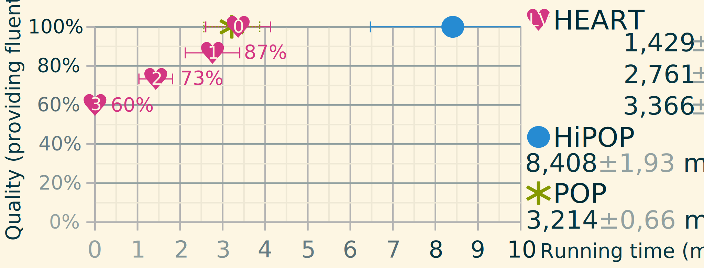
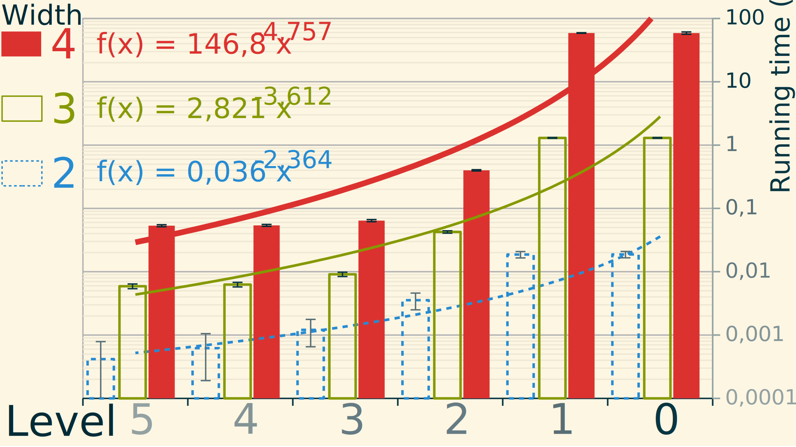

# Introduction {-}

Since the early days of automated planning, a wide variety of approaches have been considered to solve diverse types of problems. They all range in expressivity, speed, and reliability but often aim to excel in one of these domains. This leads to a polarization of the solutions toward more specialized methods to tackle each problem. All of these approaches have been compared and discussed extensively in the books of Ghallab _et al._ [-@ghallab_automated_2004; -@ghallab_automated_2016].

Partially ordered approaches are popular for their least commitment aspect, flexibility and ability to modify plans to use refinement operations [@weld_introduction_1994]. These approaches are often used in applications in robotics and multi-agent planning [@lemai_interleaving_2004; @dvorak_flexible_2014]. One of the most flexible partially ordered approaches is called *Partial Order Causal Link planning (POCL)* [@young_dpocl_1994]. It works by refining partial plans consisting of steps and causal links into a solution by solving all flaws compromising the validity of the plan.

Another approach is *Hierarchical Task Networks (HTN)* [@sacerdoti_planning_1974] that is meant to tackle the problem using composite actions in order to define hierarchical tasks within the plan. Hierarchical domains are considered easier to conceive and maintain by experts mainly because they seem closer to the way we think about these problems [@sacerdoti_nonlinear_1975].

In our work, we aim to combine HTN planning and POCL planning in such a manner as to generate intermediary high-level plans during the planning process. Combining these two approaches is not new [@young_dpocl_1994; @kambhampati_hybrid_1998; @biundo_abstract_2001]. Our work is based on *Hierarchical Partial Order Planning (HiPOP)* by Bechon _et al._ [-@bechon_hipop_2014]. The idea is to expand the classical POCL algorithm with new flaws in order to make it compatible with HTN problems and allowing the production of abstract plans. To do so, we present an upgraded planning framework that aims to simplify and factorize all notions to their minimal forms. We also propose some domain compilation techniques to reduce the work of the expert conceiving the domain.

In all these works, only the final solution to the input problem is considered. That is a good approach to classical planning except when no solutions can be found (or when none exists). Our work focuses on the case when the solution could not be found in time or when high-level explanations are preferable to the complete implementation detail of the plan. This is done by focusing the planning effort toward finding intermediary abstract plans along the path to the complete solution.

In the rest of the paper, we detail how the HiErarchical Abstraction for Real-Time (HEART) planner creates abstract intermediary plans that can be used for various applications. First, we discuss the motivations and related works to detail the choices behind our design process. Then we present the way we modeled an updated planning framework fitting our needs and then we explain our method and prove its properties to finally discuss the experimental results.

# Motivations and Potential Applications

Several reasons can cause a problem to be unsolvable. The most obvious case is that no solution exists that meets the requirements of the problem. This has already been addressed by Göbelbecker _et al._ [-@gobelbecker_coming_2010] where "excuses" are being investigated as potential explanations for when a problem has no solution.

Our approach deals with problems that are too difficult to solve within tight time constraints. For example, in robotics, systems often need to be run within refresh rates of several Hertz giving the process only fractions of a second to give an updated result. Since planning is at least EXPSPACE-hard for HTN using complex representation [@erol_htn_1994], computing only the first plan level of a hierarchical domain is much easier in relation to the complete problem.

While abstract plans are not complete solutions, they still display a useful set of properties for various applications. The most immediate application is for explainable planning [@fox_explainable_2017; @seegebarth_making_2012]. Indeed a high-level plan is more concise and does not contain unnecessary implementation details that would confuse a non-expert.

Another potential application for such plans is relative to domains that work with approximative data. Our main example here is intent recognition which is the original motivation for this work. Planners are not meant to solve intent recognition problems. However, several works extended what is called in psychology the *theory of mind*.
That theory is the equivalent of asking "*what would **I** do if I was them ?*" when observing the behavior of other agents. This leads to new ways to use *inverted planning* as an inference tool.
One of the first to propose that idea was Baker _et al._ [-@baker_goal_2007] that use Bayesian planning to infer intentions. Ramirez and Geffner [-@ramirez_plan_2009] found an elegant way to transform a plan recognition problem into classical planning. This is done simply by encoding temporal constraints in the planning domain in a similar way as Baioletti _et al._ [-@baioletti_encoding_1998] describe it to match the observed action sequence. A cost comparison will then give a probability of the goal to be pursued given the observations.
Chen _et al._ [-@chen_planning_2013] extended this with multi-goal recognition. A new method, proposed by Sohrabi _et al._ [-@sohrabi_plan_2016], makes the recognition fluent centric. It assigns costs to missing or noisy observed fluents, which allows finer details and less preprocessing work than action-based recognition. This method also uses a meta-goal that combines each possible goal and is realized when at least one of these goals is satisfied. Sohrabi _et al._ state that the quality of the recognition is directly linked to the quality and domain coverage of the generated plans. Thus guided diverse planning[^diverse] was preferred along with the ability to infer several probable goals at once.

[^diverse]: Diverse planning aims to find a set of $m$ plans that are distant of $d$ from one another.

# Related Works

HTN is often combined with classical approaches since it allows for a more natural expression of domains making expert knowledge easier to encode. These kinds of planners are named **decompositional planners** when no initial plan is provided [@fox_natural_1997].
Most of the time the integration of HTN simply consists in calling another algorithm when introducing a composite operator during the planning process. The DUET planner by Gerevini _et al._ [-@gerevini_combining_2008] does so by calling an instance of a HTN planner based on task insertion called SHOP2 [@nau_shop2_2003] to decompose composite actions.
Some planners take the integration further by making the decomposition of composite actions into a special step in their refinement process. Such works include the discourse generation oriented DPOCL [@young_dpocl_1994] and the work of Kambhampati _et al._ [-@kambhampati_hybrid_1998] generalizing the practice for decompositional planners.

In our case, we chose a class of hierarchical planners based on Plan-Space Planning (PSP) algorithms [@bechon_hipop_2014; @dvorak_flexible_2014; @bercher_hybrid_2014] as a reference approach. The main difference here is that the decomposition is integrated into the classical POCL algorithm by only adding new types of flaws. This allows keeping all the flexibility and properties of POCL while adding the expressivity and abstraction capabilities of HTN. We also made an improved planning framework based on the one used by HiPOP to reduce further the number of changes needed to handle composite actions and to increase the efficiency of the resulting implementation.

As stated previously, our goal is to obtain intermediary abstract plans and to evaluate their properties. Another work has already been done on another aspect of those types of plans. The Angelic algorithm by Marthi _et al._ [-@marthi_angelic_2007] exploited such plans in the planning process itself and used them as a heuristic guide. They also proved that, for a given fluent semantics, it is guaranteed that such abstract solutions can be refined into actual solutions. However, the Angelic planner does not address the inherent properties of such abstract plans as approximate solutions and uses a more restrictive totally ordered framework.

# Definitions
In order to make the notations used in the paper more understandable, we gathered them in @tbl:symbols. For domain and problem representation, we use a custom knowledge description language that is inspired from RDF Turtle [@beckett_turtle_2011] and is based on triples and propositional logic. In that language quantifiers are used to quantify variables `*(x)` (forall x) but can also be simplified with an implicit form: `lost(~)` meaning _" nothing is lost"_. For reference, the *exclusive quantifier* we introduced (noted `~`) is used for the negation (e.g. `~(lost(_))` for _" something is not lost"_) as well as the symbol for nil. All symbols are defined as they are first used. If a symbol is used as a parameter and is referenced again in the same statement, it becomes a variable.

**Symbol**                            **Description**
----------                            ---------------
$\mathcal{D}, \mathcal{P}$            Planning domain and problem.
$\mathit{pre}(a)$, $\mathit{eff}(a)$  Preconditions and effects of the action $a$.
$\mathit{methods}(a)$                 Methods of the action $a$.
$\phi^\pm(l)$                         Signed incidence function for partial order plans.
                                      $\phi^-$ gives the source and $\phi^+$ the target step of $l$.
                                      No sign gives a pair corresponding to link $l$.
$L^\pm(a)$                            Set of incoming ($L^-$) and 
                                      outgoing ($L^+$) links of step $a$.
                                      No sign gives all adjacent links.
$a_s \xrightarrow{c} a_t$             Link with source $a_s$, target $a_t$ and cause $c$.
$\mathit{causes}(l)$                  Gives the causes of a causal link $l$.
$a_a \succ a_s$                       A step $a_a$ is anterior to the step $a_s$.
$A_x^n$                               Proper actions set of $x$ down $n$ levels.
$lv(x)$                               Abstraction level of the entity $x$.
$a \rhd^\pm a'$                       Transpose the links of action $a$ onto $a'$.
$l \downarrow a$                      Link $l$ participates in the partial support of step $a$.
$\pi \Downarrow a$                    Plan $\pi$ fully supports $a$.
$\downarrowbarred_f a$                Subgoal : Fluent $f$ is not supported in step $a$.
$a_b \olcross l$                      Threat : Breaker action $a_b$ threatens causal link $l$.
$a \oplus^m$                          Decomposition of composite action $a$ using method $m$.
$var : exp$                           The colon is a separator to be read as "such that".
$[exp]$                               Iverson's brackets: $0$ if $exp=false$, $1$ otherwise.

: Our notations are adapted from Ghallab _et al._ [-@ghallab_automated_2004]. The symbol $\pm$ shows when the notation has signed variants. {#tbl:symbols}

## Domain

The domain specifies the allowed operators that can be used to plan and all the fluents they use as preconditions and effects.

::: {.definition name="Domain"} :::
A domain is a triplet $\mathcal{D} = \langle E_\mathcal{D}, R, A_{\mathcal{D}} \rangle$ where:

* $E_\mathcal{D}$ is the set of **domain entities**.
* $R$ is the set of **relations** over $E_\mathcal{D}^n$. These relations are akin to n-ary predicates in first order logic.
* $A_{\mathcal{D}}$ is the set of **operators** which are fully lifted *actions*.
:::::::::::::::::::::::::::::::::::

*Example*: The example domain in @lst:domain is inspired from the kitchen domain of Ramirez and Geffner [-@ramirez_probabilistic_2010].

~~~~ {#lst:domain}
take(item) pre (taken(~), ?(item)); //?(item) is used to make item into a variable.
take(item) eff (taken(item));
heat(thing) pre (~(hot(thing)), taken(thing));
heat(thing) eff (hot(thing));
pour(thing, into) pre (thing ~(in) into, taken(thing));
pour(thing, into) eff (thing in into);
put(utensil) pre (~(placed(utensil)), taken(utensil));
put(utensil) eff (placed(utensil), ~(taken(utensil)));
infuse(extract, liquid, container) :: Action; //Composite action of level 1
make(drink) :: Action; // Level 2 containing infuse
~~~~~~~~~~~~~~~~~~~~~~~~~~~~~~~~~~~~~~~~~~~~~~~~~~~~~~~~~~~~~~~~~~~~~~~~~~~~~~~~~~~~~~
: Domain file used in our planner. In order to be concise, the methods are omitted.

::: {.definition name="Fluent"} :::
A fluent $f$ is a parameterized statement $r(arg_1, arg_2, …, arg_n)$ where:

* $r \in R$ is a relation/function holding a property of the world.
* $arg_{i \in [1,n]} \in E_\mathcal{D}$ are the arguments (possibly quantified).
* $n = |r|$ is the arity of $r$.

Fluents are signed. Negative fluents are noted $\neg f$ and behave as a logical complement. The quantifiers are affected by the sign of the fluents. We do not use the closed world hypothesis: fluents are only satisfied when another compatible fluent is provided. Sets of fluents have a boolean value that equals the conjunction of all its fluents.
:::::::::::::::::::::::::::::::::::

*Example*: To describe an item not being held, we use the fluent $\neg taken(item)$. If the cup contains water, $in(water, cup)$ is true.

## Plan and hierarchical representation

::: {.definition name="Partial Plan / Method"} :::
A partially ordered plan is an *acyclic* directed graph $\pi = (S, L)$, with:

* $S$ the set of **steps** of the plan as vertices. A step is an action belonging in the plan. $S$ must contain an initial step $I_\pi$ and goal step $G_\pi$.
* $L$ the set of **causal links** of the plan as edges.
We note $l = a_s \xrightarrow{c} a_t$ the link between its source $a_s$ and its target $a_t$ caused by the set of fluents $c$. If $c = \emptyset$ then the link is used as an ordering constraint.
:::::::::::::::::::::::::::::::::

In our framework, *ordering constraints* are defined as the transitive cover of causal links over the set of steps. We note ordering constraints: $a_a \succ a_s$, with $a_a$ being *anterior* to its *successor* $a_s$. Ordering constraints cannot form cycles, meaning that the steps must be different and that the successor cannot also be anterior to its anterior steps:
$a_a \neq a_s \land a_s \not \succ a_a$.
In all plans, the initial and goal steps have their order guaranteed: $I_\pi \succ G\pi \land \nexists a_x \in S_\pi : a_x \succ I_\pi \lor G_\pi \succ a_x$.
If we need to enforce order, we simply add a link without specifying a cause. The use of graphs and implicit order constraints help to simplify the model while maintaining its properties.

The central notion of planning is operators. Instantiated operators are usually called *actions*. In our framework, actions can be partially instantiated. We use the term action for both lifted and grounded operators.

::: {.definition #def:action name="Action"} :::
An action is a parametrized tuple $a(args)=\langle name, pre, \mathit{eff}, methods \rangle$ where:

* $name$ is the **name** of the action.
* $\mathit{pre}$ and $\mathit{eff}$ are sets of fluents that are respectively the **preconditions and the effects** of the action.
* $methods$ is a set of **methods** (*partial order plans*) that decompose the action into smaller ones. Methods, and the methods of their enclosed actions, cannot contain the parent action.
::::::::::::::::::::::::::::::::::::::::::::::::::

*Example*: The precondition of the operator $take(item)$ is simply a single negative fluent noted $\neg taken(item)$ ensuring the variable $item$ is not already taken.

*Composite* actions are represented using methods. An action without methods is called *atomic*. It is of interest to note the divergence with classical HTN representation here since normally composite actions do not have preconditions nor effects. In our case, we insert them into abstract plans.

## Input control
In order to verify the input of the domain, the causes of the causal links in the methods are optional. If omitted, the causes are inferred by unifying the preconditions and effects with the same mechanism as in the subgoal resolution in our POCL algorithm.
Since we want to guarantee the validity of abstract plans, we need to ensure that user provided plans are solvable. We use the following formula to compute the final preconditions and effects of any composite action $a$: $\mathit{pre}(a) = \bigcup_{a_s \in L^+(a)} \mathit{causes}(a_s)$ and $\mathit{eff}(a) = \bigcup_{a_s \in L^-(a)} \mathit{causes}(a_s)$. An instance of the classical POCL algorithm is then run on the problem $\mathcal{P}_a = \langle \mathcal{D}, C_\mathcal{P} , a\rangle$ to ensure its coherence. The domain compilation fails if POCL cannot be completed. Since our decomposition hierarchy is acyclic ($a \notin A_a$, see @def:proper) nested methods cannot contain their parent action as a step.

## Problem

Problem instances are often most simply described by two components: the initial state and the goal.

::: {.definition name="Problem"} :::
The planning problem is defined as a tuple $\mathcal{P} = \langle \mathcal{D}, C_\mathcal{P} , a_0\rangle$ where:

* $\mathcal{D}$ is a planning domain.
* $C_\mathcal{P}$ is the set of **problem constants** disjoint from the domain constants.
* $a_0$ is the **root operator** of the problem which methods are potential solutions of the problem.
::::::::::::::::::::::::::::::::::::

*Example*: We use a simple problem for our example domain. The initial state provides that nothing is ready, taken or hot and all containers are empty (all using quantifiers). The goal is to have tea made. For reference, @lst:problem contains the problem instance we use as an example.

~~~~{#lst:problem}
init eff (hot(~), taken(~), placed(~), ~ in ~);
goal pre (hot(water), tea in cup, water in cup, placed(spoon), placed(cup));
~~~~~~~~~~~~~~~~~~~~~~~~~~~~~~~~~~~~~~~~~
: Example of a problem instance for the kitchen domain.

The root operator is initialized to $a_0 = \langle "", s_0, s^*, 
\lbrace \pi_{lv(a_0)} \rbrace\rangle$, with $s_0$ being the initial state and $s^*$ the goal specification. The method $\pi_{lv(a_0)}$ is a partial order plan with the initial and goal steps linked together via $a_0$.
The initial partial order plan is $\pi_{lv(a_0)} = (\lbrace I,G \rbrace, \lbrace I \xrightarrow{s_0} a_0 \xrightarrow{s^*} G \rbrace)$, with $I = \langle "init", \emptyset, s_0, \emptyset\rangle$ and $G = \langle "goal", s^*, \emptyset, \emptyset\rangle$.

## Partial Order Causal Links

Our method is based on the classical POCL algorithm. It works by refining a partial plan into a solution by recursively removing all of its flaws.

::: {.definition name="Flaws"} :::
Flaws have a *proper fluent* $f$ and a causing step often called the *needer* $a_n$. Flaws in a partial plan are either:

* **Subgoals**, *open conditions* that are yet to be supported by another step $a_n$ often called *provider*. We note subgoals $\downarrowbarred_f a_n$.
* **Threats**, caused by steps that can break a causal link with their effects. They are called *breakers* of the threatened link. A step $a_b$ threatens a causal link $l_t = a_p \xrightarrow{f} a_n$ if and only if $\neg f \in \mathit{eff}(a_b) \land a_b \not\succ a_p \land a_n \not\succ a_b$. Said otherwise, the breaker can cancel an effect of a providing step $a_p$, before it gets used by its needer $a_n$. We note threats $a_b \olcross l_t$.
::::::::::::::::::::::::::::::::::

*Example*: Our initial plan contains two unsupported subgoals: one to make the tea ready and another to put sugar in it. 
In this case, the needer is the goal step and the proper fluents are each of its preconditions.

These flaws need to be fixed in order for the plan to be valid. In POCL it is done by finding their resolvers.

::: {.definition name="Resolvers"} :::
Classical resolvers are additional causal links that aim to fix a flaw.

* *For subgoals*, the resolvers are a set of potential causal links containing the proper fluent $f$ in their causes while taking the needer step $a_n$ as their target and a **provider** step $a_p$ as their source.
* *For threats*, we usually consider only two resolvers: **demotion** ($a_b \succ a_p$) and **promotion** ($a_n \succ a_b$) of the breaker relative to the threatened link. We call the added causeless causal link a **guarding** link.
::::::::::::::::::::::::::::::::::::::

*Example*: The subgoal for $in( water, cup )$, in our example, can be solved by using the action $pour(water, cup)$ as the source of a causal link carrying the proper fluent as its only cause.

The application of a resolver does not necessarily mean progress. It can have consequences that may require reverting its application in order to respect the backtracking of the POCL algorithm.

::: {.definition #def:side-effects name="Side effects"} :::
Flaws that are caused by the application of a resolver are called *related flaws*. They are inserted into the *agenda* [^agenda] with each application of a resolver:

* *Related subgoals* are all the new open conditions inserted by new steps.
* *Related threats* are the causal links threatened by the insertion of a new step or the deletion of a guarding link.

Flaws can also become irrelevant when a resolver is applied. It is always the case for the targeted flaw, but this can also affect other flaws. Those *invalidated flaws* are removed from the agenda upon detection:

* *Invalidated subgoals* are subgoals satisfied by the new causal links or the removal of their needer.
* *Invalidated threats* happen when the breaker no longer threatens the causal link because the order guards the threatened causal link or either of them has been removed.
:::::::::::::::::::::::::::::::::::::::::

[^agenda]: An agenda is a flaw container used for the flaw selection of POCL.

*Example*: Adding the action $pour(water, cup)$ causes a related subgoal for each of the preconditions of the action which are: the cup and the water must be taken and water must not already be in the cup.

In @alg:pocl we present a generic version of POCL inspired by Ghallab _et al._ [-@ghallab_automated_2004, section 5.4.2].

~~~ {.algorithm #alg:pocl name="Partial Order Planner" startLine="1"}
\Function{POCL}{Agenda $a$, Problem $\mathcal{P}$}
    \If{$a = \emptyset$} \Comment{Populated agenda needs to be provided}
        \State \Return Success \Comment{Stops all recursion}
    \EndIf
    \State Flaw $f \gets$ \Call{choose}{$a$} \label{line:flawselection}
    \Comment{Heuristically chosen flaw}
    \State Resolvers $R \gets$ \Call{solve}{$f$, $\mathcal{P}$} \label{line:resolverselection}
    \ForAll{$r \in R$} \Comment{Non-deterministic choice operator}
        \State \Call{apply}{$r$, $\pi$} \label{line:resolverapplication} 
        \Comment{Apply resolver to partial plan}
        \State Agenda $a' \gets$ \Call{update}{$a$} \label{line:updateagenda}
        \If{\protect\Call{POCL}{$a'$, $\mathcal{P}$} = Success} \Comment{Refining recursively}
            \State \Return Success
        \EndIf
        \State \Call{revert}{$r$, $\pi$} \Comment{Failure, undo resolver application} \label{line:revert}
    \EndFor
    \State $a \gets a \cup \{f\}$ \Comment{Flaw was not resolved}
    \State \Return Failure \Comment{Revert to last non-deterministic choice}
\EndFunction
~~~~~~~~~~~~~~~~~~~~~~~~~~~~~~~~~~~~~~~~~~~~~~~~~

For our version of POCL we follow a refinement procedure that works in several generic steps.

The first is the search for resolvers. It is often done in two separate steps: first, select the candidates and then check each of them for validity. This is done using the polymorphic function `solve` at @line:resolverselection. 

In the case of subgoals, variable unification is performed to ensure the compatibility of the resolvers. Since this step is time-consuming, the operator is instantiated accordingly at this step to factories the computational effort. Composite operators have also all their methods instantiated at this step if they are selected as a candidate. 

Then a resolver is picked non-deterministically for applications (this can be heuristically driven). At @line:resolverapplication the resolver is effectively applied to the current plan. All side effects and invalidations are handled during the update of the agenda at @line:updateagenda. If a problem occurs, @line:revert backtracks and tries other resolvers. If no resolver fits the flaw, the algorithm backtracks to previous resolver choices to explore all the possible plans and ensure completeness.

In @def:side-effects, we mentioned effects that aren't present in classical POCL, namely *negative resolvers*. All classical resolvers only add steps and causal links to the partial plan. Our method needs to remove composite steps and their adjacent links when expanding them.

# The Heart of the Method

In this section, we explain how our method combines POCL with HTN planning and how they are used to generate intermediary abstract plans.

## Additional Notions

In order to properly introduce the changes made for using HTN domains in POCL, we need to define a few notions. 

Transposition is needed to define decomposition.

::: {.definition name="Transposition"} :::
In order to transpose the causal links of an action $a'$ with the ones of an existing step $a$ in a plan $\pi$, we use the following operation : 

$$a \rhd^-_\pi a' = \left \lbrace \phi^-(l) \xrightarrow{\mathit{causes}(l)} a' : l \in L^-_\pi(a) \right \rbrace$$

It is the same with $a' \xrightarrow{\mathit{causes}(l)} \phi^+(l)$ and $L^+$ for $a \rhd^+ a'$. This supposes that the respective preconditions and effects of $a$ and $a'$ are equivalent. When not signed, the transposition is generalized: $a \rhd a' = a\rhd^-a' \cup a\rhd^+a'$.
::::::::::::::::::::::::::::::::::::::::

*Example*: $a\rhd^-a'$ gives all incoming links of $a$ with the target set to $a'$ instead.

::: {.definition #def:proper name="Proper Actions"} :::
Proper actions are actions that are "contained" within an entity. We note this notion $A_a = A_a^{lv(a)}$ for an action $a$. It can be applied to various concepts :

* For a *domain* or a *problem*, $A_{\mathcal{P}} = A_{\mathcal{D}}$.
* For a *plan*, it is $A^0_\pi = S_\pi$.
* For an *action*, it is $A^0_a = \bigcup_{m \in \mathit{methods}(a)} S_m$.
  Recursively: $A_a^n = \bigcup_{b\in A_a^0} A_{b}^{n-1}$.
  For atomic actions, $A_a = \emptyset$. 

:::::::::::::::::::::::::::::::::::::::::::::::::::::::

*Example*: The proper actions of $make(drink)$ are the actions contained within its methods. The set of extended proper actions adds all proper actions of its single proper composite action $infuse(drink, water, cup)$.

::: {.definition #def:level name="Abstraction Level"} :::
This is a measure of the maximum amount of abstraction an entity can express [^iverson]: 
$$lv(x) = \left ( \max_{a \in A_x}(lv(a)) + 1 \right ) [A_x \neq \emptyset]$$
::::::::::::::::::::::::::::::::::::::::::::::

[^iverson]: We use Iverson brackets here, see notations in @tbl:symbols.

*Example*: The abstraction level of any atomic action is $0$ while it is $2$ for the composite action $make(drink)$. The example domain (in @lst:domain) has an abstraction level of $3$.

## Abstraction In POCL

The most straightforward way to handle abstraction in regular planners is illustrated by Duet [@gerevini_combining_2008] by managing hierarchical actions separately from a task insertion planner. We chose to add abstraction in POCL in a manner inspired by the work of Bechon _et al._ [-@bechon_hipop_2014] on a planner called HiPOP. The difference between the original HiPOP and our implementation of it is that we focus on the expressivity and the ways flaw selection can be exploited for partial resolution. Our version is lifted at runtime while the original is grounded for optimizations. All mechanisms we have implemented use POCL but with different management of flaws and resolvers. The original @alg:pocl is left untouched.

One of those changes is that resolver selection needs to be altered for subgoals. Indeed, as stated by the authors of HiPOP: the planner must ensure the selection of high-level operators in order to benefit from the hierarchical aspect of the domain. Otherwise, adding operators only increases the branching factor. 
Composite actions are not usually meant to stay in a finished plan and must be decomposed into atomic steps from one of their methods.

::: {.definition name="Decomposition Flaws"} :::
They occur when a partial plan contains a non-atomic step. This step is the needer $a_n$ of the flaw. We note its decomposition $a_n \oplus$.

* *Resolvers*: A decomposition flaw is solved with a **decomposition resolver**. The resolver will replace the needer with one of its instantiated methods $m \in \mathit{methods}(a_n)$ in the plan $\pi$. This is done by using transposition such that:
$a_n \oplus^m_\pi = \langle S_m \cup (S_\pi \setminus \lbrace a \rbrace) , a_n \rhd^- I_m \cup a_n \rhd^+ G_m \cup (L_\pi \setminus L_\pi(a_n))$.
* *Side effects*: A decomposition flaw can be created by the insertion of a composite action in the plan by any resolver and invalidated by its removal :
$$\bigcup^{f \in \mathit{pre}(a_m)}_{a_m \in S_m} \pi' \downarrowbarred_f a_m\bigcup^{l \in L_{\pi'}}_{a_b \in S_{\pi'}} a_b \olcross l \bigcup_{a_c \in S_m}^{lv(a_c) \neq 0} a_c \oplus$$
:::::::::::::::::::::::::::::::::::::::::::::

*Example*: When adding the step $make(tea)$ in the plan to solve the subgoal that needs tea being made, we also introduce a decomposition flaw that will need this composite step replaced by its method using a decomposition resolver. In order to decompose a composite action into a plan, all existing links are transposed to the initial and goal step of the selected method, while the composite action and its links are removed from the plan.
The main differences between HiPOP and HEART in our implementations are the functions of flaw selection and the handling of the results (one plan for HiPOP and a plan per cycle for HEART).
In HiPOP, the flaw selection is made by prioritizing the decomposition flaws. Bechon _et al._ [-@bechon_hipop_2014] state that it makes the full resolution faster. However, it also loses opportunities to obtain abstract plans in the process.

## Cycles

{#fig:cycles .wide}

The main focus of our work is toward obtaining **abstract plans** which are plans that are completed while still containing composite actions. In order to do that the flaw selection function will enforce cycles in the planning process.

::: {.definition name="Cycle"} :::
A cycle is a planning phase defined as a triplet $c = \langle lv(c), agenda, \pi_{lv(c)}\rangle$ where : $lv(c)$ is the maximum abstraction level allowed for flaw selection in the $agenda$ of remaining flaws in partial plan $\pi_{lv(c)}$. The resolvers of subgoals are therefore constrained by the following: $a_p \downarrow_f a_n : lv(a_p) \leq lv(c)$.
:::::::::::::::::::::::::::::::::::::::

During a cycle all decomposition flaws are delayed. Once no more flaws other than decomposition flaws are present in the agenda, the current plan is saved and all remaining decomposition flaws are solved at once before the abstraction level is lowered for the next cycle: $lv(c') = lv(c)-1$. Each cycle produces a more detailed abstract plan than the one before.

Abstract plans allow the planner to do an approximate form of anytime execution. At any given time the planner is able to return a fully supported plan. Before the first cycle, the plan returned is $\pi_{lv(a_0)}$.

*Example*: In our case using the method of intent recognition of Sohrabi _et al._ @sohrabi_plan_2016, we can already use $\pi_{lv(a_0)}$ to find a likely goal explaining an observation (a set of temporally ordered fluents). That can make an early assessment of the probability of each goal of the recognition problem.

For each cycle $c$, a new plan $\pi_{lv(c)}$ is created as a new method of the root operator $a_0$. These intermediary plans are not solutions of the problem, nor do they mean that the problem is solvable. In order to find a solution, the HEART planner needs to reach the final cycle $c_0$ with an abstraction level $lv(c_0) = 0$. However, these plans can be used to derive meaning from the potential solution of the current problem and give a good approximation of the final result before its completion.

*Example*: In the @fig:cycles, we illustrate the way our problem instance is progressively solved. Before the first cycle $c_2$, all we have is the root operator and its plan $\pi_3$. Then within the first cycle, we select the composite action $make(tea)$ instantiated from the operator $make(drink)$ along with its methods. All related flaws are fixed until all that is left in the agenda is the abstract flaws. We save the partial plan $\pi_2$ for this cycle and expand $make(tea)$ into a copy of the current plan $\pi_1$ for the next cycle. The solution of the problem will be stored in $\pi_0$ once found.

# Results

## Theoretical

In this section, we prove several properties of our method and resulting plans: HEART is complete, sound and its abstract plans can always be decomposed into a valid solution.

The completeness and soundness of POCL have been proven in [@penberthy_ucpop_1992]. An interesting property of POCL algorithms is that flaw selection strategies do not impact these properties. Since the only modification of the algorithm is the extension of the classical flaws with a decomposition flaw, all we need to explore, to update the proofs, is the impact of the new resolver. By definition, the resolvers of decomposition flaws will take into account all flaws introduced by its resolution into the refined plan. It can also revert its application properly.

::: {.lemma name="Decomposing preserves acyclicity"} :::
The decomposition of a composite action with a valid method in an acyclic plan will result in an acyclic plan. Formely, 
$\forall a_s \in S_\pi : a_s \nsucc_\pi a_s \implies \forall a'_s \in S_{a \oplus^m_\pi} : a'_s \nsucc_{a \oplus^m_\pi} a'_s$.
:::::::::::::::::::::::::::::::::::::::::::

::: proof :::
When decomposing a composite action $a$ with a method $m$ in an existing plan $\pi$, we add all steps $S_m$ in the refined plan. Both $\pi$ and $m$ are guaranteed to be cycle free by definition. We can note that $\forall a_s \in S_m : 
\left ( \nexists a_t \in S_m : a_s \succ a_t \land \lnot f \in \mathit{eff}(a_t)\right ) \implies f \in \mathit{eff}(a)$. Said otherwise, if an action $a_s$ can participate a fluent $f$ to the goal step of the method $m$ then it is necessarily present in the effects of $a$. Since higher level actions are preferred during the resolver selection, no actions in the methods are already used in the plan when the decomposition happens. This can be noted $\exists a \in \pi \implies S_m \cupdot S_\pi$ meaning that in the graph formed both partial plans $m$ and $\pi$ cannot contain the same edges therefore their acyclicity is preserved when inserting one into the other.
:::::::::::::

::: {.lemma name="Solved decomposition flaws cannot reoccur"} :::
The application of a decomposition resolver on a plan $\pi$, guarantees that $a \notin S_{\pi'}$ for any partial plan refined from $\pi$ without reverting the application of the resolver.
:::::::::::::::::::::::::::::::::::::::::::::::::::::::::::::::

::: proof :::
As stated in the definition of the methods (@def:action): $a \notin A_a$. This means that $a$ cannot be introduced in the plan by its decomposition or the decomposition of its proper actions.
Indeed, once $a$ is expanded, the level of the following cycle $c_{lv(a)-1}$ prevents $a$ to be selected by subgoal resolvers. It cannot either be contained in the methods of another action that are selected afterward because otherwise following @def:level its level would be at least $lv(a)+1$.
:::::::::::::

::: {.lemma name="Decomposing to abstraction level 0 guarantees solvability"} :::
Finding a partial plan that contains only decomposition flaws with actions of abstraction level 1, guarantees a solution to the problem.
:::::::::::::::::::::::::::::::::::::::::::::::::::::::::::::::

::: proof :::
Any method $m$ of a composite action $a: lv(a) = 1$ is by definition a solution of the problem $\mathcal{P}_a = \langle \mathcal{D}, C_\mathcal{P} , a\rangle$. By definition, $a \notin A_a$, and $a \notin A_{a \oplus^m_\pi}$ (meaning that $a$ cannot reoccur after being decomposed). It is also given by definition that the instantiation of the action and its methods are coherent regarding variable constraints (everything is instantiated before selection by the resolvers). Since the plan $\pi$ only has decomposition flaws and all flaws within $m$ are guaranteed to be solvable, and both are guaranteed to be acyclical by the application of any decomposition $a \oplus^m_\pi$, the plan is solvable.
:::::::::::::

::: {.lemma name="Abstract plans guarantee solvability"} :::
Finding a partial plan $\pi$ that contains only decomposition flaws, guarantees a solution to the problem.
:::::::::::::::::::::::::::::::::::::::::::::::::::::::::::::::

::: proof :::
Recursively, if we apply the previous proof on higher level plans we note that decomposing at level 2 guarantees a solution since the method of the composite actions are guaranteed to be solvable.
:::::::::::::

From these proofs, we can derive the property of soundness (from the guarantee that the composite action provides its effects from any methods) and completeness (since if a composite action cannot be used, the planner defaults to using any action of the domain).

## Experimental

In order to assess its capabilities, HEART was tested on two criteria: quality and complexity. All tests were executed on an Intel® Core™ i7-7700HQ CPU clocked at 2.80GHz. The Java process used only one core and was not limited by time or memory [^code]. Each experiment was repeated between $700$ and $10 000$ times to ensure that variations in speed were not impacting the results.

[^code]: The source code of HEART will be available at [genn.io/heart](https://genn.io/heart)

{#fig:quality}

@Fig:quality shows how the quality is affected by the abstraction in partial plans. The tests are made using our example domain (see @lst:domain). The quality is measured by counting the number of providing fluents in the plan $\left| \bigcup_{a \in S_\pi} \mathit{eff}(a) \right|$. This metric is actually used to approximate the probability of a goal given observations in intent recognition ($P(G|O)$ with noisy observations, see [@sohrabi_plan_2016]). The percentages are relative to the total number of unique fluents of the complete solution. 
These results show that in some cases it may be more interesting to plan in a leveled fashion to solve HTN problems. For the first cycle of level $3$, the quality of the abstract plan is already of $60\%$. This is the quality of the exploitation of the plan *before any planning*. With almost three-quarters of the final quality and less than half of the complete computation time, the result of the first cycle is a good quality/time compromise.

{#fig:width}

In the second test, we used generated domains. These domains consist of an action of abstraction level $5$. This action has a single method containing a number of actions of level $4$. We call this number the width of the domain. All needed actions are built recursively to form a tree shape. Atomic actions only have single fluent effects. The goal is the effect of the higher level action and the initial state is empty. These domains do not contain negative effects.
@Fig:width shows the computational profile of HEART for various levels and widths. We note that the behavior of HEART seems to follow an exponential law with the negative exponent of the trend curves seemingly being correlated to the actual width.
This means that computing the first cycles has a complexity that is close to being *linear* while computing the last cycles is of the same complexity as classical planning which is at least *P-SPACE* (depending on the expressivity of the domain) [@erol_complexity_1995].

# Conclusions {-}

In this paper, we have presented a new planner called HEART based on POCL. An updated planning framework fitting the need for such a new approach was proposed.
We showed how HEART performs compared to complete planners in terms of speed and quality. While the abstract plans generated during the planning process are not complete solutions, they are exponentially faster to generate while retaining significant quality over the final plans. They are also proof of solvability of the problem. By using these plans, it is possible to find good approximations to intractable problems within tight time constraints.

# References {-}

\setlength{\parindent}{0in}
\setlength{\leftskip}{0in}
\small
\noindent
